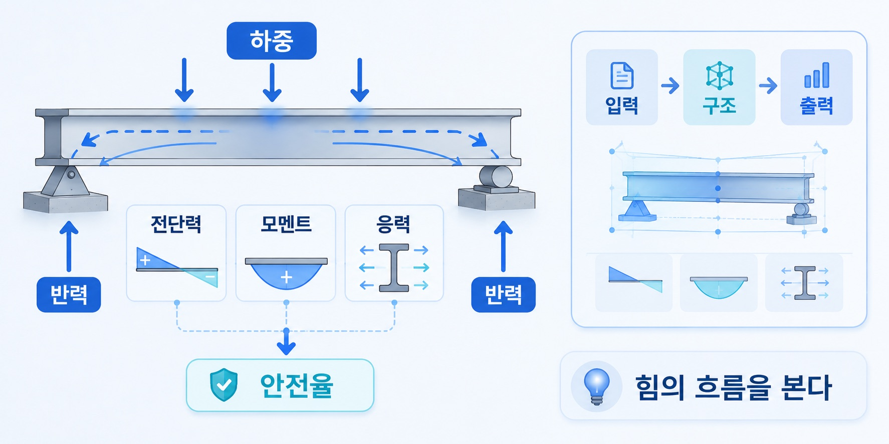
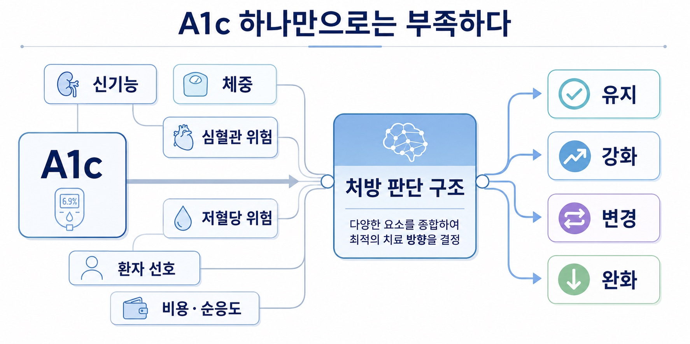

## 1. 의대생이 공학을 놓지 않는 이유

의대에 들어오면 이전 전공은 종종 과거가 됩니다. 입학 전에는 무엇을 공부했는지, 어떤 분야에 있었는지, 어떤 방식으로 생각했는지는 생각보다 빠르게 뒤로 밀려납니다. 의대 공부는 양이 많습니다. 외워야 할 것도 많고, 따라가야 할 일정도 많습니다.

해부학, 생리학, 병리학, 약리학을 지나 내과, 외과, 소아과, 산부인과, 정신과를 공부하다 보면 이전 전공은 잠시 접어두게 됩니다.

저도 그랬습니다.

공학을 전공했지만, 의대에 들어온 뒤에는 한동안 의학을 따라가는 것만으로도 충분히 바빴습니다. 하지만 시간이 지나면서 알게 되었습니다. 공학은 완전히 사라진 것이 아니었습니다. 전공 지식은 흐려졌지만, 생각하는 방식은 남아 있었습니다.

### 1) 공학은 문제를 구조로 보는 방식이다

제가 공부했던 공학의 중심에는 구조가 있었습니다. 구조역학에서는 힘을 계산합니다. 어디에 하중이 걸리는지 보고, 그 하중이 어떤 방향으로 전달되는지 봅니다.

힘은 모멘트를 만들고, 모멘트는 부재 안의 응력으로 이어집니다. 응력이 재료가 견딜 수 있는 범위를 넘으면 구조물은 안전하지 않습니다. 그래서 구조를 설계할 때는 단순히 모양을 그리는 것이 아니라 힘의 흐름을 계산해야 합니다.

하중. 반력. 전단력. 모멘트. 응력. 변형. 안전율. 각각은 따로 떨어진 숫자가 아닙니다. 하나의 구조 안에서 연결되어 있습니다. 공학은 이렇게 문제를 나누고, 관계를 계산하고, 제약 안에서 가능한 설계를 찾는 일에 가깝습니다.

입력이 무엇인지. 출력이 무엇인지. 조건은 무엇인지. 제약은 어디에 있는지. 오차는 어디서 생기는지. 시스템은 어떤 피드백을 받는지.

공학에서는 문제가 주어지면 먼저 전체 구조를 봅니다. 현실은 복잡하지만, 그 복잡함을 그대로 붙잡고 있으면 아무것도 설계할 수 없습니다. 그래서 나눕니다. 단순화합니다. 모델을 만듭니다. 그리고 그 모델이 어디까지 유효한지 확인합니다.

이 사고방식은 의학에서도 계속 남았습니다.

### 2) 의학도 입력과 출력 사이의 판단이다

처음 의학을 공부할 때는 의학이 거대한 지식 목록처럼 보였습니다. 질병 이름. 진단 기준. 검사 수치. 치료 알고리즘. 약물 용량. 금기와 부작용.

끝없이 외워야 하는 항목들의 집합처럼 느껴졌습니다. 하지만 실습을 돌고, 환자를 보고, 교수님들의 판단을 옆에서 보면서 조금 다르게 보이기 시작했습니다. 의학도 결국 입력과 출력 사이의 판단이었습니다.

환자의 증상과 병력. 신체진찰 소견. 검사 결과. 기저질환과 복용약. 나이와 생활 맥락. 환자의 선호와 치료 목표.

이런 것들이 입력입니다.

그 입력을 바탕으로 검사를 더 할지, 약을 쓸지, 수술을 할지, 지켜볼지, 설명하고 안심시킬지 결정합니다.

그것이 출력입니다.

물론 의학은 공학보다 훨씬 더 복잡합니다. 환자는 기계가 아니고, 몸은 단순한 구조물이 아니며, 같은 입력이 항상 같은 출력을 만들지도 않습니다.

그래서 더 어렵습니다.

하지만 그렇기 때문에 오히려 구조가 필요합니다. 입력이 불완전하고, 조건이 변하고, 출력이 확률적일수록 판단의 구조를 더 분명히 해야 합니다.

### 3) 당뇨약 선택도 구조의 문제다

내분비를 공부하면서 이 점을 자주 느꼈습니다. 예를 들어 당뇨병 약제를 선택하는 일은 단순히 혈당을 낮추는 약을 고르는 일이 아닙니다.

A1c가 얼마인지. 공복혈당과 식후혈당 중 무엇이 문제인지. 신기능은 어떤지. 체중은 어떤지. 심혈관질환이나 심부전 위험은 있는지. 저혈당 위험은 얼마나 되는지. 환자의 나이와 생활 패턴은 어떤지. 주사제를 받아들일 수 있는지. 비용과 순응도는 어떤지.

이런 조건들이 함께 들어옵니다.

같은 A1c라도 어떤 환자에게는 metformin을 유지하는 것이 적절할 수 있고, 어떤 환자에게는 SGLT2 inhibitor나 GLP-1 receptor agonist를 고려할 수 있습니다. 또 다른 환자에게는 오히려 저혈당 위험을 줄이기 위해 치료 강도를 낮춰야 할 수도 있습니다.

가이드라인은 기준을 줍니다.

하지만 실제 선택은 그 기준을 환자의 조건 안에 다시 배치하는 일입니다. 이 과정은 구조역학과 닮아 있습니다. 하중 하나만 보고 구조를 설계하지 않듯이, A1c 하나만 보고 약제를 선택할 수는 없습니다. 하중, 재료, 지점 조건, 안전율을 함께 보듯이 혈당, 신기능, 체중, 심혈관 위험, 저혈당 위험, 환자 선호를 함께 봐야 합니다.

판단은 하나의 수치에서 나오지 않습니다. 조건들의 관계에서 나옵니다. 이 생각은 나중에 DiaFrame을 구상하는 배경이 되었습니다. 당뇨약 선택을 단순 추천 문제가 아니라 입력 조건과 판단 방향, 안전성 제약을 가진 의사결정 구조로 보고 싶었습니다.

### 4) 프로젝트는 사고방식의 부산물이다

제가 여러 프로젝트를 만든 것도 사실 코딩 자체가 목적이었기 때문은 아닙니다. 반복되는 판단이 보이면 그 판단을 분해하고 싶었습니다. 어떤 정보가 입력으로 들어오고, 어떤 조건에서 판단이 달라지고, 어떤 출력이 필요한지 정리하고 싶었습니다. CleanText는 의료 텍스트를 분석 가능한 데이터로 바꾸려는 시도였습니다.

VoiceGrape는 목소리라는 감각을 측정 가능한 음성 지표로 바꾸려는 시도였습니다. EstroFrame은 호르몬 농도를 시간 위의 곡선으로 보려는 시도였습니다. NeuroFrame은 하루의 상태를 에너지 흐름으로 모델링하려는 시도였습니다. DiaFrame은 당뇨약 선택을 검증 가능한 의사결정 구조로 바라보려는 시도였습니다.

각 프로젝트의 주제는 달랐지만, 출발점은 비슷했습니다. 애매한 판단을 조금 더 구조화된 형태로 바꾸고 싶었습니다. 그래서 제게 코딩은 개발자가 되기 위한 기술이라기보다 생각을 구현하는 방법에 가까웠습니다. 생각을 표로 만들고, 규칙으로 만들고, 모델로 만들고, 사용자가 볼 수 있는 화면으로 만드는 일.

그 과정에서 공학은 과거 전공이 아니라 현재의 사고방식으로 남아 있었습니다.

### 5) 의학 안으로 공학을 가져오기

저는 의대생입니다.

앞으로 의사가 되기 위해 의학을 더 많이 공부해야 합니다. 환자를 봐야 하고, 병력을 들어야 하고, 신체진찰을 해야 하고, 검사 결과를 해석해야 하고, 치료의 책임을 져야 합니다. 공학이 이 일을 대신해주지는 않습니다. 하지만 공학적 사고는 이 일을 바라보는 방식을 바꿔줍니다.

복잡한 문제를 구조로 보고, 불완전한 정보를 입력으로 받아들이고, 제약 속에서 판단하고, 오차와 예외를 인정하고, 필요하면 그 과정을 시스템으로 구현하는 것.

이것은 의학과 충돌하지 않습니다.

오히려 의학 안에서 계속 쓸 수 있는 사고방식입니다. 제가 공학을 놓지 않는 이유는 과거 전공에 대한 미련 때문이 아닙니다. 의학을 공학으로 대체하고 싶어서도 아닙니다. 다만 의학을 공부할수록 공학적으로 생각하는 방식이 임상 문제를 더 선명하게 보게 해준다고 느끼기 때문입니다.

의학은 사람을 다루는 학문입니다.

그래서 단순한 모델로 환자를 설명할 수는 없습니다. 하지만 사람을 다루는 학문이기 때문에 오히려 더 신중한 구조가 필요합니다. 저는 공학을 버리고 의학으로 온 것이 아닙니다. 공학을 의학 안으로 가져오고 있습니다.
