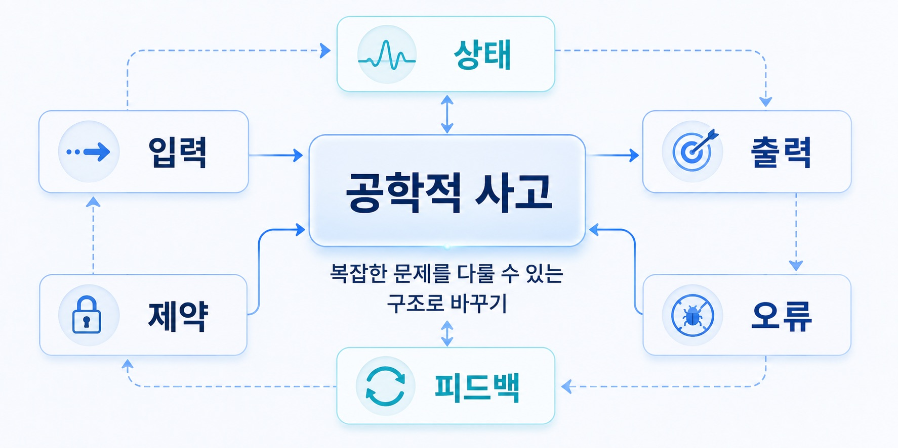
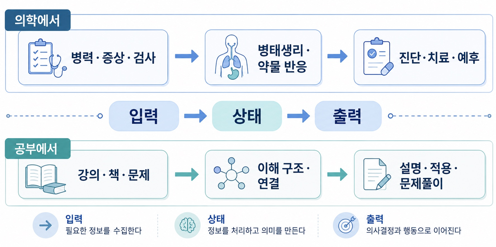
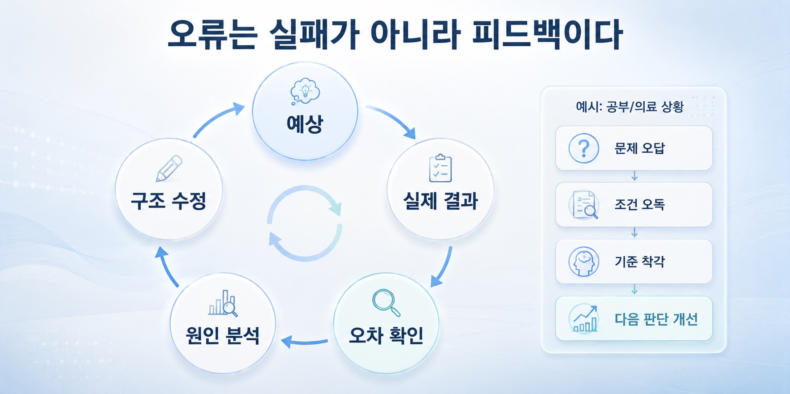

## 2. 공학적 사고란 무엇인가

공학적 사고라는 말을 들으면 먼저 기계나 회로, 코드 같은 것을 떠올리기 쉽습니다. 수식을 많이 쓰고, 계산을 하고, 무언가를 설계하고, 프로그램을 만드는 방식.

물론 그것도 공학의 일부입니다.

하지만 제가 생각하는 공학적 사고의 핵심은 특정 기술에 있지 않습니다. 공학적 사고는 문제를 조건과 구조로 나누어 보는 방식입니다. 무엇이 들어오고, 어떤 상태를 거치며, 무엇이 나가는지. 어떤 제약이 있고, 어디서 오류가 생기며, 어떤 피드백이 다시 시스템에 영향을 주는지.

이런 방식으로 문제를 바라보는 태도에 가깝습니다.

### 1) 문제를 그대로 붙잡지 않는다

현실의 문제는 대부분 복잡합니다.

처음부터 깔끔하게 정리되어 있지 않고, 원인과 결과가 섞여 있으며, 중요한 정보와 덜 중요한 정보가 함께 들어 있습니다. 공학적 사고는 그 복잡함을 그대로 붙잡고 있지 않습니다.

먼저 나눕니다.

입력은 무엇인가. 출력은 무엇인가. 중간 상태는 무엇인가. 바뀌지 않는 조건은 무엇인가. 바뀔 수 있는 변수는 무엇인가. 반드시 지켜야 하는 제약은 무엇인가.

이렇게 나누고 나면 문제는 조금 덜 막막해집니다. 예를 들어 의대 공부도 처음에는 거대한 암기 덩어리처럼 보입니다. 질병 이름, 증상, 검사, 치료, 약물, 부작용이 한꺼번에 밀려옵니다.

하지만 구조로 나누면 달라집니다.

환자에게 어떤 문제가 있고, 그 문제를 설명하는 병태생리는 무엇이며, 어떤 검사로 확인하고, 어떤 기준으로 치료를 결정하는지. 공부의 대상이 단순한 목록에서 하나의 흐름으로 바뀝니다. 공학적 사고는 복잡한 문제를 단순하게 무시하는 것이 아니라, 다룰 수 있는 단위로 나누는 일에서 시작합니다.

### 2) 입력, 상태, 출력을 본다

공학에서는 시스템을 볼 때 입력과 출력을 자주 생각합니다. 무엇이 들어오고, 그 안에서 어떤 변화가 생기고, 결과로 무엇이 나오는지 봅니다.

이 구조는 의학에도 잘 맞습니다.

환자의 병력, 증상, 신체진찰, 검사 결과는 입력입니다. 환자의 몸 안에서 일어나는 병태생리와 약물 반응은 상태입니다. 진단, 치료 결정, 예후, 부작용은 출력에 가깝습니다.

공부도 마찬가지입니다.

책이나 강의에서 들어오는 정보가 입력입니다. 그 정보를 내가 어떤 구조로 이해하고 연결하는지가 상태입니다. 문제를 풀거나, 설명하거나, 환자에게 적용하는 것이 출력입니다. 이렇게 보면 공부는 단순히 정보를 많이 넣는 일이 아닙니다.

입력을 처리하는 내부 구조를 만드는 일입니다. 같은 내용을 읽어도 어떤 사람은 금방 잊고, 어떤 사람은 문제에 적용합니다.

차이는 단순 기억량만이 아닙니다.

정보가 들어왔을 때 그 정보를 어디에 연결하고, 어떤 기준으로 꺼내 쓸 수 있는지가 중요합니다.

### 3) 제약을 먼저 본다

공학적 사고에서 중요한 것은 무엇을 할 수 있는지만 보는 것이 아닙니다. 무엇을 할 수 없는지도 함께 봅니다.

예산이 제한되어 있을 수 있습니다. 시간이 부족할 수 있습니다. 재료가 버틸 수 있는 한계가 있을 수 있습니다. 시스템이 감당할 수 있는 부하가 있을 수 있습니다.

이런 제약을 무시하면 그럴듯한 설계는 가능할지 몰라도 실제로 작동하는 설계는 어렵습니다.

의학에서도 제약은 중요합니다.

가이드라인상 가능한 치료가 있어도 환자의 신기능이 나쁘면 쓸 수 없는 약이 있습니다. 효과가 좋은 약이라도 저혈당 위험이 크면 조심해야 합니다. 좋은 검사라도 지금 당장 시행하기 어렵거나 환자에게 부담이 클 수 있습니다. 이론적으로 맞는 설명이라도 환자가 이해하고 받아들일 수 있어야 합니다.

제약은 판단을 방해하는 요소가 아닙니다. 오히려 판단을 현실에 붙잡아두는 요소입니다. 공학적 사고는 최선의 답을 공중에 그리지 않고, 제약 안에서 가능한 답을 찾습니다.

### 4) 오류와 피드백을 전제로 한다

공학적 사고는 처음부터 완벽한 답이 나온다고 생각하지 않습니다. 모델에는 오차가 있고, 측정값에는 노이즈가 있으며, 설계는 실제 조건에서 수정될 수 있습니다.

그래서 피드백이 필요합니다.

예상한 결과와 실제 결과가 다르면 어디서 차이가 생겼는지 봅니다. 입력이 잘못되었는지, 가정이 틀렸는지, 모델이 너무 단순했는지, 측정 과정에 문제가 있었는지 확인합니다.

이 태도는 공부에도 중요합니다.

문제를 틀렸을 때 단순히 답을 외우는 것으로 끝내면 같은 유형을 다시 틀릴 수 있습니다.

왜 틀렸는지 봐야 합니다.

개념을 몰랐는지. 조건을 잘못 읽었는지. 감별진단의 우선순위를 잘못 잡았는지. 치료 기준을 착각했는지. 문제의 함정을 놓쳤는지.

오답은 단순한 실패가 아니라 내 사고 구조의 오류를 보여주는 피드백입니다. Anki도 이 관점에서 보면 단순 암기 도구가 아닙니다. 내가 어떤 정보를 반복해서 잊는지, 어떤 연결이 약한지, 어떤 기준을 자꾸 혼동하는지 보여주는 피드백 시스템에 가깝습니다.

### 5) 도구는 사고를 구현한다

공학적 사고는 머릿속에서만 끝나지 않습니다. 반복되는 구조가 보이면 그 구조를 도구로 만들 수 있습니다. CleanText는 의료 텍스트를 정리하는 반복 작업을 데이터 처리 구조로 옮긴 것입니다. DiaFrame은 당뇨약 선택에서 필요한 조건과 안전성 제약을 의사결정 지원 구조로 옮긴 것입니다.

Jisong Cloud는 파일 업로드, 메모, AI 분석, 문서 변환처럼 반복되는 개인 작업 흐름을 하나의 작업대로 묶은 것입니다. 이런 도구들은 서로 달라 보입니다.

하지만 공통점이 있습니다.

반복되는 판단을 발견하고, 그 판단을 입력과 출력으로 나누고, 중간 과정을 규칙이나 모델로 만들고, 사용 가능한 형태로 구현했다는 점입니다. 공학적 사고는 생각을 구조로 만들고, 그 구조를 다시 현실에서 작동하게 만드는 방식입니다.

### 6) 공학적 사고는 차갑지 않다

공학적 사고를 말하면 차갑고 기계적인 태도로 오해될 수 있습니다. 하지만 저는 그렇게 생각하지 않습니다. 문제를 구조로 본다는 것은 사람을 단순화한다는 뜻이 아닙니다. 오히려 복잡한 문제 앞에서 무엇을 놓치고 있는지 확인하려는 태도에 가깝습니다.

의학에서 환자는 단순한 입력값이 아닙니다. 환자의 삶과 맥락, 선호와 불안은 항상 판단 안에 들어와야 합니다. 다만 그 맥락까지 포함해 더 신중하게 판단하려면 구조가 필요합니다. 공학적 사고는 정답을 자동으로 만들어내는 방식이 아닙니다.

문제를 더 명확히 보고, 제약을 인정하고, 오류를 수정하고, 더 나은 판단을 준비하는 방식입니다. 제가 의대 공부와 프로젝트에서 계속 공학적 사고를 붙잡는 이유도 여기에 있습니다. 공학적 사고는 기계를 만드는 사고가 아니라 복잡한 현실을 다룰 수 있는 구조로 바꾸는 사고입니다.
