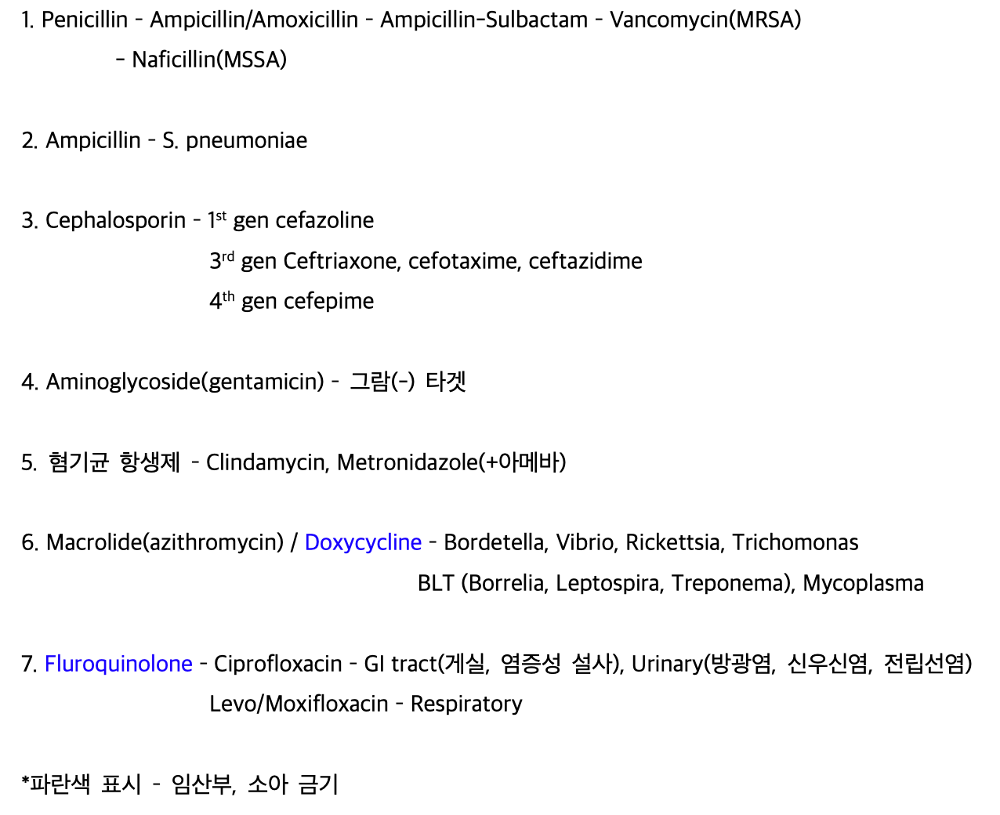
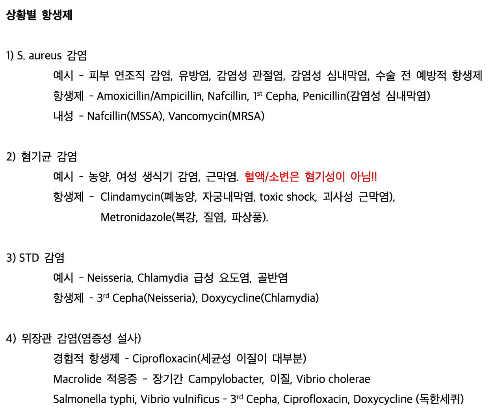
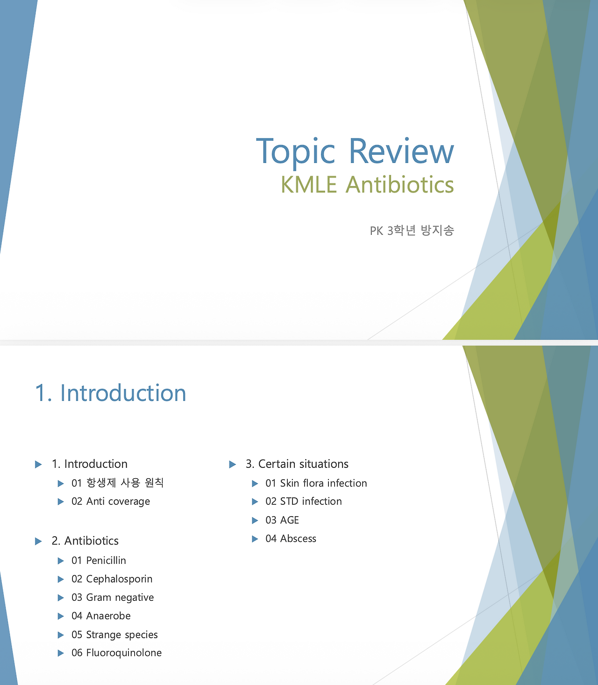

## 4. 구조화의 힘

항생제를 처음 공부할 때는 막막했습니다. 이름은 끝도 없이 많고, 비슷해 보이는데 미묘하게 다르고, 커버 범위도 제각각이었습니다. 하나하나 외우려고 할수록 더 헷갈렸습니다.

그래서 방식을 바꿨습니다.

항생제를 “목록”으로 보지 않고, 구조로 보려고 했습니다.

### # **1) 잘게 쪼개기**

워드 정리본 일부

먼저 크게 세 덩어리로 나눴습니다. β-lactam 계열, 그 외의 그람 음성 커버 약제, 그리고 특수 균종을 담당하는 약제들. 그 다음에는 세대별로, 그리고 커버 범위가 넓어지는 방향으로 다시 정리했습니다. 예를 들어 cephalosporin은 1세대에서 4세대로 갈수록 그람 음성 커버가 확장된다는 흐름을 먼저 이해했습니다.

이렇게 세 개씩 묶어보니 패턴이 보이기 시작했습니다.

1세대는 주로 그람 양성,

3세대는 그람 음성 확장,

4세대는 더 넓은 범위.

단어를 외우는 게 아니라, 이동 방향을 기억하는 느낌이었습니다.

### # **2) 상황별 재배치**

워드 정리본 일부

피부 감염, 호흡기 감염, 복강 내 감염처럼 임상 맥락 속에 넣어보니, 항생제가 더 이상 단독 정보가 아니었습니다. “이 균을 커버하려면 이 계열이 필요하다”는 식으로 인과가 생겼습니다.

결국 제가 한 일은 단순했습니다.

많은 약을 줄인 게 아니라, 묶었습니다.

- 세대별로 묶고

- 커버 범위로 묶고

- 임상 상황으로 묶고

이 과정을 거치자, 개별 약물은 구조 속의 위치를 갖게 되었습니다. 위치가 생기니 기억은 자연스럽게 따라왔습니다. 지금은 예전처럼 하나하나 떠올리려 애쓰지 않아도, 구조를 떠올리면 그 안에서 이름이 같이 따라 나옵니다. 항생제를 다 외웠다고 느끼는 순간은,

사실 다 기억했기 때문이 아니라,

구조를 기억하게 되었기 때문이라고 생각합니다.

### # **3) 설명하며 정리하기**

발표 PPT 표지 및 목차

일련의 과정을 거치며 자연스럽게 정리본을 만들게 되었고, 나중에는 동기들에게 설명하기 위해 PPT까지 제작하게 되었습니다. 강의를 준비하면서 느낀 건, 설명은 이해를 압축하는 과정이라는 점이었습니다. 내가 모호하게 알고 있던 부분을 더 명료화 하여 슬라이드 한 장으로 정리하고, 구조를 명확하고도 간결하게 표현할 수 있었습니다. 아래는 제가 강의한 파일의 링크입니다.

[https://drive.google.com/file/d/1boVPckI9mTgu89BxclFlgS9DWYtZg6If/view?usp=share_link](https://drive.google.com/file/d/1boVPckI9mTgu89BxclFlgS9DWYtZg6If/view?usp=share_link)

암기는 여전히 필요합니다.

하지만 구조 없이 암기하면 흩어집니다. 구조를 만든 뒤의 암기는 오래 갑니다. 항생제 정리는 제게 “구조화의 힘”을 처음으로 체감하게 해준 예시였습니다.