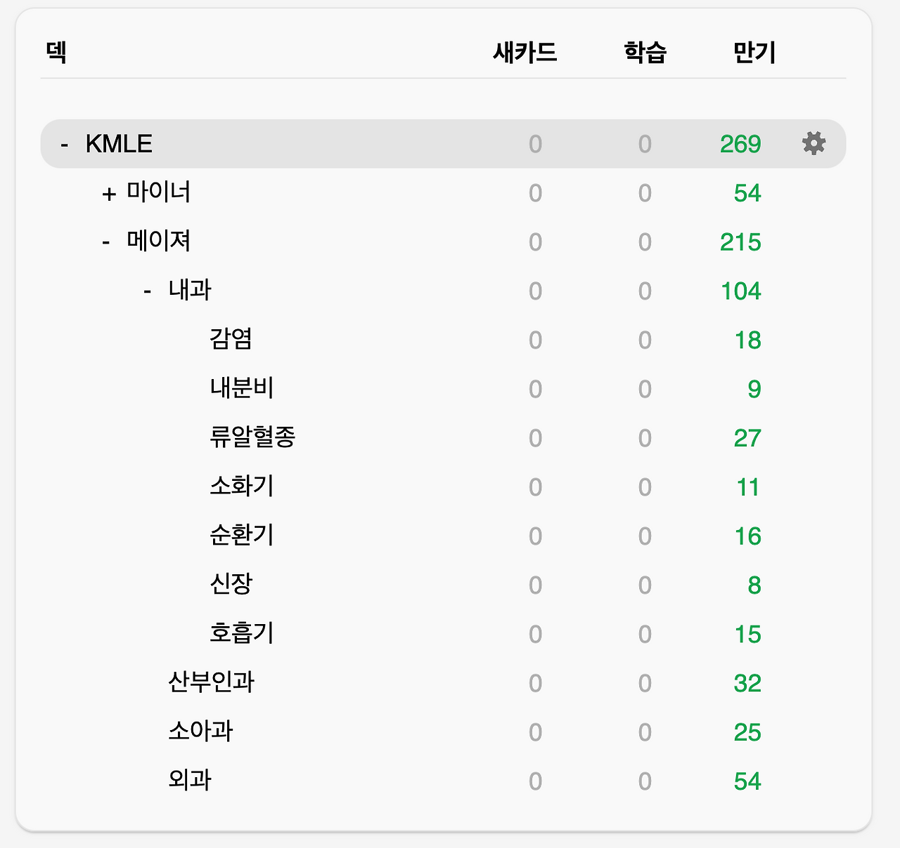
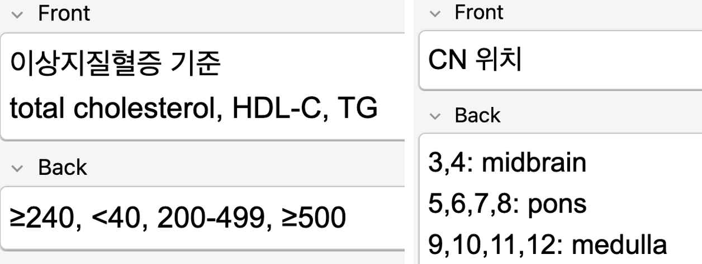

## 5. Anki는 구조 관리 도구

의대에 와서 가장 많이 들은 말은 결국은 암기라는 말이었습니다. 실제로 시험은 수치와 기준, 정의와 분류를 묻습니다. 그래서 한동안은 무작정 외우는 방식으로 공부를 해보기도 했습니다. 하지만 이해 없이 밀어 넣은 정보는 오래 가지 않았습니다. 시험이 끝나면 같이 사라졌습니다.

그래서 방식을 바꾸기로 했습니다.

암기를 줄이는 대신, 암기의 위치를 바꾸기로 했습니다. Anki를 단순 반복 암기 도구로 쓰지 않고, 이해 위에 남는 정보를 관리하는 시스템으로 쓰기 시작했습니다. 그때부터 공부의 결이 조금씩 달라졌습니다.

Anki 메인 화면

### # **1) 카드를 만드는 기준**

카드 예시

카드를 만들기 전에 먼저 묻습니다. 이건 이해할 것인가, 암기할 것인가. 병태생리, 인과관계, 질환의 흐름은 카드로 만들지 않습니다. 그건 노트에서 먼저 구조를 세웁니다.

왜 이런 증상이 나타나는지, 왜 이런 치료를 선택하는지 이해가 먼저입니다. Anki에는 구조 위에 남는 ‘표면 정보’만 올립니다.

예를 들어,

- 진단 기준 수치

- 응고인자 번호

- 항생제 세대별 성분명

- 특정 검사 cut-off 값

이건 이해를 아무리 해도 결국 정확히 기억해야 하는 정보입니다. 카드는 최대한 잘게 쪼갭니다. 한 카드에 한 질문만 둡니다.

질문은 짧고, 답도 간결하게. 문장을 길게 쓰지 않습니다. 회상 단위를 작게 만들수록 반복은 덜 부담스럽고, 복원은 더 정확해집니다. Anki는 이해를 만드는 공간이 아니라, 이해 위에 얹힌 사실을 단단하게 만드는 공간이라고 생각합니다.

### # **2) 활용 방식**

덱은 과목별로 나누지만, 실제로 돌릴 때는 상황 단위로 묶습니다. 예를 들어 항생제, 응급, 감별, 고열처럼 태그를 중심으로 다시 돌립니다. 시험은 과목 순서대로 나오지 않기 때문입니다. 문제를 읽는 순간, 과목명이 아니라 구조가 먼저 떠오르도록 훈련합니다.

Image Occlusion은 도표, 비교표, 알고리즘 구조에 사용합니다. 그림을 가리고, 키워드만 남깁니다. 카드를 보는 순간 전체 구조가 머릿속에서 복원되도록 설계합니다.

이 방식의 장점은 분명합니다.

암기가 이해를 방해하지 않습니다. 오히려 이해를 빠르게 호출하는 장치가 됩니다. 반복이 쌓일수록 정보는 따로 외운 느낌이 아니라, 구조 속에서 자연스럽게 튀어나옵니다.

### # **3) 본과 3학년 임종평에서 느낀 점**

임종평을 준비하면서 새로 외운 내용은 거의 없었습니다. 이미 만들어둔 카드들을 반복하는 것이 대부분이었습니다. 시험장에서 문제를 읽으면, 먼저 구조가 떠올랐습니다. 그 다음에 세부 수치와 기준이 따라왔습니다.

이전에는 시험이 끝나면 상당 부분을 잊어버렸지만, 이번에는 다르다는 느낌이 들었습니다. 단순히 단기 기억으로 밀어 넣은 것이 아니라, 여러 번 복원된 정보였기 때문이라고 생각합니다. 성적도 만족스러웠습니다. 본3 전국 21등의 성적은 제 방식이 틀리지 않았다는 확인처럼 느껴졌습니다. 하지만 더 의미 있었던 건 점수 자체가 아니라, 누적된 구조가 실제 시험장에서 작동했다는 경험이었습니다.

암기와 이해를 분리해서 관리한 시간이 결과로 이어졌다는 점에서, 이번 임종평은 작은 검증이었습니다.

저는 Anki를 암기 앱으로 사용하지 않습니다. 구조를 유지하는 시스템으로 사용합니다. 이해는 먼저 세우고, 암기는 그 위에 얹습니다. 둘을 분리하면 오히려 더 오래 남는다고 느꼈습니다.

이번 결과는 그 구조가 제대로 쌓이고 있었다는 신호였습니다. 앞으로도 같은 방식으로 축적해볼 생각입니다.