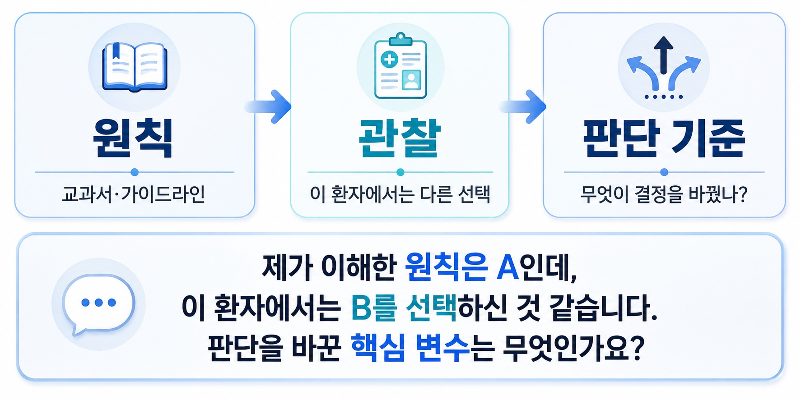
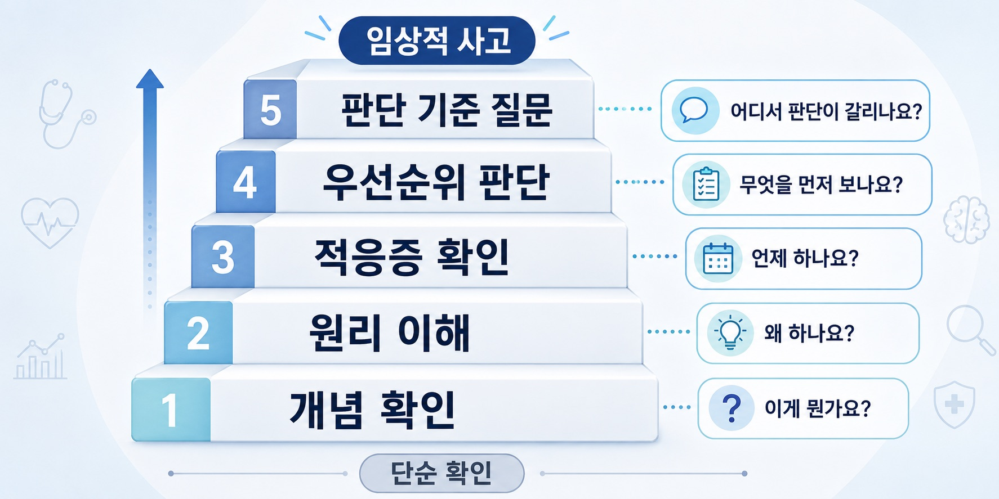

## 7. 좋은 질문은 무엇일까

임상실습을 돌면서 질문이 조금 달라졌습니다. 처음에는 질문을 해야 한다고 생각했습니다. 교수님 앞에서 멀뚱히 있으면 안 될 것 같고, 무언가 듣고 있다는 신호를 보내야 할 것 같고, 실습생으로서 적극성을 보여야 할 것 같았습니다.

그래서 질문을 하기는 했습니다. 하지만 그 질문들은 지금 생각해보면 조금 겉돌았습니다. 이 약은 뭔가요. 이 검사는 왜 하나요. 이 환자는 수술하나요. 이 질환의 증상은 뭔가요.

물론 이런 질문도 필요합니다. 모르는 것을 확인하는 일은 중요합니다. 하지만 어느 순간부터 느꼈습니다. 좋은 질문은 단순히 모르는 것을 묻는 질문이 아니었습니다. 좋은 질문은 판단이 갈리는 지점을 묻는 질문이었습니다.

좋은 질문은 지식의 빈칸이 아니라, 판단의 갈림길을 묻습니다.

### # 1) 질문도 사실 알아야 할 수 있다

질문을 많이 하는 것은 단순히 적극성의 문제처럼 보입니다. 하지만 실습을 돌면서 알게 된 것은 질문도 사실 뭘 알아야 할 수 있다는 점입니다. 아무것도 모르면 질문이 잘 나오지 않습니다. 무엇이 중요한지 모르고, 무엇이 예외인지 모르고, 어디에서 판단이 갈리는지도 보이지 않습니다.

그러면 질문은 대개 단순 확인형이 됩니다.

“이게 뭔가요?”

“왜 하나요?”

“이 약은 뭐예요?”

이 질문들은 출발점으로는 필요합니다. 하지만 계속 이 수준에만 머무르면 임상 판단의 구조를 보기 어렵습니다. 반대로 어느 정도 배경지식이 생기면 질문이 달라집니다. 교과서적으로는 A라고 알고 있는데, 이 환자에서는 왜 B를 선택했을까.

가이드라인상으로는 이렇게 되어 있는데, 실제 병동에서는 어디까지 적용될까. 이 기준은 어느 정도까지 원칙이고, 어느 지점부터 예외가 될까. 교수님은 이 상황에서 어떤 변수를 가장 크게 보고 판단하셨을까. 이런 질문은 배경지식이 조금 있어야 가능합니다.

질문은 무지의 표시만은 아닙니다. 오히려 어느 정도 이해가 쌓였을 때 내가 모르는 경계가 보이기 시작합니다.

### # 2) 실습 초반의 질문은 보여주기식에 가까웠다

실습 초반에는 질문이 약간 보여주기식이었습니다.

물론 나쁜 의미만은 아닙니다.

처음 병동에 들어가면 무엇을 봐야 할지 잘 모릅니다. 수술방에서도, 외래에서도, 병동에서도 정보는 너무 많고 저는 아직 초보입니다. 그러면 질문은 “제가 듣고 있습니다”라는 신호에 가까워집니다. 교수님이나 전공의 앞에서 아무 말도 하지 않는 것이 어색해서 질문을 합니다. 그런데 그때의 질문은 대개 단순 지식 확인에 가깝습니다.

무엇인지 묻고, 왜 하는지 묻고, 언제 하는지 묻습니다.

이것도 필요한 단계입니다.

하지만 그 단계에서는 질문자의 사고 구조가 깊게 드러나지는 않습니다. 질문을 하고 있지만, 아직 상황을 붙잡고 있는 것은 아닙니다.

### # 3) 관심 있는 분야를 깊게 보면 진짜 질문이 생긴다

질문이 달라진 것은 관심 있는 분야를 반복해서 보면서부터였습니다. 어떤 분야를 조금 더 깊게 보면 단순한 사실보다 예외가 먼저 보이기 시작합니다. 교과서에는 A라고 되어 있는데 실제 환자에서는 B를 선택하는 경우가 있습니다. 가이드라인에는 기준이 있지만 교수님은 환자의 다른 변수를 더 크게 보는 것처럼 보일 때가 있습니다.

수술 과정도 마찬가지입니다. 책에서는 단계가 깔끔하게 나뉘어 있지만 실제 수술에서는 조직 상태, 유착, 출혈, 해부학적 변이, 이전 수술력에 따라 판단이 계속 바뀝니다. 이때 질문은 더 이상 “질문해야 하니까 하는 질문”이 아닙니다. 진짜 궁금해서 나오는 질문이 됩니다. 왜 여기서는 원칙대로 가지 않았을까. 어디서부터 판단이 바뀌었을까. 이 상황에서 교수님은 무엇을 가장 먼저 보셨을까. 관심 있는 분야를 깊게 보면 질문이 자연스럽게 생깁니다. 질문은 억지로 만들어내는 말이 아니라 이해가 어느 정도 쌓였을 때 생기는 틈입니다.

### # 4) 좋은 질문은 어려운 질문이 아니다

좋은 질문은 어려운 질문이 아닙니다. 어려운 용어를 많이 쓰는 질문도 아닙니다. 오히려 좋은 질문은 판단이 갈리는 지점을 정확히 묻는 질문입니다.

예를 들면 이런 구조입니다.

제가 이해한 바로는 A가 원칙입니다. 그런데 이 환자에서는 B를 선택하신 것처럼 보였습니다. 이때 판단을 바꾼 핵심 변수는 C였나요, 아니면 다른 기준이 있었나요?

이 질문은 단순히 지식을 묻지 않습니다. 먼저 내가 이해한 원칙을 밝힙니다. 그다음 실제 관찰한 상황을 말합니다. 마지막으로 그 차이를 만든 판단 기준을 묻습니다.

이 구조가 좋은 이유는 분명합니다. 첫째, 기본 지식이 있음을 보여줍니다. 둘째, 실제 상황을 관찰했다는 것이 드러납니다. 셋째, 교수님이나 전공의의 판단 구조를 끌어낼 수 있습니다.

좋은 질문은 정답을 요구하지 않습니다. 판단의 기준을 묻습니다.

좋은 질문은 원칙, 관찰, 판단 기준으로 이루어진다.

### # 5) 질문에도 수준이 있다

질문은 대략 단계가 있습니다.

처음에는 개념을 묻습니다.

“이게 뭔가요?”

그다음에는 원리를 묻습니다.

“왜 하나요?”

조금 더 가면 적응증을 묻습니다.

“언제 하나요?”

그다음부터 질문은 판단에 가까워집니다. “A와 B 중 왜 A를 선택하나요?” “어디서부터 observation이 아니라 intervention으로 넘어가나요?” “교수님은 실제 임상에서 어떤 변수를 가장 크게 보시나요?”

이 단계로 가면 질문은 단순 지식 확인이 아닙니다. 임상 판단의 구조를 추적하는 일이 됩니다. 실습을 돌면서 질문이 늘었다는 것은 단순히 말이 많아졌다는 뜻이 아니었습니다. 상황의 해상도가 올라갔다는 뜻에 가까웠습니다.

이전에는 그냥 지나갔던 장면에서 판단의 갈림길이 보이기 시작한 것입니다.

### # 6) 수업마다 질문이 생기고, 수술마다 질문이 생긴다는 것

어느 순간부터 수업을 들으면 질문이 두세 개씩 생겼습니다. 수술을 보면 네다섯 개씩 궁금한 점이 생겼습니다.

이 변화가 꽤 크게 느껴졌습니다.

처음에는 질문을 해야 해서 질문했습니다. 나중에는 질문이 생겨서 질문했습니다.

둘은 완전히 다릅니다.

전자는 태도의 문제에 가깝습니다.

후자는 이해도의 문제입니다.

질문이 자연스럽게 생긴다는 것은 그 장면을 그냥 보고 있지 않았다는 뜻입니다. 어떤 원칙을 알고 있고, 그 원칙과 다른 상황을 감지했고, 그 차이를 설명할 기준이 궁금해졌다는 뜻입니다. 임상실습에서 질문 능력이 자란다는 것은 결국 관찰의 밀도가 올라가는 일입니다. 같은 장면을 봐도 더 많은 구조를 보는 것입니다.

### # 7) 질문을 보면 사람의 수준이 보인다

요즘은 질문을 들으면 그 사람이 어디까지 이해하고 있는지 조금 보이는 것 같습니다. 질문에는 생각보다 많은 정보가 들어 있습니다.

무엇을 핵심 문제로 보는지. 어떤 배경지식을 가지고 있는지. 어디서 판단이 갈린다고 보는지. 맥락을 잡고 있는지. 지엽적인 단어에만 매달리는지. 단순 사실을 묻는지, 사고 구조를 묻는지. 그래서 질문은 단순한 발화가 아닙니다.

그 사람의 사고 해상도를 보여주는 지표입니다. 좋은 질문을 하는 사람은 대개 상황을 어느 정도 구조화하고 있습니다. 모르는 것이 많더라도 자기가 어디를 모르는지 알고 있습니다. 반대로 질문이 계속 겉돌면 아직 문제의 중심을 잡지 못했을 가능성이 큽니다.

물론 이것을 남을 평가하는 도구로만 쓰고 싶지는 않습니다. 오히려 저 자신에게 더 많이 적용하게 됩니다. 내 질문이 겉돌고 있다면 아직 구조를 충분히 보지 못한 것입니다. 내 질문이 판단 기준으로 향하고 있다면 조금씩 임상적 사고에 가까워지고 있는 것입니다.

### # 8) 실습에서 바로 쓸 수 있는 질문의 형태

실습에서 좋은 질문을 만들기 위해 몇 가지 틀을 생각해볼 수 있습니다. 첫 번째는 원칙-예외형 질문입니다.

제가 이해한 원칙은 A인데, 이 환자에서는 B로 가신 것 같습니다. 이 경우 판단을 바꾼 핵심 변수는 무엇인가요?

두 번째는 threshold형 질문입니다.

이 상황에서 어느 정도까지는 observation을 하고, 어디서부터 intervention으로 넘어가시나요?

세 번째는 우선순위형 질문입니다.

이 환자에서 문제가 여러 개 있을 때, 교수님은 어떤 문제를 가장 우선순위로 보셨나요?

네 번째는 실제 임상형 질문입니다.

가이드라인상으로는 A라고 알고 있는데, 실제 외래나 병동에서는 어떤 경우에 B를 선택하시나요?

다섯 번째는 수술/시술형 질문입니다.

이 단계에서 가장 조심해야 하는 구조물이나 complication은 무엇이고, 그걸 피하기 위해 어떤 landmark를 보시나요?

이 질문들은 모두 공통점이 있습니다. 단순히 “무엇인가요?”라고 묻지 않습니다.

판단이 바뀌는 조건을 묻습니다.

좋은 질문은 원칙과 예외 사이의 판단 기준을 묻는다.

### # 9) 질문 능력은 적극성보다 이해도의 문제다

실습을 처음 돌 때는 질문을 많이 하는 사람이 적극적인 사람처럼 보였습니다.

물론 어느 정도 맞습니다.

입을 열어야 배울 기회가 생깁니다. 하지만 이제는 조금 다르게 생각합니다. 질문 능력은 적극성보다 이해도의 문제입니다. 정확히는 상황을 이해하고, 모르는 경계를 감지하고, 판단의 기준을 물을 수 있는 능력입니다.

좋은 질문은 내가 모른다는 사실만 드러내지 않습니다. 내가 어디까지 이해했고, 어디에서 막혔고, 무엇이 판단을 바꾸는지 알고 싶다는 것을 보여줍니다. 그래서 좋은 질문은 배우는 사람의 중요한 능력입니다. 질문을 잘한다는 것은 말을 잘한다는 뜻이 아닙니다. 생각을 잘 나누고 있다는 뜻입니다.

### # 10) 좋은 질문은 판단의 갈림길을 묻는다

임상실습을 돌면서 질문에 대한 생각이 바뀌었습니다. 처음에는 질문이 적극성의 표현이라고 생각했습니다. 지금은 질문이 사고 구조의 표현이라고 생각합니다. 질문이 좋아진다는 것은 내가 상황의 구조와 예외를 보기 시작했다는 뜻입니다.

단순히 더 많이 아는 것이 아니라, 어디에서 판단이 갈리는지 보기 시작했다는 뜻입니다. 의학은 결국 판단의 학문입니다.

검사 수치 하나, 증상 하나, 영상 소견 하나만으로 모든 것이 결정되지 않습니다. 환자의 상태, 위험도, 시간, 치료 가능성, 합병증, 예외 상황이 함께 들어옵니다. 그래서 좋은 질문은 지식의 빈칸을 채우는 질문에서 멈추지 않습니다.

판단의 구조를 묻습니다.

좋은 질문은 “무엇을 모르는가”가 아니라, “어디서 판단이 갈리는가”를 정확히 묻는 질문입니다. 그리고 그런 질문을 할 수 있게 되는 순간, 실습은 단순한 관찰이 아니라 임상적 사고를 배우는 시간이 됩니다.
