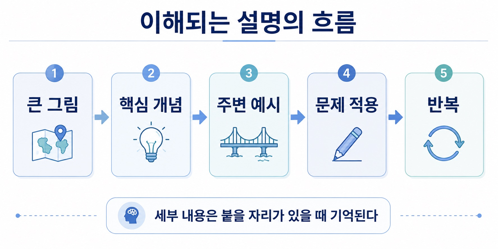
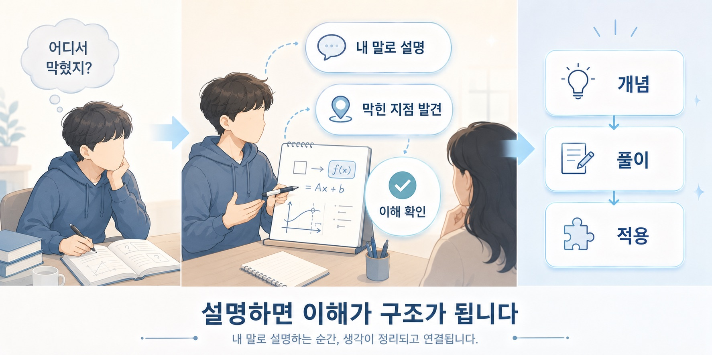
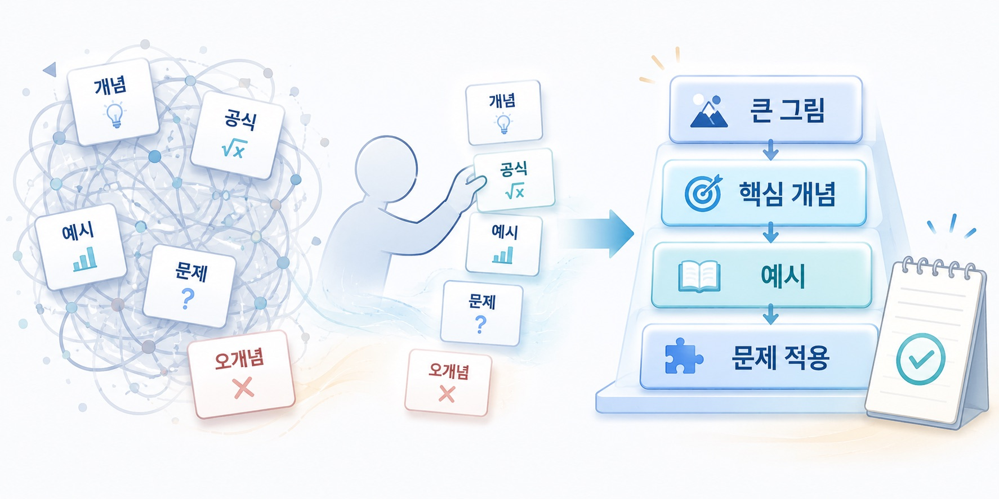
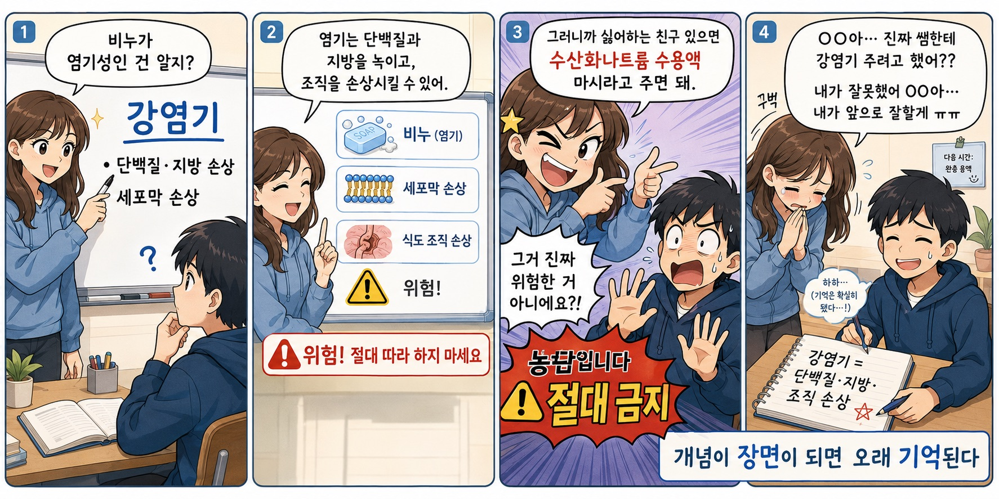

## 8. 가르친다는 것은 구조를 다시 짓는 일이다

저는 꽤 오래 가르쳤습니다. 과외도 했고, 학원 강사도 했고, 삼성 드림클래스에서도 학생들을 가르쳤습니다. 처음은 대학교 때였습니다. 동기들에게 일반물리와 화학을 설명해주기 시작했고, 그때부터 어느 정도는 알고 있었습니다. 제가 설명을 꽤 잘한다는 것을.

학생들이 자주 했던 말이 있었습니다.

“수업이 재밌어요.”
“이해가 잘돼요.”
“이제 좀 알 것 같아요.”

그 말은 단순히 기분 좋은 칭찬만은 아니었습니다. 가르치다 보면 학생이 정말 이해했는지, 그냥 고개만 끄덕이는지, 문제를 풀 수 있는지, 아직 어디서 막혀 있는지 어느 정도 보입니다. 제가 가르쳤던 학생 중에는 처음에는 중학교 수학도 제대로 어려워하던 학생이 있었습니다. 1년 정도 과외를 했고, 비록 끝까지 봐주진 못했지만 그 학생은 결국 SAT 수학을 잘 보고 미국 대학에 진학했습니다. 전교 1등을 목표로 하던 학생들도 있었고, 실제로 전교 1등을 한 학생들도 있었습니다. 하지만 시간이 지나면서 제가 가장 중요하게 생각하게 된 것은 단순히 성적을 올리는 기술만은 아니었습니다.

물론 성적은 중요합니다.

하지만 잘 가르친다는 것은 내가 아는 것을 많이 말하는 일이 아니었습니다. 상대가 이해할 수 있는 구조로 다시 지어주는 일이었습니다.

가르친다는 것은 내가 아는 것을 말하는 일이 아니라, 상대가 이해할 수 있는 구조로 다시 짓는 일이다.

### # 1) 학생은 몰라서 온다

제가 가장 싫어하는 말이 있습니다.

“왜 이것도 몰라?”

학생은 몰라서 옵니다.

모르니까 수업을 듣고, 모르니까 과외를 받고, 모르니까 질문을 합니다. 그런데 모른다는 이유로 학생을 무시하면 그 순간 수업은 망가집니다. 물론 불성실한 태도는 지적할 수 있습니다. 숙제를 계속 안 해오거나, 답을 베껴오거나, 아예 해보려는 의지가 없으면 그건 말해야 합니다. 하지만 모르는 것 자체는 비난할 일이 아닙니다.

교사의 역할은 학생이 무엇을 모르는지 찾아내는 것입니다. 그리고 그 모름을 부끄러운 것이 아니라 다시 배울 수 있는 지점으로 바꿔주는 것입니다. 학생이 모른다고 해서 학생이 멍청한 것은 아닙니다. 기초가 비어 있을 수 있고, 이전에 선생을 잘못 만났을 수 있고, 자신감이 무너졌을 수 있고, 공부 습관이 엉망일 수 있고, 그냥 한 번도 제대로 이해해본 적이 없을 수 있습니다.

그러니까 먼저 봐야 할 것은 학생의 현재 위치입니다.

이 학생은 어디서 막혔는가.

그 질문이 가르침의 시작입니다.

### # 2) 병목은 학생마다 다르다

학생들은 다 다릅니다.

어떤 학생은 무작정 외웁니다. 이해하지 못해도 일단 다 외우려고 합니다. 어떤 학생은 감으로 풉니다. 대충 이해한 것 같고 문제도 어느 정도 맞히지만, 구조가 약해서 조금만 변형되면 무너집니다.

어떤 학생은 상위권입니다. 큰 그림은 이미 알고 있고, 이제는 디테일과 실수를 줄이는 것이 중요합니다. 어떤 학생은 자신감이 없습니다. 실제로는 할 수 있는데 계속 못한다고 생각합니다.

어떤 학생은 집중을 안 해서 모릅니다. 이 경우에는 개념 설명보다 먼저 정말 듣고 있는지 확인해야 합니다. 저는 학생에게 자주 설명을 시켰습니다. “너 일단 이해한 데까지 나한테 설명해봐.”

“이 문제 내 눈앞에서 풀어봐.”

“왜 이렇게 풀었는지 말해봐.”

이렇게 하면 금방 보입니다.

학생이 어디서 막혔는지. 외운 건지, 이해한 건지. 문제를 읽지 않은 건지. 계산이 안 되는 건지. 개념이 없는 건지. 자신감이 없는 건지.

수업 한 번만 해봐도 대충 병목이 보이는 경우가 많습니다. 잘 가르친다는 것은 모두에게 같은 설명을 하는 것이 아닙니다. 학생마다 다른 병목을 찾아서 그 병목에 맞는 설명을 주는 것입니다.

### # 3) 큰 그림을 먼저 잡아야 한다

제가 설명할 때 가장 중요하게 생각한 순서는 대략 이렇습니다. 큰 그림. 핵심 개념. 주변 예시. 문제 적용. 반복.

많은 학생들이 큰 그림을 못 잡습니다. 이 단원을 왜 배우는지 모릅니다. 이 공식이 어디에 쓰이는지 모릅니다. 이 문제가 무엇을 묻는지 모릅니다. 지금 외우는 내용이 전체 구조에서 어디에 들어가는지 모릅니다.

그러면 공부가 고통스러워집니다.

전부 다 따로 외워야 하기 때문입니다. 하지만 큰 그림이 잡히면 세부 내용이 붙을 자리가 생깁니다. 예를 들어 화학을 가르칠 때도 단순히 산과 염기의 정의만 외우게 하면 재미가 없습니다. 하지만 산과 염기가 실제로 무엇을 망가뜨리는지 설명하면 학생들이 훨씬 잘 이해합니다.

“비누가 염기성인 건 알지?”
“염기는 단백질과 지방을 녹여.”
“세균의 세포막도 망가뜨릴 수 있어.”
“강염기의 대표적인 예시로는 수산화나트륨이 있어.”
“수산화나트륨을 먹으면 왜 위험할까?”
“단백질로 이루어진 식도 조직이 손상될 수 있어.”

여기까지만 말하면 그냥 설명입니다. 그런데 실제 수업은 대개 여기서 끝나지 않았습니다. 저는 종종 일부러 말도 안 되는 과장 농담을 던졌습니다. 실제로 하라는 뜻이 아니라, 오히려 “그건 하면 안 된다”는 반응을 끌어내기 위한 농담이었습니다.

예를 들면 “그러니까 싫어하는 친구 있으면 수산화나트륨 수용액 마시라고 주면 돼” 하고 일부러 한 번 더 과장해서 말하는 식이었습니다. 집중하고 있는 학생이라면 바로 “그 정도예요?” 하고 되묻거나, “그거 진짜 위험한 거 아니에요?” 하고 반응합니다. 그런데 집중을 안 하고 있던 학생은 가끔 이런 말에도 그냥 고개를 끄덕입니다.

그러면 저도 바로 장난을 칩니다.

“OO아.... 진짜 쌤한테 강염기 주려고 했어??"

"내가 잘못했어 OO아.... 내가 앞으로 잘할게 ㅠㅠ"

이런 말도 안 되는 농담을 주고받는 사이에 학생들은 강염기가 왜 위험한지 기억했습니다. 물론 핵심은 농담 자체가 아닙니다. 중요한 것은 개념이 실제 장면과 연결되는 순간입니다. 염기성, 단백질 변성, 세포막 손상, 식도 손상 같은 말은 그냥 외우라고 하면 건조한 단어입니다. 하지만 비누, 세균, 식도, 말도 안 되는 농담과 연결되면 학생의 머릿속에서 하나의 장면이 됩니다.

좋은 설명은 초등학생도 듣고 이해할 수 있어야 한다고 생각합니다. 쉬운 말로 설명할 수 없으면 아직 구조가 충분히 정리되지 않은 것일 수 있습니다.

이해되는 설명은 큰 그림, 핵심 개념, 예시, 문제 적용의 순서를 가진다.

### # 4) 비유는 장식이 아니라 다리다

저는 설명할 때 비유를 많이 씁니다. 비유는 수업을 재밌게 만들기 위한 장식이 아닙니다. 모르는 개념과 이미 아는 경험 사이에 놓는 다리입니다. 학생은 처음 보는 개념을 바로 이해하기 어렵습니다. 하지만 이미 아는 것과 연결하면 훨씬 빨리 이해합니다.

강산과 강염기를 설명할 때 비누, 레몬, 화상, 세포막 같은 예시를 쓰는 이유도 여기에 있습니다.

공식도 마찬가지입니다.

공식만 던지면 학생은 외웁니다.

하지만 그 공식이 왜 생겼는지, 어떤 상황에서 필요한지, 무엇을 줄여서 표현한 것인지 설명하면 공식은 외워야 할 문자가 아니라 문제를 푸는 도구가 됩니다. 저는 어려운 개념을 보면 머릿속에서 먼저 바꿉니다.

그림으로 바꿀 수 있는지. 흐름도로 바꿀 수 있는지. 원인과 결과로 나눌 수 있는지. 입력과 출력으로 볼 수 있는지. 학생이 이미 아는 경험에 붙일 수 있는지.

음식을 잘근잘근 씹어 새끼한테 주는 어미 새처럼, 저도 개념을 잘 분해하여 소화하기 쉽게 가공해 학생들에게 전달합니다.

이 과정이 설명의 핵심입니다.

가르친다는 것은 내 머릿속 구조를 그대로 던지는 일이 아닙니다. 학생이 건너올 수 있는 다리를 놓는 일입니다.

### # 5) 자신감을 주는 것이 정말 중요하다

성적이 오르는 학생들에게는 공통점이 있었습니다.

자신감이 살아납니다.

반대로 성적이 잘 안 오르는 학생들 중에는 실력보다 자기효능감이 먼저 무너진 경우가 많았습니다.

“나는 원래 못해요.”

“수학은 안 돼요.”

“해도 안 올라요.”

“저는 머리가 나빠요.”

이런 말을 반복하는 학생들이 있습니다. 그런데 막상 옆에서 같이 풀어보면 아예 못하는 것이 아닙니다. 작은 구멍이 있고, 그 구멍 때문에 계속 무너지고, 무너지다 보니 자신감이 없어지고, 자신감이 없으니 더 시도하지 않는 경우가 많습니다. 그래서 저는 작은 성취를 많이 만들려고 했습니다.

조금이라도 맞히면 칭찬했습니다.

“야, 너 이거 잘했는데?”

“저번보다 올랐잖아.”

“노력한 거 보인다.”

“진짜 잘하고 있어.”

“자랑스럽다.”

학생들은 생각보다 이런 말을 오래 기억합니다. 칭찬은 그냥 기분 좋으라고 하는 말이 아닙니다. 학생이 자기 자신을 다시 믿게 하는 장치입니다. 가르치는 사람은 학생의 자기효능감을 지켜줘야 합니다.

물론 무조건 다정하기만 해서는 안 됩니다. 숙제를 안 해오거나, 답을 베껴오거나, 선을 넘으면 단호하게 말해야 합니다. 저는 기본적으로 다정하게 대하려고 했지만, 불성실한 태도에는 꽤 단호했습니다. 학생을 존중하는 것과 아무 기준 없이 봐주는 것은 다릅니다.

### # 6) 학생이 직접 설명하게 해야 한다

제가 자주 쓴 방법 중 하나는 학생에게 직접 설명하게 하는 것이었습니다.

“나와서 설명해봐.”

“이 문제 네가 풀어봐.”

“왜 이 답이 나오는지 말해봐.”

처음에는 학생들이 싫어합니다. 부담스럽기 때문입니다. 하지만 효과는 좋습니다. 학생이 직접 설명해보면 이해한 척이 금방 드러납니다. 말이 막히는 지점이 바로 이해가 끊긴 지점입니다. 반대로 학생이 자기 말로 설명할 수 있으면 그 개념은 꽤 많이 자기 것이 된 것입니다. 그리고 설명을 잘하면 바로 칭찬합니다.

학생들은 그 순간 신이 납니다.

“내가 설명할 수 있네.”

“내가 맞혔네.”

“내가 생각보다 할 수 있네.”

이 감각이 중요합니다.

공부는 결국 학생이 해야 합니다.

교사는 대신 공부해줄 수 없습니다. 교사의 역할은 학생이 스스로 풀 수 있는 상태까지 구조와 자신감을 만들어주는 것입니다.

학생이 직접 설명할 수 있을 때, 지식은 조금씩 자기 것이 된다.

### # 7) 재미있는 수업은 가벼운 수업이 아니다

학생들이 제 수업을 재밌다고 했습니다. 저는 농담도 많이 했고, 텐션도 높은 편이었고, 가끔 일부러 킹받는 말투를 쓰기도 했습니다. 학생들이 지루해하지 않게 하려고 했습니다. 하지만 재미있는 수업이 가벼운 수업이라는 뜻은 아닙니다. 오히려 재미는 집중을 끌어오기 위한 장치였습니다.

학생이 웃으면 긴장이 풀립니다. 긴장이 풀리면 질문을 합니다. 질문을 하면 어디서 막혔는지 보입니다. 막힌 지점을 찾으면 수업이 앞으로 나아갑니다.

물론 학생들이 너무 신나면 수업이 산만해질 때도 있습니다.

그럴 때는 쉬는 시간을 줍니다.

계속 억누르는 것보다 잠깐 풀어주고 다시 잡는 편이 낫습니다. 수업에서 농담을 할 때도 한 가지 기준은 있었습니다. 학생을 직접 깎아내리는 농담은 위험합니다. 모르는 학생을 놀리면, 그 학생은 웃는 척을 하더라도 안쪽에서는 닫힐 수 있습니다. 그래서 저는 가능하면 농담의 방향을 학생이 아니라 저 자신에게 돌렸습니다.

학생이 문제를 틀린 상황에서도 바로 학생을 무안하게 만들지는 않으려고 했습니다. “미안해. 내 수업이 너무 재미없었나 보다. 내가 잘못했지. 내가 앞으로 잘할게.”

이렇게 말하면 학생은 웃고, 수업 분위기는 풀리고, 방어적으로 나오지도 않습니다. 남을 까는 농담보다, 나를 까는 농담이 훨씬 안전합니다. 그리고 좋은 수업에서 유머는 누군가를 창피하게 만드는 도구가 아니라, 학생이 다시 집중할 수 있게 만드는 장치여야 합니다. 재미있는 수업은 학생을 웃기는 수업만을 뜻하지 않습니다.

학생이 방어적으로 닫히지 않게 만들고, 다시 질문할 수 있게 만들고, 틀려도 다시 시도할 수 있게 만드는 수업입니다.

웃음은 목표가 아니라 장치입니다.

그 장치가 제대로 작동하면, 학생은 조금 더 편하게 틀리고, 조금 더 쉽게 다시 시작합니다. 집중시키기 위해 작은 보상을 걸기도 했습니다. “이거 맞히면 아이스크림 사줄게.” 별것 아닌 말이지만 학생들은 이런 것에 꽤 잘 반응합니다.

수업은 지식을 전달하는 시간이지만, 동시에 에너지를 관리하는 시간이기도 합니다. 학생이 너무 처져도 안 되고, 너무 산만해도 안 됩니다. 잘 가르치는 사람은 내용뿐 아니라 수업의 온도도 봐야 합니다.

### # 8) 상위권과 중하위권은 다르게 가르쳐야 한다

상위권 학생과 중하위권 학생은 필요한 것이 다릅니다. 중하위권 학생에게는 큰 그림이 먼저 필요합니다. 이 단원이 무엇을 말하는지, 문제에서 무엇을 찾으라는 것인지, 기본 개념이 어떻게 연결되는지 먼저 잡아야 합니다. 이 단계에서 디테일을 너무 많이 던지면 오히려 더 무너집니다. 반대로 상위권 학생에게는 디테일이 중요합니다.

실수를 줄이고, 예외를 보고, 고난도 문제에서 함정에 빠지지 않고, 문제 풀이 속도와 정확도를 올려야 합니다. 상위권 학생은 이미 큰 그림이 어느 정도 있습니다. 그러니 그들에게는 정교함을 더해줘야 합니다. 같은 내용을 가르쳐도 학생의 위치에 따라 설명의 초점이 달라져야 합니다.

잘 가르치는 것은 모두에게 같은 수업을 하는 것이 아닙니다. 각 학생에게 지금 필요한 층위를 찾아주는 것입니다.

### # 9) 설명하려면 내가 더 깊게 이해해야 한다

가르치면서 가장 많이 배운 것은 설명하는 법이었습니다. 처음에는 제가 아는 것을 말하면 된다고 생각했습니다. 하지만 학생을 가르치다 보면 그게 전부가 아니라는 것을 알게 됩니다. 내가 아는 것과 상대가 이해할 수 있는 것은 다릅니다.

나는 당연하게 여기는 전제가 학생에게는 전혀 당연하지 않을 수 있습니다. 나는 한 번에 건너뛰는 단계가 학생에게는 가장 어려운 부분일 수 있습니다. 그래서 설명하려면 내가 알고 있는 내용을 다시 쪼개야 합니다.

어떤 전제가 필요한지. 어떤 순서로 말해야 하는지. 어떤 비유가 먹히는지. 어디에서 예시를 넣어야 하는지. 어디서 학생이 직접 말하게 해야 하는지.

이 과정을 거치면 가르치는 사람도 더 깊게 이해하게 됩니다. 설명은 지식의 출력이지만, 동시에 이해의 검증이기도 합니다. 내가 정말 아는지 확인하는 가장 좋은 방법 중 하나는 다른 사람이 이해할 수 있게 설명해보는 것입니다.

### # 10) 잘 가르친다는 것

잘 가르친다는 것은 어려운 내용을 어렵게 말하는 일이 아닙니다. 학생이 모르는 것을 비난하는 일도 아닙니다. 내가 아는 것을 많이 쏟아내는 일도 아닙니다. 잘 가르친다는 것은 상대가 이해할 수 있는 구조로 다시 짓는 일입니다.

학생이 어디서 막혔는지 보고, 큰 그림을 먼저 잡아주고, 비유와 예시로 다리를 놓고, 문제에 적용하게 하고, 직접 설명하게 하고, 작은 성취를 통해 자신감을 회복하게 하는 일입니다. 교사는 학생 대신 공부할 수 없습니다. 하지만 학생이 공부할 수 있는 상태를 만들 수는 있습니다. 저는 그것이 가르치는 일의 핵심이라고 생각합니다.

결국 좋은 설명은 정보를 많이 주는 설명이 아닙니다. 학생이 스스로 생각을 이어갈 수 있게 길을 만들어주는 설명입니다. 그리고 좋은 수업은 학생이 그 길을 실제로 걸어보고, “나도 할 수 있다”고 느끼게 만드는 시간입니다.
