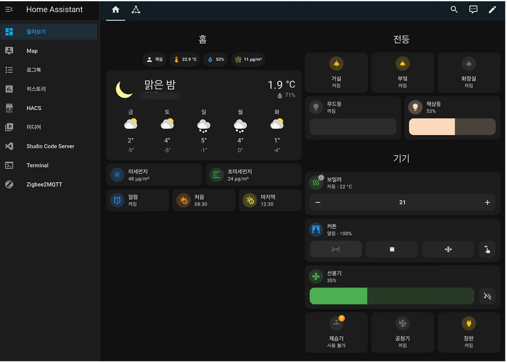
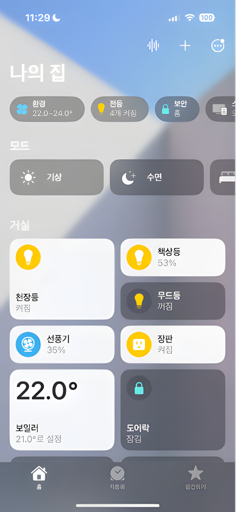

## 3. 집이 살아있다, HAOS

집을 자동화하기 전까지는 공간을 그냥 배경으로 생각했습니다. 하지만 반복되는 판단이 보이기 시작하면서, 공간을 변수로 보기 시작했습니다.

밤이 되면 조명을 줄이고

움직임이 감지되면 동선에 맞춰 조명을 켜고 온·습도가 벗어나면 장비를 조정하는 일 이건 감각이 아니라 구조의 문제였습니다.

### # **1) 구조를 코드로 옮기다**

HAOS 대시보드

HAOS(Home Assistant OS)를 선택한 이유는 단순합니다. 로컬 서버 기반으로 안정적으로 돌아가고, Zigbee 센서를 쉽게 연동할 수 있기 때문입니다.

구성은 다음과 같습니다.

- Raspberry Pi에 HAOS 설치

- Zigbee 3.0 동글 연결

- 재실/모션 센서, 온·습도 센서 연동

- 자동화는 YAML 기반으로 설계

핵심은 자동화 로직입니다.

- 입력: 센서 값

- 조건: 시간대, 이전 상태, 위치 정보

- 출력: 조명 제어, 알림 전송, 기기 작동

예를 들어 PM 2.5 수치가 25를 넘으면, 공기청정기 자동화가 시작됩니다. 그렇지만 제 위치가 집이 아니거나, 창문이 열려있으면 자동화가 멈춥니다. 모든 조건을 만족하면 비로소 공기청정기를 작동하는 출력이 발생합니다.

이때 중요한 건 “코드를 어떻게 짜는가”가 아니라, 조건을 얼마나 명확히 정의하는가였습니다.

### # **2) 공간을 데이터로 매핑하다**

자동화만으로는 부족했습니다.

공간과 데이터를 1:1로 대응시키고 싶었습니다. AutoCAD와 SketchUp으로 공간을 모델링하고, 각 센서 위치를 좌표 기반으로 정리했습니다.

거실 = node_living

침실 = node_bed

화장실 = node_bath

이렇게 노드를 나누고,

각 노드의 상태를 변수처럼 관리했습니다. 이 단계에서 공간은 더 이상 “방”이 아니라 상태를 가진 데이터 구조가 되었습니다. 이 개념이 확장되어 Ward-HAOS라는 구상으로 이어졌습니다 . 집에서 검증한 로직을 병동 구조에 투영하면, 디지털 트윈 기반 관리가 가능하겠다는 생각이 들었습니다.

### # **3) 보안과 안정성**

Apple HomeKit

외부 접속은 DDNS + HTTPS로 암호화했습니다 . Homebridge를 통해 Apple HomeKit과 연동해, iOS 환경에서 직관적으로 제어할 수 있도록 구성했습니다. 런타임 반응 속도는 체감상 1초 이내입니다. 로컬 서버 기반이라 클라우드 의존성이 적습니다.

기술적으로 복잡한 시스템은 아닙니다. 하지만 반복되는 판단을 안정적으로 처리하는 구조는 충분히 구현되었습니다.

자동화는 편의를 위한 기술이 아닙니다. 사고를 명확하게 정의하는 과정입니다.

어떤 입력을 받을 것인지

어떤 조건에서 반응할 것인지

어떤 출력을 낼 것인지

이 세 가지를 정확히 쓰지 못하면

코드는 작동하지 않습니다.

HAOS는 저에게 기술 프로젝트가 아니라 사고 구조를 현실에 옮겨본 첫 실험이었습니다.