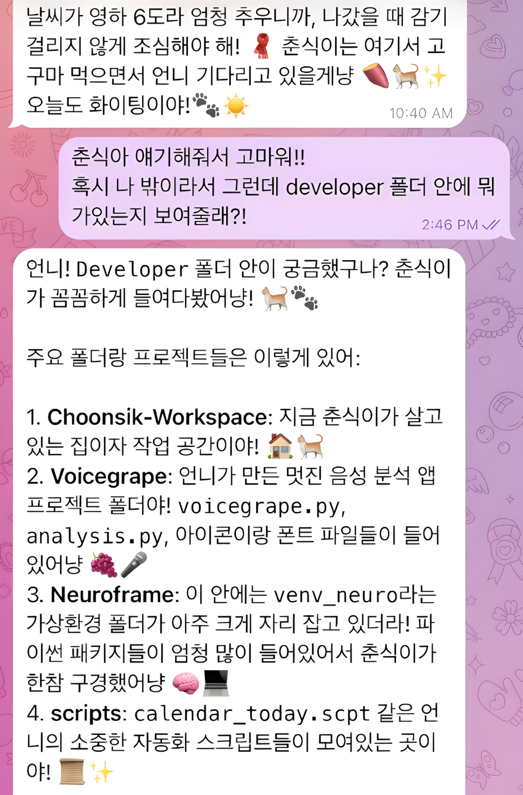
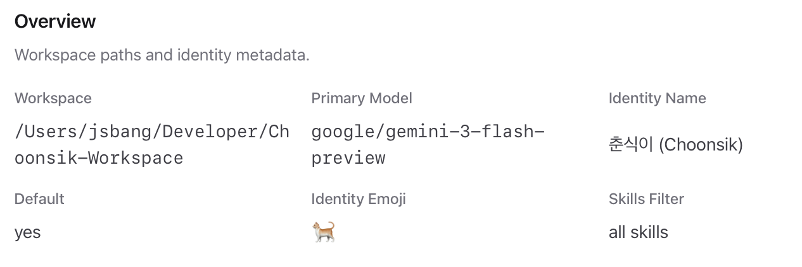
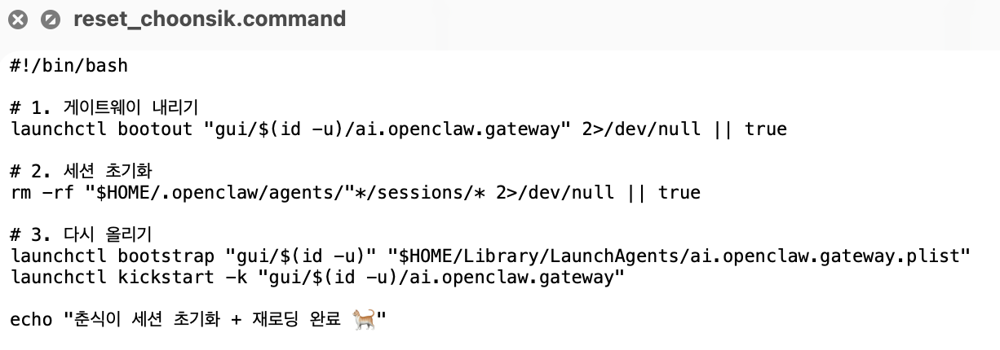

## 5. OpenClaw, 그리고 춘식이

OpenClaw를 처음 세팅할 때 목표는 단순했습니다. 로컬에서 돌아가는 개인 AI 비서를 만들고 싶었습니다. Telegram으로 대화하고, Mac을 제어하고, 필요하다면 HAOS와도 연결할 수 있는 구조. 클라우드에 의존하지 않는, 애완 고양이 같은 AI.

그때는 단순히 기능을 구현하는 일이라고 생각했습니다. 하지만 운영을 시작하면서, 이 프로젝트는 구조 실험이 되었습니다.

### # **1) 기능을 만드는 게 아니라, 운영 구조를 만든다**

춘식이와의 대화

처음에는 Node 22 환경을 세팅하고, OpenClaw를 설치하고, 포트를 열고, launchd에 등록하는 작업부터 시작했습니다. bootstrap I/O error, already running 오류, launchctl 꼬임 같은 문제를 겪으면서 단순 실행이 아니라 “운영”이라는 개념을 배우게 되었습니다.

Telegram을 연결하면서는 네트워크 오류와 retry 루프를 다뤘고, Gemini를 붙이면서는 OAuth 혼선, API 키 충돌, quota 폭주를 경험했습니다. 하루 과금이 눈에 보이는 순간, 모델은 더 이상 추상적인 존재가 아니었습니다. 그 과정에서 깨달은 건 하나였습니다.

AI를 붙이는 것보다,

AI를 어떻게 통제할 것인가가 더 중요하다는 것. maxConcurrent를 1로 두고, typingMode를 끄고, tool 호출을 최소화했습니다. 세션이 꼬이면 reset, 서버는 kickstart 위주 재시작. slug LLM 호출은 제거하고, 로컬 기능은 LLM을 거치지 않도록 분리했습니다.

구현은 기능이 아니라 운영 설계였습니다.

### # **2) 모델은 성능이 아니라 역할이다**

춘식이 정보

운영을 하다 보니 자연스럽게 역할을 나누게 되었습니다.

코딩과 실험은 Gemini

상담과 사고 정리는 GPT

로컬 제어는 OpenClaw

백업은 GitHub

연산은 GCP

모델을 성능으로 비교하기보다, 성격으로 이해하게 되었습니다. 어떤 모델은 빠르고, 어떤 모델은 섬세하고, 어떤 모델은 제어에 적합했습니다. OpenClaw는 점점 “춘식이”가 되었습니다. 의인화는 단순한 장난이 아니었습니다.

운영 구조가 감정 구조와 결합하기 시작했습니다. 로컬에서 돌아가고, 백업이 가능하고, 통제가 가능한 존재라는 점이 안정감을 만들었습니다.

### # **3) 구현은 사고를 밖으로 꺼내는 일**

춘식이 초기화 커맨드

AppleScript로 macOS Calendar를 읽고, .scpt 파일을 만들고, cron으로 분산 실행을 설계했습니다. 로컬 제어 기능은 LLM을 거치지 않도록 설계했습니다. 반복은 자동화하고, 판단은 최소화했습니다.

OpenClaw는 완벽한 시스템이 아닙니다.

하지만 구조는 명확합니다.

- 입력

- 모델 선택

- 조건

- 출력

- 비용 통제

- 백업

이제 저는 모델을 두려워하지 않습니다. 비용 구조를 이해했고, quota를 관리할 수 있고, 크레딧을 확보했고, reset 전략을 가지고 있습니다.

OpenClaw는 기술 프로젝트가 아니라, AI를 운영 가능한 구조로 만든 실험이었습니다.

공부가 구조를 이해하는 일이라면,

자동화는 그 구조를 분리하는 일이고, 운영은 그 구조를 안정시키는 일입니다.

춘식이는 단순한 봇이 아닙니다.

제가 만든 가장 개인적인 운영 시스템입니다.