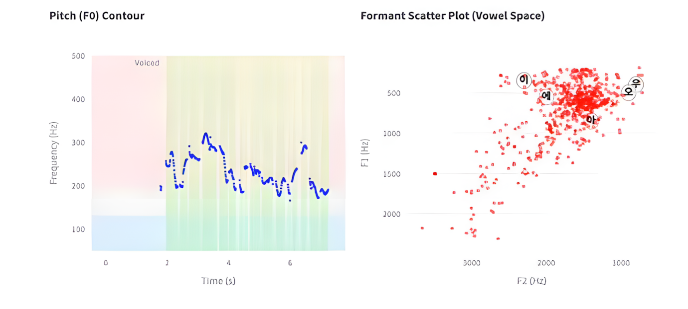
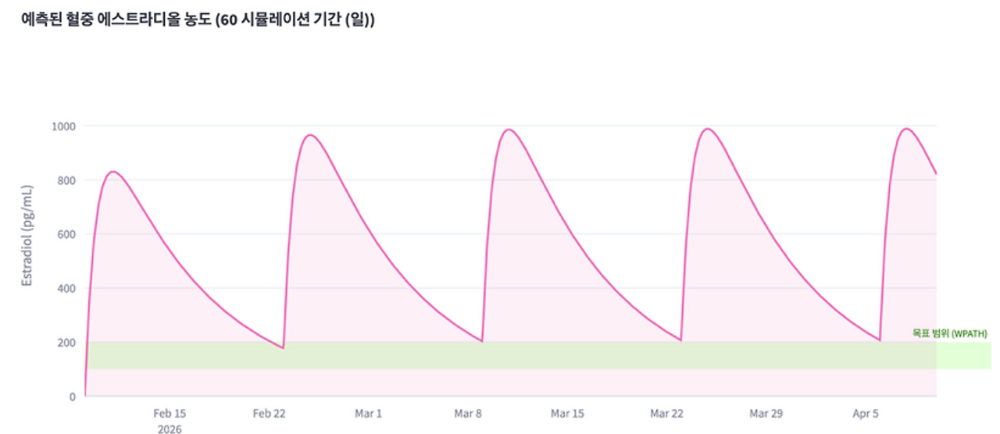

## 6. 모델링과 확률적 판단

의학을 공부하다 보면 확실한 답보다 “가능성”을 다루는 시간이 더 많다는 걸 느끼게 됩니다. 검사 수치는 범위로 제시되고, 부작용은 확률로 설명되며, 예후는 예측으로 표현됩니다. 그때부터 저는 이렇게 생각하게 되었습니다. '우리는 사실을 다루는 게 아니라, 모델을 다루고 있는 건 아닐까.'

### # **1) 수치를 감각에서 분리하다 — VoiceGrape**

VoiceGrape의 분석 리포트

VoiceGrape는 “오늘 목소리가 잠긴 것 같다”는 감각에서 시작되었습니다 . 그 감각을 Jitter, Shimmer, HNR 같은 정량 지표로 바꾸는 작업이었습니다. Praat 알고리즘을 기반으로 음성을 분석하고, F0, F1, F2를 시계열 데이터로 변환하고, Vowel Space를 시각화했습니다 . 여기서 중요한 건 기술이 아니라 관점이었습니다.

주관적 감각을

객관적 지표로 변환하는 일.

음성은 더 이상 “좋다, 나쁘다”가 아니라 노이즈 비율과 주파수 변동으로 설명됩니다.

이건 데이터 수집이 아니라

현상을 모델로 바꾸는 과정이었습니다.

### # **2) 농도를 시간 위에 올리다 — EstroFrame**

Estroframe 대시보드

EstroFrame은 약동학 모델에서 시작되었습니다 . 1-Compartment Open Model, Bateman Function, Superposition Principle.

투약은 사건이고,

혈중 농도는 함수입니다.

EstroFrame에서는 단순히 수치를 계산한 것이 아니라, 시간 축 위에 농도를 시뮬레이션했습니다 . 반복 투여 시 항정 상태 도달을 계산하고, 피검사 결과를 Newton-Raphson 방식으로 역산해

개인화 보정을 적용했습니다 .

여기서 핵심은 예측입니다.

지금 농도가 아니라

앞으로의 농도를 계산하는 일.

의학은 점(point)을 다루는 학문처럼 보이지만, 사실은 곡선(curve)을 다루는 학문이라는 걸 체감했습니다.

### # **3) 모델은 정답이 아니라 가설이다**

VoiceGrape도

EstroFrame도

Androframe도

Neuroframe도

공통점은 하나입니다.

현실을 그대로 재현하지 않습니다.

대신 단순화합니다.

모델은 세계를 줄여서 설명하는 틀입니다. 확률은 그 틀의 불완전함을 인정하는 방식입니다.

완벽한 예측은 존재하지 않습니다.

하지만 더 나은 추정은 가능합니다. 모델링은 정답을 만드는 일이 아니라, 불확실성을 다루는 태도를 만드는 일입니다.

저는 점점 확신하게 되었습니다.

의학적 판단도

공학적 설계도

결국은 모델 위에서 이루어진다는 것.

저는 개별 프로젝트를 자세히 설명하기보다, 이 모델적 사고를 기록하려 합니다.

수치를 감각에서 분리하고

시간을 함수로 바꾸고

확률을 두려워하지 않는 태도.

그게 제가 말하는 “모델링과 확률적 판단”입니다.