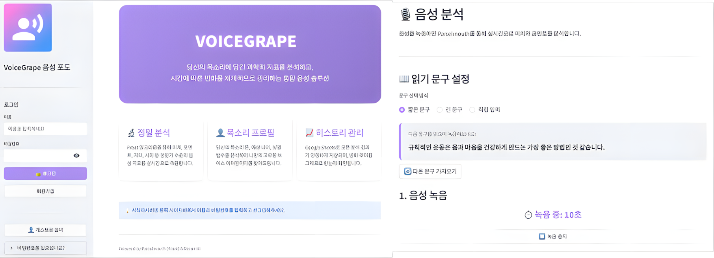
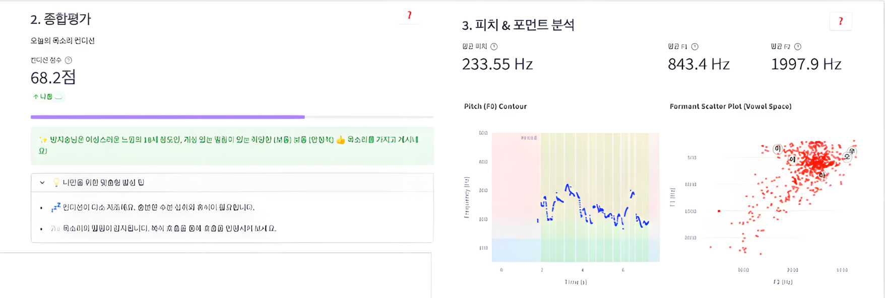

## 7. 감각의 객관화, VoiceGrape

“오늘 목소리가 잠긴 것 같다.”

이 문장은 감각의 언어입니다.

하지만 의학은 감각이 아니라 지표로 말합니다. VoiceGrape는 음성이라는 연속 신호를 정량적 파라미터로 환원하는 시도에서 시작되었습니다.

주소: [https://voicegrape.streamlit.app](https://voicegrape.streamlit.app/)

레포: [https://github.com/MedicalFrame/VoiceGrape](https://github.com/MedicalFrame/VoiceGrape)

### # **1) 음성을 신호로 해석하다**

VoiceGrape UI

VoiceGrape는 Praat 기반의 음향 분석 엔진을 백엔드에 탑재한 플랫폼입니다 . 사용자의 음성을 입력받으면 자기상관(Autocorrelation)과 LPC(Linear Predictive Coding) 알고리즘이 작동하여 기본 주파수(F0)와 포먼트(Formant)를 추출합니다 .

파형은 연속적이지만,

분석은 이산적입니다.

### # **2) 시계열과 좌표계로 음성을 펼치기**

이 순간 음성은 더 이상 “목소리”가 아니라 Frequency Perturbation과 Amplitude Perturbation의 집합이 됩니다. Jitter는 주파수 변동률을 나타내고 Shimmer는 진폭 변동률을 나타냅니다 . HNR(Harmonic-to-Noise Ratio)는 신호 대 잡음 비율을 통해 기식성을 정량화합니다 . 감각은 설명이 아니라, 데이터 구조가 됩니다.

### # **3) 시간-주파수 공간으로 확장하다**

VoiceGrape 분석 리포트

VoiceGrape는 단일 스냅샷 분석에 머물지 않습니다. Pitch Contour는 시간 축 위에서의 F0 변화를 보여주고, Vowel Space Map은 조음 공간의 이동을 시각화합니다 .

이는 단순 시각화가 아닙니다.

시간 영역(Time Domain)과 주파수 영역(Frequency Domain)을 동시에 해석하는 작업입니다. 음성은 파형이 아니라 상태 전이(state transition)의 연속으로 보입니다. 또한 분석 결과를 시계열 데이터로 축적하여 추적 관찰이 가능하도록 설계했습니다 . 단일 측정이 아니라 longitudinal monitoring 구조입니다.

이 순간, 음성은 감각적 사건이 아니라 디지털 바이오마커(digital biomarker)가 됩니다.

### # **4) 모델은 현실을 단순화한다**

VoiceGrape는 음성을 완벽하게 재현하지 않습니다.

대신 모델링합니다.

Praat 기반 알고리즘은 복잡한 음향 신호를

소수의 파라미터로 환원합니다 .

이 환원은 손실(lossy compression)에 가깝습니다.

하지만 해석 가능성을 얻습니다.

모델은 현실의 축소판입니다.

완전하지 않지만 일관됩니다.

VoiceGrape를 만들면서 저는 확신하게 되었습니다. 의학적 판단은 결국 확률적 모델 위에서 이루어진다는 것.

“목소리가 잠겼다”는 감각은

Jitter 상승이라는 가설로 치환됩니다.

그리고 그 가설은

시간에 따라 검증됩니다.

VoiceGrape는 음성을 분석하는 도구가 아니라, 감각을 모델로 변환하는 실험이었습니다.
