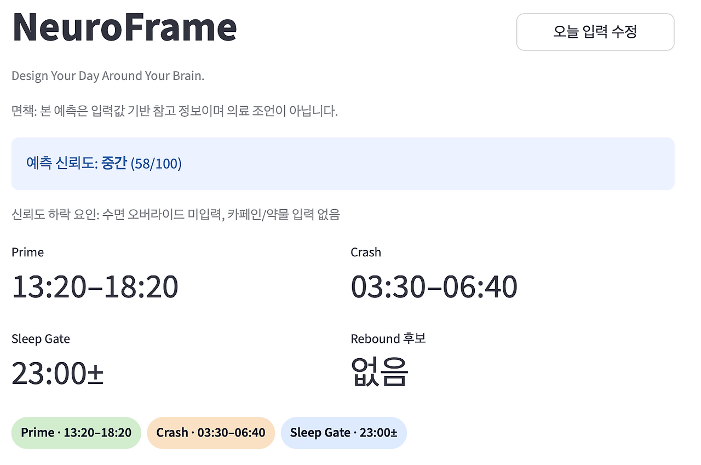
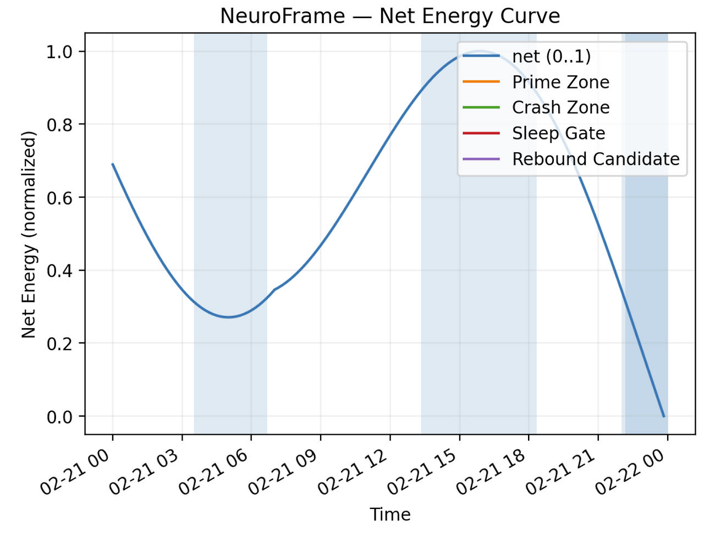
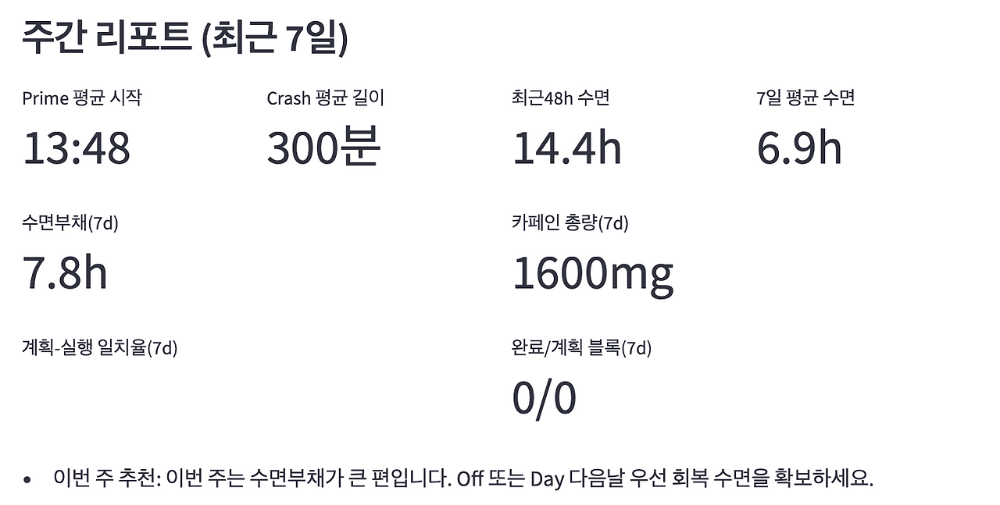

## 8. 상태를 모델로, NeuroFrame

NeuroFrame은 생산성 앱으로 시작하지 않았습니다. 솔직히 말하면, 인턴과 레지던트를 하게 될 미래가 두려워서 시작했습니다. 당직과 외래, 수술과 회진 사이에서

에너지는 바닥나고,

집중력은 흔들리고,

감정은 둔해질 것 같았습니다.

그때 이런 생각이 들었습니다.

시간을 관리하는 게 아니라,

상태를 관리해야 하는 건 아닐까.

주소: [https://neuroframe.streamlit.cloud](https://neuroframe.streamlit.cloud/)

레포: [https://github.com/MedicalFrame/NeuroFrame](https://github.com/MedicalFrame/NeuroFrame)

### # **1) 일정이 아니라 상태를 기록하다**

하루 패턴 예측

기존 생산성 도구는 대부분 일정 중심입니다. 하지만 저는 다른 질문을 던졌습니다.

오늘의 에너지는 어땠는가.

집중도는 몇 점이었는가.

감정은 어떤 패턴을 보였는가.

NeuroFrame의 Today Input 시스템은 하루의 상태를 구조화된 데이터로 입력하도록 설계되었습니다.

에너지

집중도

감정 상태

근무 형태

자기 평가 메모

단순 로그가 아닙니다.

이후 분석을 위한 상태 변수입니다. 감각을 수치로 바꾸는 작업이라는 점에서, VoiceGrape와 닮아 있습니다.

### # **2) 패턴을 보는 순간 판단이 바뀐다**

총 에너지 그래프

일주일이 지나면 Weekly Metrics가 생성됩니다.

평균 에너지

근무 유형별 피로도 분포

당직 후 회복 곡선

자기평가 추세

이 데이터는 단순 통계가 아닙니다.

패턴을 보여주는 구조입니다.

예를 들어,

당직 다음 날의 에너지가 항상 3 이하라면 그건 의지 문제가 아니라 회복 설계의 문제입니다.

NeuroFrame은

“나는 왜 이렇게 힘들지?”라는 질문을 “어떤 패턴이 반복되고 있지?”로 바꿉니다.

이건 시간 관리가 아니라

인지 프레임 관리입니다.

### # **3) 코칭은 개입이다**

Coach 엔진

NeuroFrame의 핵심은 Coach 엔진입니다.

입력된 상태에 따라

리프레이밍 메시지를 제안하고

번아웃 위험을 경고하고

성취 패턴을 강화하는 피드백을 제공합니다.

이건 단순 통계 출력이 아닙니다.

행동 유도형 구조입니다.

제가 처음 이 시스템을 만든 이유는 “내가 망가지지 않기 위해서”였습니다. 하지만 구조를 만들다 보니 생각이 확장되었습니다.

ADHD 환자

고강도 전문직 종사자

지속적인 감정 노동을 하는 사람들

이들에게도 동일한 문제가 존재합니다.

일정은 관리하지만

상태는 관리하지 못합니다.

NeuroFrame은

시간이 아니라 신경 인지 프레임을 다룹니다.

NeuroFrame은 완성된 솔루션이 아닙니다.

다만 하나의 가설입니다.

우리는 스스로를 더 잘 관리할 수 있을까.

의지가 아니라 데이터로.

인턴과 레지던트가 되기 전,

저는 먼저 제 상태를 모델로 만들었습니다.

NeuroFrame은

미래의 저를 위한 예방적 실험입니다.

그리고 어쩌면,

같은 환경에 놓인 다른 사람들에게도 작은 도구가 될 수 있을지 모릅니다.
