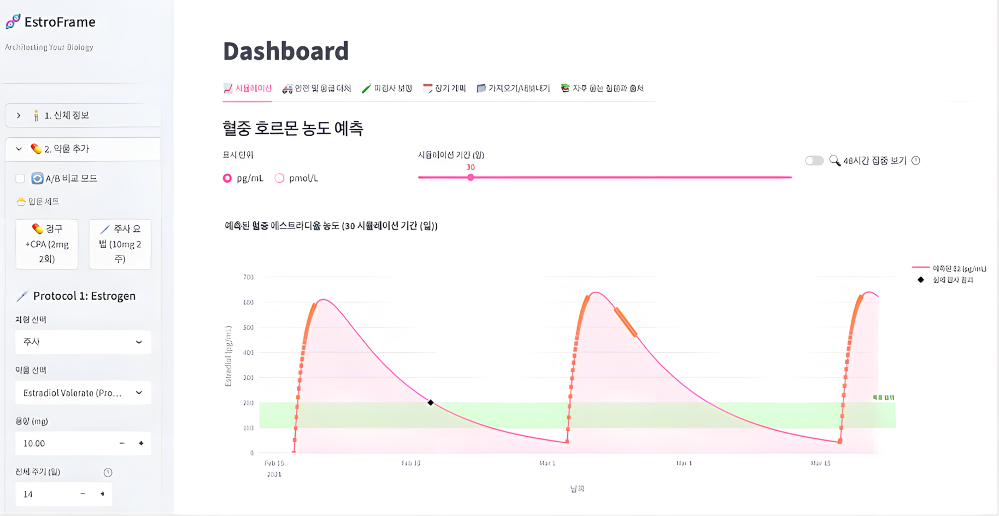
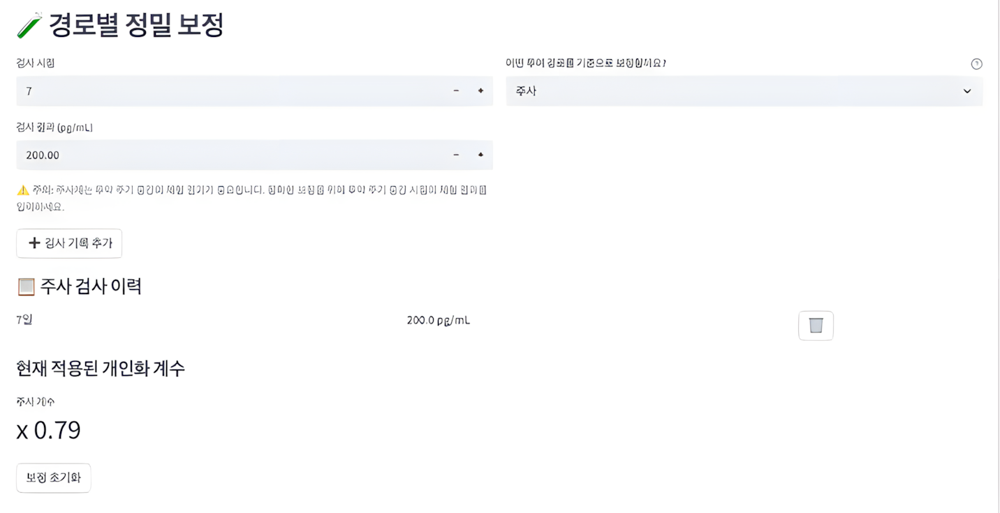
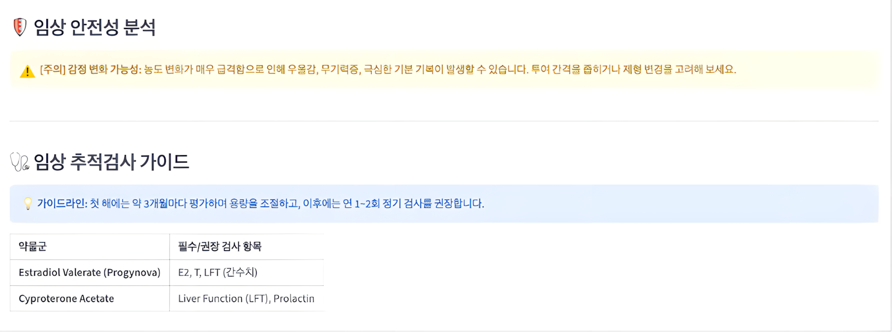

## 9. CDSS prototype, EstroFrame

강동성심병원 LGBTQ 센터에서 특성화 실습을 하면서 한 가지 의문이 생겼습니다. '호르몬 요법은 왜 이렇게 경험적으로 조정될까.'

가이드라인은 존재하지만,

개인별 대사 특성과 농도 변동을 실시간으로 예측하는 도구는 부족했습니다. 3~6개월 간격의 혈액 검사는 급격한 농도 변화를 충분히 포착하지 못합니다 . 저는 내분비내과에 관심이 많았습니다. 호르몬을 “수치”가 아니라 “함수”로 보고 싶었습니다. 그래서 EstroFrame을 만들게 되었습니다.

주소: [http://estroframe.streamlit.app](http://estroframe.streamlit.app/)

[**EstroFrame**

은 트랜스젠더 여성(MTF) 및 호르몬 대체 요법(HRT)을 진행하는 분들을 위한 입니다.

https://estroframe.streamlit.app/?utm_medium=social](http://estroframe.streamlit.app/)

레포: [https://github.com/JisongFoundation/EstroFrame](https://github.com/JisongFoundation/EstroFrame)

### # **1) 농도를 시간 위에 올리다**

EstroFrame 대시보드

EstroFrame은 1-Compartment Open Model을 기반으로 합니다 . 핵심 엔진은 Bateman Function이며, 반복 투여 시 Superposition Principle을 적용해 총 혈중 농도를 계산합니다 .

투약은 사건(event)이고

혈중 농도는 시간 함수입니다.

- Peak

- Trough

- Average concentration

이 값들은 단순한 숫자가 아니라,

시간-농도 곡선의 특정 지점입니다 .

의학은 점을 기록하지만,

약동학은 곡선을 다룹니다.

EstroFrame은 그 곡선을 시각화합니다.

### # **2) 개인을 모델 안에 넣다**

개인화 보정

문헌상의 반감기를 그대로 적용하면 개인차로 인해 오차가 발생합니다 . 그래서 저는 Newton-Raphson 기반의 역산 알고리즘을 적용해, 실제 피검사 결과를 바탕으로 대사율(Clearance)과 분포용적을 보정했습니다 .

이 과정은 단순 계산이 아닙니다.

환자의 실제 데이터 →

모델 파라미터 보정 →

개인화된 농도 곡선 생성

이 구조는 디지털 트윈에 가깝습니다. 환자의 내분비계를 완벽히 재현하는 것이 아니라, 예측 가능한 범위 안에서 근사하는 모델입니다. 여기서 저는 정밀의학이 “정확함”이 아니라 “보정 가능한 모델”이라는 걸 체감했습니다.

### # **3) CDSS라는 방향**

임상 안전성 분석 및 추적감사 가이드

EstroFrame은 계산기가 아니라 CDSS(Clinical Decision Support System) 프로토타입입니다 . WPATH SOC 8 가이드라인을 반영하고

VTE 위험도 평가를 내장하고

수술 전 wash-out period를 예측합니다 . 이건 처방을 대신하는 시스템이 아닙니다.

의사결정을 보조하는 모델입니다.

농도가 100~200 pg/mL 범위에 있는지 수술 당일 잔존 농도가 안전 기준선 아래인지

의사는 판단을 내립니다.

모델은 가설을 제공합니다.

강동성심병원 LGBTQ 센터 실습은 저에게 임상적 질문을 던져주었습니다. EstroFrame은 그 질문에 대한 공학적 응답이었습니다.

호르몬은 단순한 수치가 아닙니다.

시간에 따라 움직이는 곡선입니다.

그리고 그 곡선을 이해하는 순간,

내분비학은 감각이 아니라 모델이 됩니다. EstroFrame은 정밀의학을 완성한 시스템이 아닙니다. 다만 호르몬을 디지털 트윈으로 바라본 첫 시도입니다.
