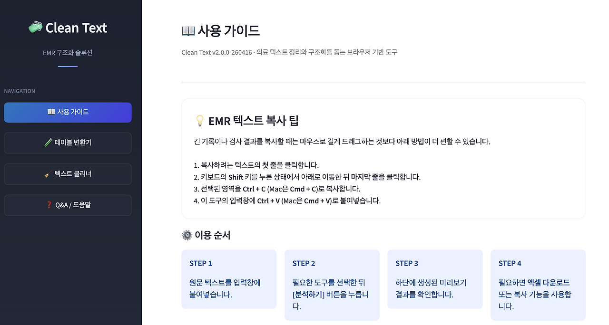
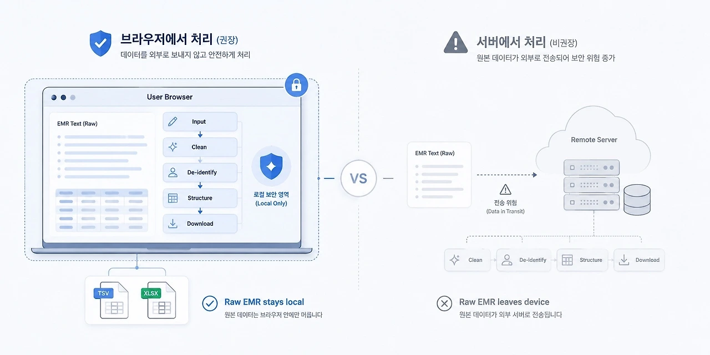
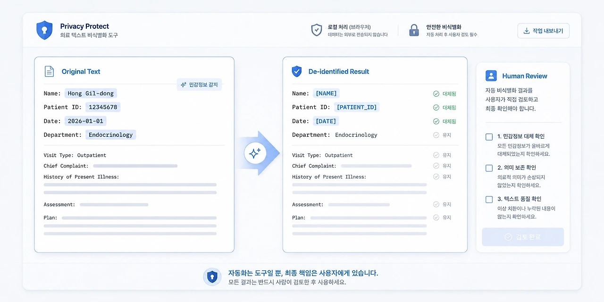
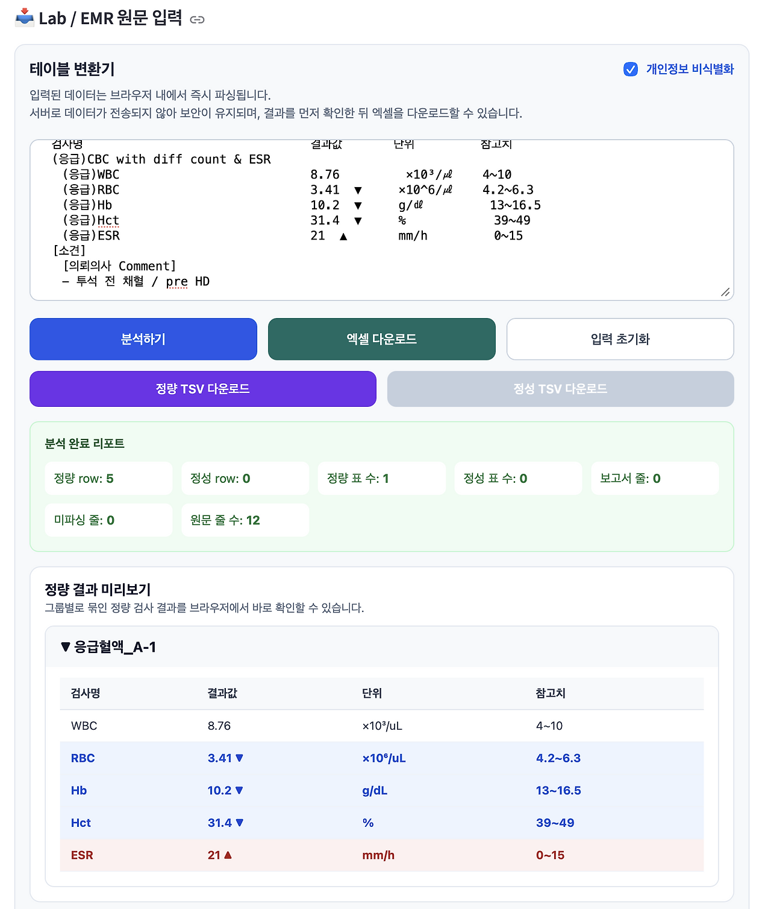

## 3. 로컬 기반 EMR 파싱, CleanText

의료 텍스트를 다룰 때 가장 먼저 떠올려야 하는 것은 편리함이 아닙니다.

보안입니다.

EMR에는 많은 정보가 들어 있습니다. 환자의 증상과 병력, 검사 결과, 처방, 진료 기록이 남습니다. 그 안에는 환자를 직접 식별할 수 있는 정보도 있고, 겉으로는 사소해 보이지만 맥락에 따라 식별 가능성이 생기는 정보도 있습니다. 그래서 의료 텍스트를 다루는 도구를 만들 때 가장 먼저 정해야 하는 것은 기능이 아니었습니다.

어디까지 처리할 것인가.

어디까지 저장하지 않을 것인가.

어디까지 서버로 보내지 않을 것인가. CleanText는 이 질문에서 시작했습니다.

[CleanText]

개발 기간: 2026년 2월 ~ 2026년 6월

버전: v2.0.0

형태: 의료 텍스트 정리 및 검사 결과 구조화 도구

스택: Python, Streamlit, React, TypeScript, Vite, Docker, Google Cloud Run

핵심 구조: 기존 Python 중심 파싱 흐름을 브라우저 기반 처리 구조로 전환

주요 기능: EMR 텍스트 정리, 검사 결과 표 변환, 비식별화, Excel/TSV 내보내기 설계 원칙: 원문 텍스트의 서버 의존도를 줄이고, 핵심 처리 로직을 가능한 한 브라우저 안에서 수행

주소: [cleantext.jisong.dev](http://cleantext.jisong.dev/)

레포: [https://github.com/MedicalFrame/Clean_Text](https://github.com/MedicalFrame/Clean_Text)

CleanText 첫 화면

### # 1) 서버로 보내면 편하지만, 위험도 커진다

텍스트 처리 도구를 만드는 가장 쉬운 방식은 서버에 원문을 보내고, 서버에서 처리한 뒤 결과를 돌려주는 것입니다.

구현은 단순해집니다.

원문을 서버로 받고,

파싱하고,

비식별화하고,

표로 바꾸고,

결과를 다시 보여주면 됩니다.

하지만 의료 텍스트에서는

이 구조가 곧바로 부담이 됩니다.

서버가 원문을 받는 순간,

그 서버는 의료 데이터를 취급하는 공간이 됩니다.

저장하지 않겠다고 해도,

전송 과정이 생기고,

로그가 남을 수 있고,

예외 상황이 생길 수 있습니다.

개발자 입장에서는 편한 구조일 수 있지만, 의료 데이터 입장에서는 위험한 구조일 수 있습니다. 그래서 저는 CleanText를 만들 때 가능한 한 원문 처리의 중심을 브라우저 쪽으로 옮기고 싶었습니다.

사용자가 붙여넣은 텍스트를

먼저 사용자의 브라우저 안에서 정리하고,

구조화하고,

비식별화하고,

엑셀이나 TSV로 내보내는 방식.

핵심은 단순합니다.

원문을 덜 움직이게 하는 것.

의료 데이터 보안에서 중요한 것은

나중에 붙이는 경고 문구가 아니라

처음부터 원문이 어디로 흐르는지 정하는 구조라고 생각했습니다.

브라우저 기반 처리 구조

### # 2) 비식별화는 버튼 하나로 끝나지 않는다

CleanText에는 비식별화 기능이 들어 있습니다. 환자명, 직원명, 날짜, 식별자 패턴 등을 감지해 자동으로 가리는 방향을 시도합니다.

하지만 저는 자동 비식별화를

완성된 안전장치로 생각하지 않습니다. 자동 비식별화는 어디까지나 보조 장치입니다. 의료 텍스트는 형식이 일정하지 않습니다.

병원마다 다르고,

과마다 다르고,

의료진마다 다르고,

복사해온 화면마다 다릅니다.

어떤 정보는 명확한 식별자처럼 보이지만, 어떤 정보는 문맥 안에서만 식별 가능성이 생깁니다.

날짜 하나가 문제 될 수도 있고,

희귀한 수술명이나 특이한 병력 조합이 간접 식별 가능성을 만들 수도 있습니다.

그래서 비식별화는

“자동으로 처리했으니 안전하다”로 끝날 수 없습니다.

도구는 후보를 가리고,

사용자는 다시 확인해야 합니다.

CleanText에서 중요하게 생각한 것도 이 지점이었습니다. 원문과 정리된 결과를 비교할 수 있게 하고, 구조화 결과를 사람이 다시 볼 수 있게 하고, 중요한 내용은 최종 활용 전에 직접 확인하도록 하는 것.

의료 데이터 도구는

사람의 확인을 없애는 방향이 아니라 사람이 더 잘 확인할 수 있게 만드는 방향이어야 한다고 생각했습니다.

비식별화 과정

### # 3) 정리, 구조화, 내보내기

CleanText의 기능은 크게 세 가지로 나눌 수 있습니다.

첫째, 텍스트를 정리합니다.

EMR 특유의 줄바꿈 오류,

전각 공백,

특수 마커,

복사 과정에서 생긴 노이즈를 줄입니다.

둘째, 검사 결과를 구조화합니다.

수치 중심의 정량 데이터와

정성·반정량 결과를 구분하고,

보고서형 텍스트는 별도로 분리합니다.

셋째, 결과를 내보냅니다.

정리된 결과를 표로 보고,

필요하면 TSV나 Excel 파일로 저장할 수 있게 합니다.

이 과정은 화려하지 않습니다.

하지만 의료 데이터 작업에서는

이런 앞단의 정리가 매우 중요합니다.

AI 모델에 무엇을 넣을 것인지.

연구용 데이터로 어떤 값을 추출할 것인지. 나중에 실제 판단과 비교할 수 있는 구조를 어떻게 만들 것인지.

이 모든 것은

입력 데이터가 정리되어 있어야 가능합니다. CleanText는 답을 내리는 도구가 아닙니다.

오히려 답을 묻기 전에

질문에 들어갈 재료를 정리하는 도구에 가깝습니다.

Lab → Excel 변환 결과 화면

### # 4) 보안은 기능이 아니라 아키텍처다

의료 데이터 도구에서 보안은

마지막에 붙이는 기능이 아닙니다.

“주의해서 사용하세요”라는 문구만으로는 부족합니다. 어떤 데이터가 어디에서 처리되는지,

어떤 데이터가 서버로 가는지,

무엇이 저장되고 무엇이 저장되지 않는지, 사용자가 어느 지점에서 다시 확인하는지. 이런 구조가 먼저 정해져야 합니다. CleanText는 완벽한 보안 시스템이 아닙니다. 의료기관의 보안 절차를 대체하지도 않습니다.

자동 비식별화가 모든 위험을 없애주지도 않습니다. 결과의 최종 확인은 여전히 사람의 몫입니다. 다만 제가 이 도구를 만들면서 정한 원칙은 분명했습니다. 원문을 불필요하게 움직이지 않을 것.

핵심 처리는 가능한 한 브라우저 안에서 끝낼 것. 자동화된 결과를 사람이 다시 확인할 수 있게 할 것. AI에 넣기 전에 먼저 정리하고 줄일 것. 저는 이것이 의료 데이터 도구의 기본 태도라고 생각했습니다.

기술적으로 더 편한 방식이 있더라도, 의료 데이터에서는 먼저 경계를 그어야 합니다. 그 경계 안에서 도구를 설계해야 합니다.

CleanText는 경계 안의 도구 설계의 첫 시도였습니다. 의료 텍스트를 더 편하게 다루기 위한 도구이기 전에, 의료 텍스트를 더 조심스럽게 다루기 위한 도구. 제가 브라우저 안에서 EMR을 정리하려 한 이유는

바로 거기에 있습니다.
