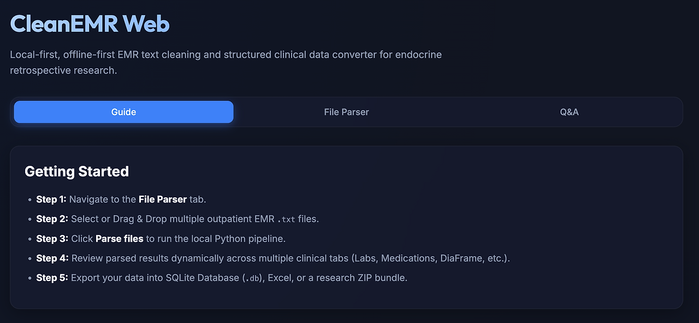
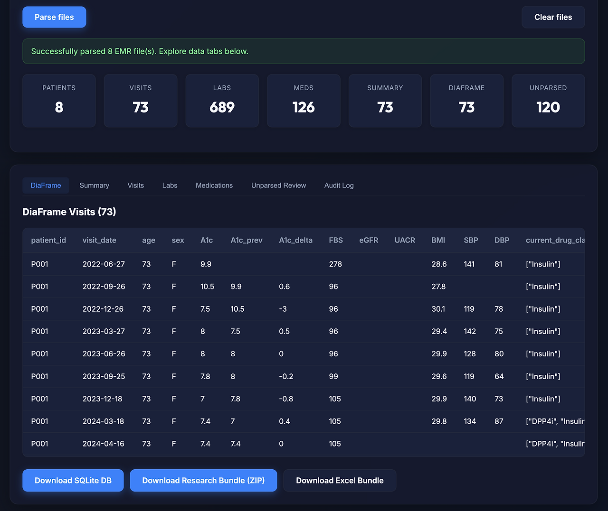
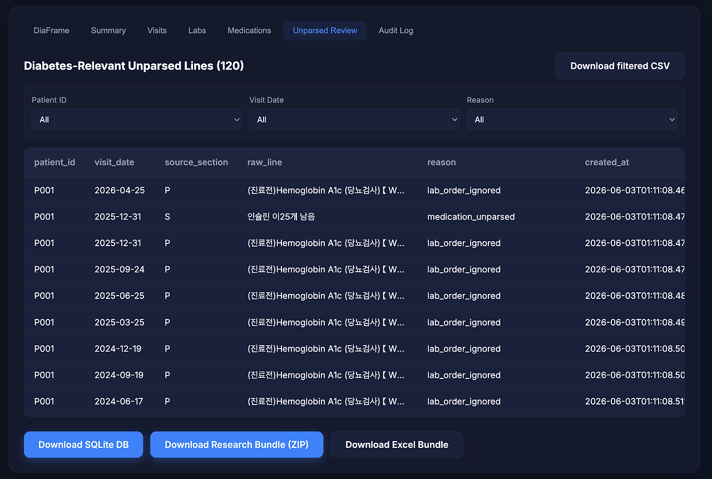

## 4. EMR 연구용 파싱, CleanEMR

CleanText를 만들면서 텍스트를 깨끗하게 정리하는 것과 연구 가능한 데이터베이스를 만드는 것은 서로 다른 문제라는 것을 곧 알게 되었습니다. 검사 결과 한 덩어리를 표로 바꾸는 것만으로는 부족했습니다. 연구를 하려면 환자가 있어야 하고, 방문이 있어야 하고, 검사와 약물이 있어야 하며, 그 시점의 판단이 있어야 합니다.

의료 기록은 한 줄의 텍스트가 아니라 시간에 따라 쌓이는 사건들의 묶음입니다. CleanEMR은 바로 이 지점에서 시작했습니다.

*CleanEMR 첫 화면*

**개발 기간:** 2026년 4월 25일~
**버전:** v2.0.0
**형태:** 로컬 기반 외래 EMR 전처리 및 연구용 데이터셋 생성 파이프라인
**스택:** Python 3.12, FastAPI, SQLite3, React, TypeScript, Vite, Pandas, Pytest
**대상:** 내분비/당뇨 외래 자유 텍스트 EMR
**출력:** cleanemr.db, 연구용 CSV/JSON 번들, codebook, quality report, Excel bundle
**핵심 구조:** 원문 EMR → 정규화 → 비식별화 → 외래 방문 분리 → SOAP/검사/활력징후/약물 파싱 → 근거 기반 매핑 → 미파싱 문장 리뷰 → 연구용 DB/파일 내보내기

### # 1) 기록은 환자 단위로 다시 묶여야 한다

EMR 기록은 진료를 위해 작성됩니다. 의사는 이전 외래 기록을 보고 검사 결과를 확인한 뒤, 약을 조정하고 다음 계획을 남깁니다. 이 구조는 진료 현장에는 적합하지만, 연구를 하려면 기록을 다른 방식으로 다시 배열해야 합니다. 

한 환자의 여러 방문을 연결해야 하고, 방문마다 어떤 검사값이 있었는지 정리해야 하며, 그 시점에 어떤 약을 쓰고 있었는지 알아야 합니다. 또한 다음 방문에서 약이 추가되었는지, 중단되었는지, 혹은 유지되었는지도 확인해야 합니다. 즉 연구용 데이터는 단순히 깨끗한 텍스트가 아니라, 환자와 방문을 기준으로 정렬된 구조여야 합니다.

CleanEMR은 이처럼 외래 기록을 환자 단위, 방문 단위, 검사 단위, 약물 단위로 다시 나누려는 시도였습니다. 텍스트를 읽기 좋게 만드는 것이 아니라, 기록 자체를 연구 가능한 테이블로 바꾸는 것이 목표였습니다.

### # 2) 외래 기록을 방문 단위로 나누다

*방문 단위로 분리된 외래 기록*

외래 EMR은 시간의 기록입니다. 한 환자는 여러 번 병원에 오고, 각 방문마다 증상, 검사, 약물, 계획이 조금씩 달라집니다. 그래서 CleanEMR에서 가장 중요했던 첫 단계는 원문 기록을 방문 날짜를 기준으로 나누는 일이었습니다. 그 후 각 방문 안에서 Subjective, Objective, Assessment, Plan 등의 SOAP 구조와 검사, 활력징후, 약물 정보를 추출합니다.

모든 기록이 완벽하게 정리되어 있지는 않습니다. 어떤 기록은 구조가 비교적 분명하지만, 어떤 기록은 줄글에 가깝거나 약어와 검사 결과가 뒤섞여 있습니다. 하지만 연구를 위해서는 적어도 어떤 정보가 어느 방문에 속하는지 명확히 구분해야 합니다. 검사값 하나도 어느 날짜의 것인지 모르면 그 의미가 크게 줄어들기 때문입니다. 언제부터 어떤 약이 추가되었고, 어떤 방문에서 치료 방향이 바뀌었는지 알아야 비로소 실제 의사결정의 흐름을 파악할 수 있습니다. 

### # 3) 검사와 약물을 연구 변수로 꺼내다

연구에서 중요한 것은 반복해서 비교할 수 있는 변수입니다. 당뇨 외래의 경우 HbA1c, FBS, PP2, eGFR, creatinine, AST, ALT, LDL, HDL, TG, total cholesterol, UACR 같은 검사값과 혈압, 맥박, 체중, 키, BMI 등 활력징후가 중요하게 작용합니다.

여기에 더해 어떤 약을 사용 중인지, 어떤 약제 계열이 추가되거나 중단되었는지 파악하는 것도 필수적입니다. Metformin, SGLT2 inhibitor, DPP-4 inhibitor, GLP-1 receptor agonist, Sulfonylurea, TZD, Insulin, Statin, ACE inhibitor, ARB 등의 정보들은 EMR 원문 안에 흩어져 있습니다. 어떤 것은 결과 표에, 어떤 것은 외래 기록 본문에, 어떤 것은 처방 기록에 위치합니다.

CleanEMR은 이런 흩어진 정보들을 환자와 방문에 연결된 연구 변수로 꺼냅니다. 여기서 핵심은 단순 추출이 아닙니다. 각 값이 어느 환자의 어느 방문에 속하는지, 나아가 원문에서 어떤 텍스트를 근거로 파싱되었는지 추적할 수 있어야 나중에 오류를 검증할 수 있습니다. 좋은 연구 데이터는 값만 존재하는 것이 아니라, 그 값이 어디서부터 왔는지 확인할 수 있는 데이터입니다.

### # 4) 결정론적 파싱을 선택한 이유

CleanEMR에서는 AI 모델을 바로 붙이는 대신 정규표현식과 dictionary 기반 매칭, 즉 규칙 기반 파싱을 기본 구조로 잡았습니다. 이유는 단순합니다. 연구용 데이터셋은 무엇보다 재현 가능해야 하기 때문입니다.

같은 원문을 넣었을 때 어제와 오늘의 결과가 달라지면 곤란합니다. 모델의 상태나 프롬프트의 미세한 차이에 따라 HbA1c가 다르게 추출되거나 약물 계열이 다르게 분류된다면, 그 데이터로는 신뢰할 수 있는 연구를 진행하기 어렵습니다. 그래서 CleanEMR은 가능한 한 동일한 입력에서 동일한 출력을 만들도록 설계되었습니다.

물론 규칙 기반 파싱이 완벽한 것은 아닙니다. 표현이 너무 다양하거나 문장이 복잡한 경우, 기록 형식이 예상과 다른 경우에는 파싱하지 못하는 항목이 생깁니다. 하지만 적어도 왜 그렇게 추출되었는지 그 근거를 명확히 확인할 수 있습니다. 의료 연구용 전처리 단계에서는 이 투명성이 예측 불가능한 모델의 유연성보다 훨씬 중요합니다.

### # 5) 파싱되지 않은 줄도 버리지 않는다

*수동 검토가 필요한 문장 목록*

자동 파싱에서 중요한 것은 추출에 성공한 값만 쳐다보는 것이 아니라, 시스템이 읽어내지 못한 줄도 살펴보는 것입니다. 의료 기록은 형식이 일정하지 않아 같은 약이나 검사라도 이름이 다르게 적히거나 예상 밖의 위치에 기록될 수 있습니다.

그래서 CleanEMR은 정형 데이터로 변환되지 못한 모호한 문장을 별도의 테이블에 남겨둡니다. 이것은 시스템의 실패 목록이 아니라 수동 검토 목록입니다. 자동화가 조용히 틀린 값을 내놓는 것보다, 불확실한 부분을 솔직하게 드러내는 편이 낫습니다. 의료 데이터에서는 모르는 것을 모른다고 표시하는 것이 매우 중요합니다. 파싱되지 않은 줄을 따로 모아두면 파서의 한계를 파악하고 다음 버전에 어떤 규칙을 보완해야 할지 알 수 있습니다. 자동화와 수동 검토 사이의 안전한 경계를 만드는 과정입니다.

### # 6) DiaFrame으로 넘기기 위한 데이터베이스

*CleanEMR과 DiaFrame의 연결 구조*

CleanEMR의 중요한 목적 중 하나는 DiaFrame(당뇨병 약제 추천을 평가하기 위한 프로토타입)과 연결되는 것입니다. DiaFrame이 제대로 작동하려면 환자의 혈당 상태, 신기능, 체중, 현재 사용 중인 당뇨약 계열, 그리고 다음 방문에서 처방이 강화되었는지 완화되었는지에 대한 실제 방향 등이 명확히 정리되어 있어야 합니다. 이 정보가 갖춰져야만 비로소 AI 추천과 실제 처방을 비교할 수 있습니다.

CleanEMR은 이 downstream 분석을 위해 `cleanemr.db`라는 구조화된 데이터베이스를 내보냅니다. 이 데이터베이스는 단순한 요약본이 아니라, 진단이나 약물 추천의 바로 앞단에서 실제 기록을 연구 가능한 입력 형태로 바꾸는 중간 데이터 계층 역할을 합니다.

### # 7) 연구 가능한 형태로 바꾼다는 것

연구는 질문에서 시작하지만, 질문에 답하려면 변수를 꺼낼 수 있는 일정한 구조가 필요합니다. CleanEMR은 원문 외래 기록을 로컬 환경에서 정규화 및 비식별화하고, 방문 단위로 나눈 뒤 검사와 약물을 파싱하여 원문의 근거를 남기는 전체 파이프라인입니다. 애매한 문장은 별도 리뷰 대상으로 넘기고 결과를 SQLite, CSV, Excel 등으로 내보냅니다.

이 지저분한 정리 작업은 전혀 화려하지 않지만, 의료를 구조화하려면 반드시 거쳐야 하는 단계입니다. 데이터의 시작은 AI 모델이 아니라 바로 이 구조화에 있으며, CleanEMR은 그 기반을 다지기 위한 첫 번째 계층이었습니다.