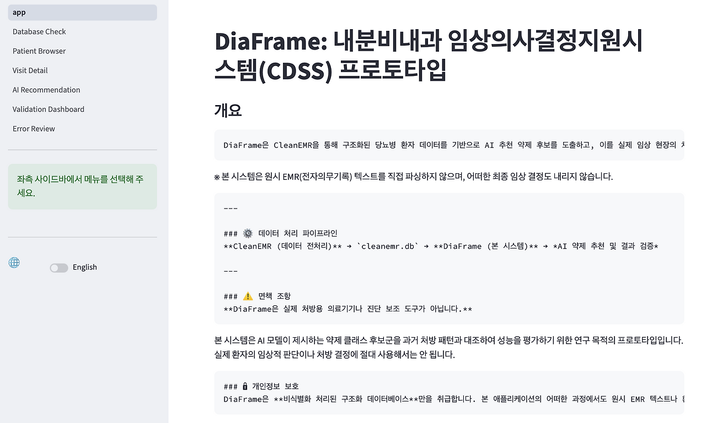
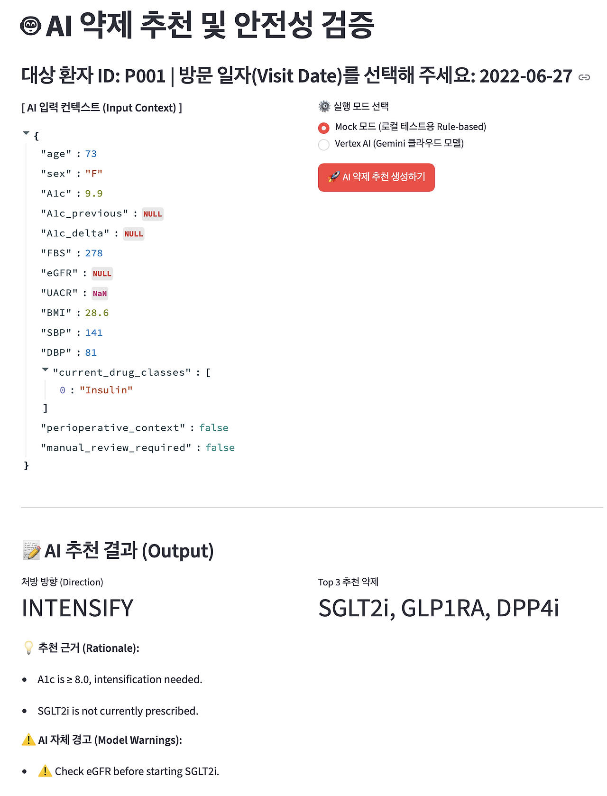
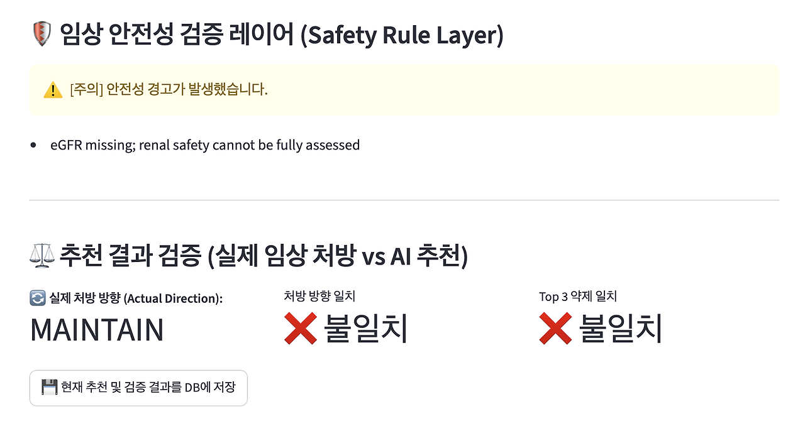
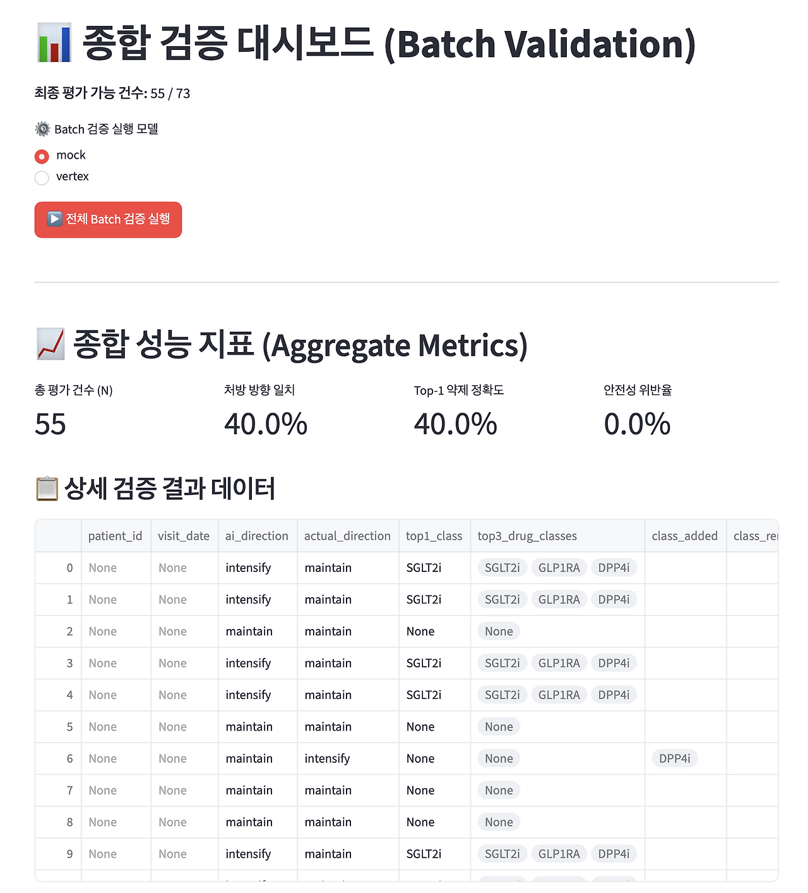
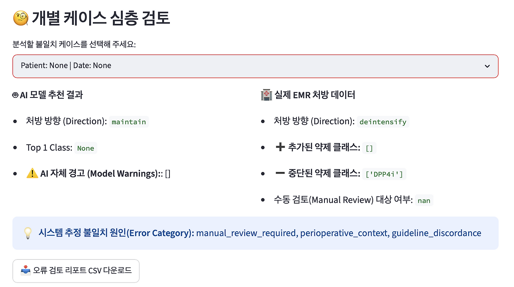

## 5. 머신러닝 기반 당뇨 약물 추천, DiaFrame

AI에게 환자 정보를 주고 약제를 추천하게 하는 것은 생각보다 어렵지 않습니다. 문제는 그다음입니다. 그 추천이 맞는지 어떻게 볼 것인가, 어떤 기준으로 평가할 것인가, 그리고 실제 의사의 처방과 다를 때 그 차이를 어떻게 해석할 것인가. 

의료 AI에서 중요한 것은 답을 내는 능력만이 아니라, 그 답을 검증할 수 있는 구조입니다. DiaFrame은 바로 이 질문에서 시작했습니다.

*DiaFrame 메인화면*

**레포:** [github.com/MedicalFrame/DiaFrame](https://github.com/MedicalFrame/DiaFrame)
**개발 기간:** 2026년 6월
**형태:** 당뇨병 약제 추천 평가용 내분비 CDSS 프로토타입
**스택:** Python, Streamlit, SQLite, Vertex AI Gemini, Pandas
**입력:** CleanEMR에서 생성된 비식별화 구조화 데이터베이스 cleanemr.db
**핵심 구조:** CleanEMR → diaframe_visits → AI 추천 JSON → Safety Rule Layer → 실제 처방 방향과 비교 → 오류 리뷰
**주의:** 실제 처방을 내리기 위한 시스템이 아니라, 과거 처방 패턴과 AI 추천을 비교·평가하기 위한 연구용 프로토타입입니다.

### # 1) DiaFrame은 EMR 파서가 아니다

*Data Pipeline 구조도*

DiaFrame은 EMR 원문을 읽고 파싱하거나 자유 텍스트를 구조화하는 도구가 아닙니다. 그 역할은 앞서 다룬 CleanEMR이 수행합니다. DiaFrame은 그다음 단계, 즉 `cleanemr.db` 안의 구조화된 데이터를 읽어 들이는 계층입니다.

환자 ID, 방문일, 나이와 성별, A1c, FBS, eGFR, BMI 같은 임상 지표, 현재 사용 중인 당뇨약 계열, 수동 검토 필요 여부 등이 명확히 정리되어 있어야 AI 추천을 평가할 수 있습니다. 즉 DiaFrame은 텍스트를 변환하는 과정이 아니라, 이미 구조화된 데이터를 바탕으로 AI의 추천과 실제 처방을 비교하는 검증 계층입니다. 

### # 2) 추천을 자유롭게 말하게 두지 않는다

*구조화된 AI 추천 출력*

의료 AI에서 가장 위험한 것은 그럴듯하게 자유롭게 말하도록 두는 것입니다. 일반적인 대화형 AI는 부드럽고 긴 설명을 잘 만들어내지만, 의료 현장에서는 그 유연성이 오히려 혼란과 위험을 초래할 수 있습니다. 추천 방향이 애매해지거나, 약제명이 임의로 등장하거나, 금기 사항을 놓치면 결과 자체를 평가하기가 불가능해집니다.

그래서 DiaFrame에서는 AI의 출력 형식을 엄격히 제한했습니다. AI는 유지, 강화, 완화, 변경 중 하나의 처방 방향을 명확히 제시해야 하고, 허용된 목록 안에서 상위 3개의 약제 계열을 골라내야 합니다. 또한 추천 근거와 경고 사항을 정해진 JSON 구조 안에 담도록 강제했습니다. 이렇게 해야 AI가 무엇을 제안했는지, 실제 처방과 어느 부분이 일치하고 어느 부분이 다른지 정량적으로 비교할 수 있습니다. 평가 가능한 형태로 입을 닫게 만드는 것이, 모델을 제대로 평가하기 위한 첫걸음입니다.

### # 3) 안전 규칙은 모델 밖에 따로 둔다

*안전성 위반 경고 예시*

아무리 잘 훈련된 AI라도 추천을 전적으로 믿을 수는 없습니다. DiaFrame에는 AI의 추천 결과를 한 번 더 걸러내는 별도의 Safety Rule Layer가 존재합니다. 

이 레이어는 AI가 eGFR이 낮은 환자에게 Metformin을 추천하지는 않았는지, 고령 환자에게 저혈당 위험이 큰 SU나 Insulin을 무리하게 강권하지는 않았는지 등을 시스템 밖에서 기계적으로 확인합니다. 모델이 알아서 조심해주기를 기대하기보다, 명백히 위험한 출력을 확실하게 막아내는 최소한의 안전망을 덧대는 방식입니다. 모델이 답을 내고, 규칙이 그 답을 다시 검사하는 이 이중 구조가 있어야 비로소 그 추천을 연구의 대상으로 다룰 수 있습니다.

### # 4) 실제 처방과 비교해야 한다

*추천 방향 일치율, Top-1/Top-3 일치율, Safety Violation Rate*

검증의 기준은 AI의 추천이 얼마나 '그럴듯해 보이는가'가 아닙니다. 실제 임상 기록에서 의사가 어떤 처방을 선택했는지와의 비교가 중요합니다. AI가 치료 강화를 제안했을 때 실제 의사도 처방을 강화했는지, AI가 고른 약제 계열이 실제 추가된 약제와 일치하는지 등을 처방 방향 일치율과 Top-1/Top-3 일치율로 확인합니다.

만약 추천 결과가 실제 처방과 비슷하더라도 앞선 안전성 규칙을 위반했다면 그 추천은 실패로 간주됩니다. 이런 객관적인 지표들이 있어야 AI의 대답은 단순한 텍스트 덩어리를 넘어 검증 가능한 결과로 변모합니다.

### # 5) 불일치가 더 중요할 때도 있다

*AI 추천과 실제 처방 간 불일치 케이스 리뷰*

가끔은 일치율보다 AI와 실제 처방이 어긋나는 순간의 차이를 들여다보는 일이 더 중요합니다. AI가 놓친 환자의 맥락이 있었는지, 의사가 지나치게 보수적이거나 공격적으로 판단했는지, 아니면 단순히 가이드라인 해석의 차이인지 고민하게 만듭니다.

불일치는 모델의 실패일 수도 있지만, 임상 의사결정의 숨겨진 구조를 이해하기 위한 분석의 출발점이 되기도 합니다. 그래서 DiaFrame에는 불일치 케이스를 따로 모아 검토하는 기능이 포함되어 있습니다. AI를 무작정 믿기 위한 도구가 아니라, AI와 의사의 차이를 통해 판단의 근거를 되짚어보는 돋보기에 가깝습니다.

### # 6) 연구용 프로토타입이라는 경계

다시 한 번 강조하지만, DiaFrame은 환자의 실제 임상 결정을 내리는 처방용 시스템이 아닙니다. 비식별화된 과거 데이터를 바탕으로 추천과 검증 구조를 테스트해보는 연구용 도구입니다.

이 프로젝트의 핵심은 약제를 직접 추천하는 기능 자체가 아니라, 어떤 추천이 나왔을 때 그것을 안전 규칙으로 거르고, 실제 과거 처방과 비교하며, 불일치 사례를 면밀히 검토해 나가는 전체 파이프라인의 구축에 있습니다.

의료 AI의 진정한 난관은 답을 내는 순간이 아니라, 그 답을 어떻게 검증할 것인가를 고민하는 시점에서 시작됩니다. DiaFrame은 그 검증의 구조를 시각화하기 위해 만들어진 프로토타입입니다. AI의 추천을 믿기 전에, 우리는 그것을 먼저 검증할 수 있어야 합니다.
