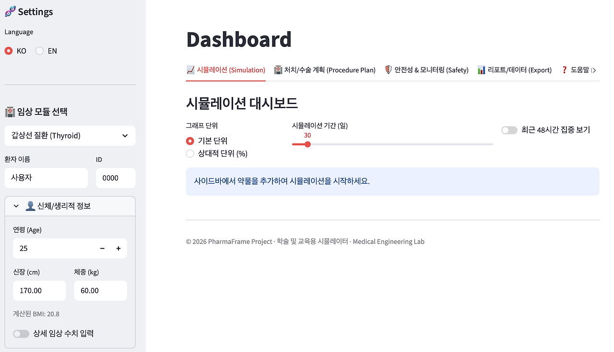
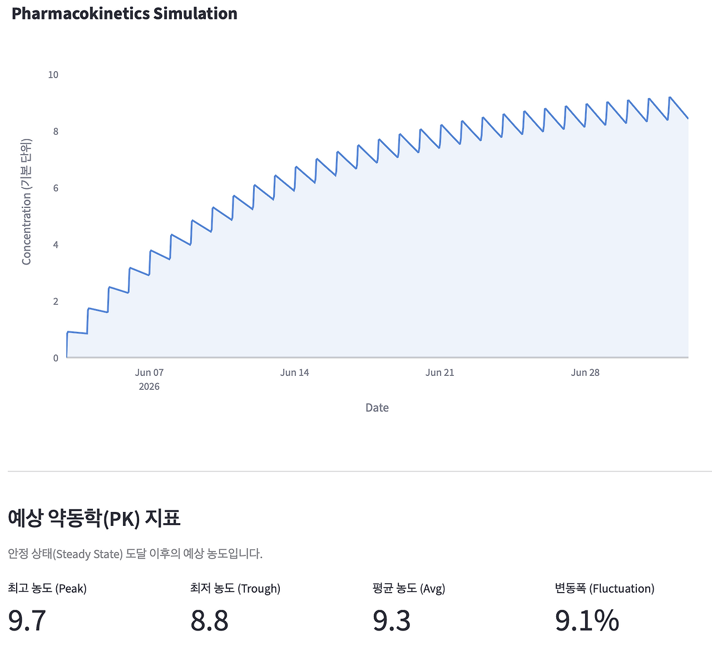
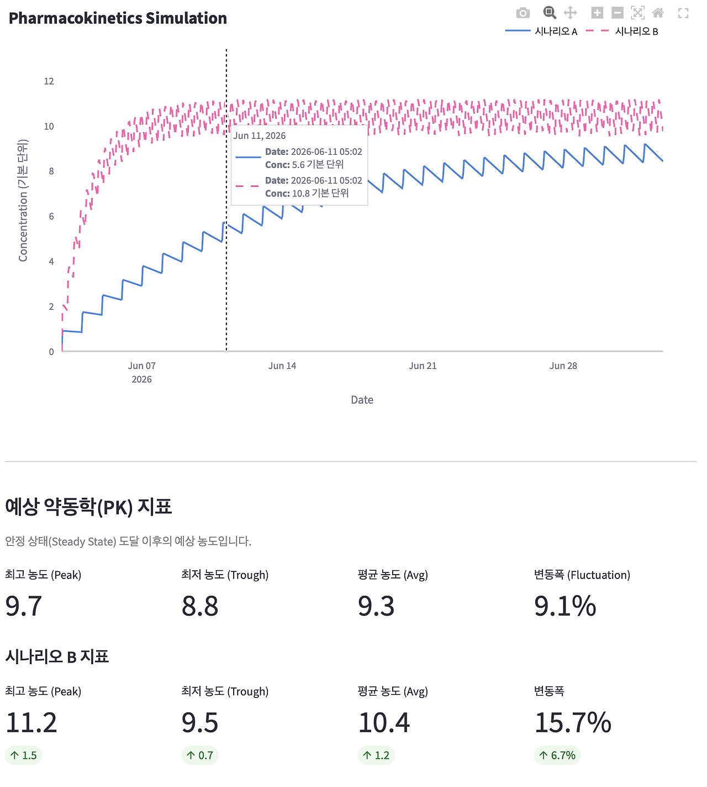
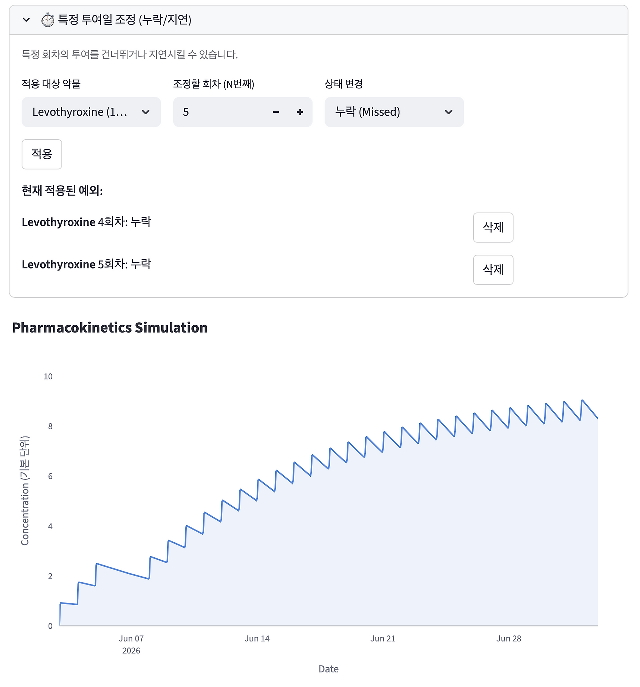
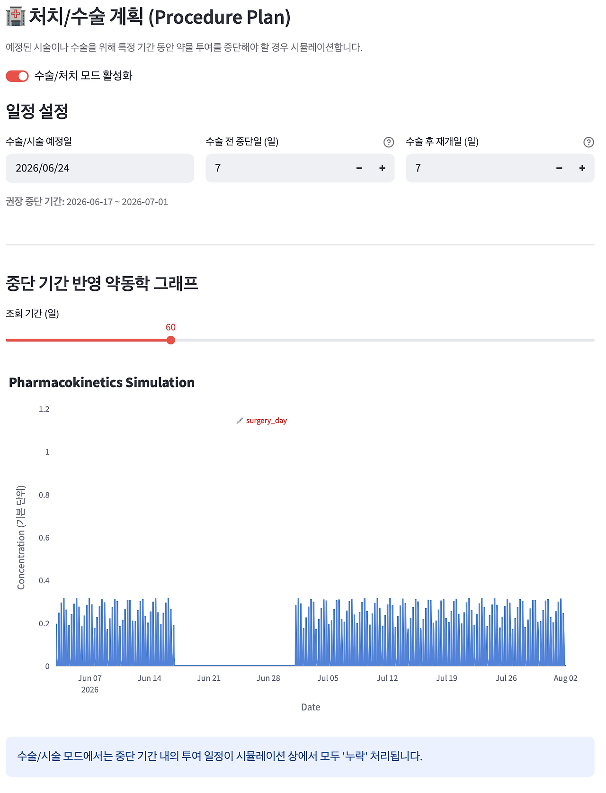

## 1. 다학제 약제 PK 분석, PharmaFrame

약은 보통 점처럼 기록됩니다. 몇 mg, 하루 몇 번, 며칠 동안, 식전 또는 식후, 혹은 몇 주 뒤 증량. 처방전에는 늘 단편적인 점으로 적힙니다.

하지만 몸이 경험하는 약물은 하나의 점이 아닙니다. 약을 먹거나 맞는 그 짧은 순간은 사건에 불과하지만, 그 뒤 몸 안에서 약물 농도는 끊임없이 움직입니다. 약물은 서서히 흡수되고, 온몸으로 분포하며, 간이나 신장을 거쳐 대사되고, 마침내 배설됩니다. 처방은 용량과 간격으로 쓰이지만, 몸은 시간에 따른 농도 곡선을 통째로 경험합니다. PharmaFrame은 바로 이 관점에서 시작한 프로젝트입니다.

*PharmaFrame 첫 화면*

**레포:** github.com/MedicalFrame/PharmaFrame
**개발 기간:** 2026년 5월 15일~
**형태:** 학술·교육용 개인화 약동학 시뮬레이터
**스택:** Python, Streamlit, Plotly, YAML, ReportLab, iCalendar
**지원 모듈:** 갑상선, 폐경 후 호르몬 요법, opioids, NSAIDs, 사춘기 유도, 심혈관 약물 등
**핵심 구조:** 약물 PK 데이터베이스 → 환자 프로필 → 복약 일정 → 시간-농도 곡선 → 시나리오 비교 → 수술/시술 전후 중단 계획 → 리포트/캘린더 내보내기
**주의:** 실제 처방 조정을 지시하는 의료기기가 아닙니다. 약동학적 사고 과정을 시각화하기 위한 학술·교육용 프로토타입입니다.

### # 1) 처방은 사건이고, 농도는 함수다

*시간-농도 곡선 위의 peak와 trough*

약을 복용하거나 주사하는 순간은 하나의 사건입니다. "오전 8시에 복용했다", "일주일에 한 번 주사했다", "수술 며칠 전부터 중단했다" 같은 사건들은 EMR에 기록하기 쉽습니다. 하지만 그 사건 이후에 몸 안에서 일어나는 일은 시간이라는 연속된 축 위에서 펼쳐집니다. 

혈중 농도는 서서히 올라가 최고점에 도달한 뒤 다시 감소합니다. 투여를 반복하면, 이전 투여로 인해 남아 있던 잔여 농도 위에 새로운 투약분이 겹쳐 쌓입니다. 그래서 약물은 점이 아니라 곡선으로 파악해야 합니다. Peak, Trough, Average concentration, Fluctuation index와 같은 지표들은 각각 동떨어진 숫자가 아니라, 시간-농도 곡선 위의 특정한 지점을 가리키는 이름표일 뿐입니다. 처방은 점으로 쓰여도 약동학은 곡선으로 이해해야 합니다.

### # 2) 같은 용량이어도 같은 곡선이 아니다

같은 약을 같은 용량으로 쓴다고 해서 모든 사람이 동일한 농도 곡선을 경험하지는 않습니다. 나이가 다르고, 체중이 다르고, 신장과 체지방률이 다르기 때문입니다. 더 근본적으로는 신기능(eGFR)과 간기능(AST, ALT 등)이 환자마다 천차만별입니다. 

약물에 따라 신장 배설 비율이나 간 대사 비율도 모두 다릅니다. eGFR이 떨어져 있다면 신장으로 주로 배설되는 약물의 소실 속도가 현저히 느려질 수 있습니다. 간 수치가 높다면 간에서 대사되는 약물을 쓸 때 조심해야 하고, BMI와 체지방률은 약물의 분포용적 자체에 영향을 줍니다. 이런 임상 수치들은 단순한 환자 정보가 아니라, 약물 농도 곡선의 형태를 빚어내는 중요한 변수입니다. 

PharmaFrame은 환자의 임상 지표를 약동학 파라미터에 적극적으로 반영하려 했습니다. 같은 용량이라도 환자가 달라지면 곡선도 달라져야 합니다. 약물을 환자와 동떨어진 고정값으로 보지 않고, 환자의 신체 조건과 유기적으로 연결된 동적인 모델로 바라보기 위함입니다.

### # 3) 약물 조정은 곡선의 형태를 바꾸는 일이다

*Liothyronine(T3)과 Levothyroxine(T4) 복약일정에 따른 농도 곡선 비교*

임상 현장에서 의사들은 끊임없이 약을 조정합니다. 용량을 올리거나 간격을 좁히고, 때로는 투약을 중단하거나 약제 자체를 바꿉니다. 겉으로 보면 단순한 처방 변경이지만, 약동학적으로 들여다보면 이 모든 행위는 농도 곡선의 형태를 빚고 변형하는 조각 작업과 같습니다.

용량을 올리면 곡선 전체가 위로 떠오르고, 투여 간격을 좁히면 최저농도(trough)가 높아지며 혈중 농도의 진동폭(fluctuation)이 줄어듭니다. 반대로 투여 간격을 늘리면 최고농도(peak)와 최저농도의 격차가 심해집니다. 약을 아예 중단하면, 그 약의 고유한 반감기와 환자의 청소율에 맞춰 농도가 긴 꼬리를 그리며 서서히 떨어집니다.

이렇게 보면 약물 조정은 “증량”이나 “감량”이라는 납작한 단어로 요약될 수 없습니다. 환자의 몸이 겪게 될 농도 곡선의 높이, 폭, 진동의 주기, 그리고 하강 속도를 정교하게 바꾸는 행위입니다. PharmaFrame을 통해 시각적으로 확인하고 싶었던 것은 처방 변경이 만들어내는 이 구체적인 곡선의 변화였습니다.

### # 4) 복약 누락도 하나의 시나리오다

*복약 누락과 지연 시뮬레이션*

현실의 복약 패턴은 결코 처방전처럼 단정하지 않습니다. 바빠서 약을 늦게 먹기도 하고, 깜빡 잊어 한 회차를 통째로 건너뛰기도 하며, 임의로 복약 일정을 바꾸기도 합니다. 이런 일들은 외래에서 흔히 듣는 이야기지만, 약동학적으로는 환자 몸속의 곡선 형태를 크게 흔들어 놓습니다.

단 한 번의 복약 누락만으로도 다음 최저농도(trough)가 예상보다 훌쩍 낮아질 수 있고, 복용 지연은 최고농도(peak)의 도달 시점을 한참 뒤로 밀어버립니다. 투약 일정이 불규칙해지면, 이전 투여로 쌓인 잔여 농도와 새로운 투약분이 설계와는 완전히 다른 방식으로 겹쳐지게 됩니다. 

PharmaFrame에 특정 회차의 투여를 임의로 늦추거나 건너뛸 수 있는 'override' 기능을 넣은 이유가 여기에 있습니다. 환자의 복약 순응도를 단순히 '잘 먹었다', '못 먹었다'는 이분법으로 재단하는 대신, 그것이 시간-농도 곡선에 어떤 변형을 가하는지 직관적으로 보기 위해서입니다. 이 관점에서는 복약 누락 역시 무시할 수 없는 중요한 입력 데이터이며, 그 누락이 환자의 다음 상태에 미칠 파장을 미리 가늠해볼 수 있게 해줍니다.

### # 5) 수술 전 약을 끊는다는 것

*수술 전후 약물 중단 시뮬레이션*

수술이나 시술을 앞두고 가장 흔히 던지는 지시 중 하나가 "며칠 전부터 드시던 약을 끊으세요"라는 말입니다. 어떤 약은 출혈 위험 때문에, 어떤 약은 혈전이나 감염 위험, 혹은 대사적 변동성 때문에 투약을 일시적으로 중단해야 합니다. 하지만 이 짧은 안내 문장 뒤에는 생각보다 복잡한 시간의 퍼즐이 숨어 있습니다.

해당 약물의 반감기는 얼마나 긴지, 오랫동안 복용해서 몸에 얼마나 누적되어 있는지, 중단 후 실제 혈중 농도는 어떤 속도로 떨어질지, 그리고 대망의 수술 당일에는 몸속에 잔여 약물이 얼마나 남아 있을지. 나아가 수술이 끝나고 나면 언제 다시 안전하게 약을 재개할 수 있을지까지 모두 시간의 지배를 받는 질문들입니다. 

PharmaFrame의 수술 전후 중단 시뮬레이션(Procedure/Surgery Cessation Planner)은 바로 이 지점을 파고듭니다. 수술 전 중단 기간 동안의 투여를 누락(missed) 처리했을 때, 수술 당일과 전후의 잔류 농도 추이가 어떻게 바닥을 향해 내려가는지 그래프로 보여줍니다. 수술 전 약물 중단을 달력의 날짜를 세는 일이 아니라, 농도 곡선이 안전선 아래로 미끄러져 내려가는 물리적 과정으로 이해하려는 시도입니다.

### # 6) 여러 약물군으로 확장하기

처음에는 호르몬 치료를 관찰하며 곡선의 개념에 깊이 천착했습니다. 호르몬 수치는 외래에서 단 한 번의 채혈 값으로 기록되지만, 그 이면에 흐르는 실제 체내 농도는 주사 시점과 채혈 시점의 간격에 따라 완전히 다른 값을 가리킵니다. 같은 환자라도 주사 직후의 최고점과 주기 말의 최저점은 하늘과 땅 차이입니다. EstroFrame과 AndroFrame은 호르몬의 이런 역동적인 변화를 곡선으로 잡아내려는 프로젝트였습니다.

하지만 약을 곡선으로 보는 이 관점은 비단 호르몬에만 국한되지 않습니다. 갑상선 호르몬, 폐경 후 호르몬 요법, 강력한 진통제인 Opioids와 NSAIDs, 사춘기 유도 호르몬, 그리고 미세한 용량 조절이 생명인 심혈관계 약물들까지 수많은 약들이 시간의 흐름을 타며 흡수, 분포, 대사, 배설의 과정을 겪습니다. 

그래서 특정 호르몬의 시뮬레이션을 넘어, 더 보편적이고 일반적인 약물 모델링 프레임워크로 시야를 넓히고자 만든 것이 PharmaFrame입니다. 특정 약물 하나를 정밀하게 묘사하는 데 그치지 않고, 다양한 약물 데이터베이스와 환자의 개별 프로필, 그리고 복잡한 복약 일정이라는 세 축을 단일한 약동학 구조 안에서 매끄럽게 연결하고 싶었습니다.

### # 7) 약물은 판단의 시간축이다

처방전 종이 위에 인쇄된 약물은 정적입니다. 용량과 투여 간격이 무심하게 적혀 있을 뿐입니다. 그러나 그 약물이 환자의 몸 안으로 들어오는 순간부터 약은 동적인 생명력을 얻습니다. 임상 현장에서 의사가 내리는 모든 판단에는 필연적으로 '시간'이라는 축이 개입합니다.

언제쯤 약효가 나타날 것인가, 언제 부작용 발생 확률이 정점을 찍을 것인가, 며칠 뒤에 채혈해야 정확한 상태를 파악할 수 있는가, 수술 며칠 전에 중단해야 수술 당일 안전한 농도에 도달할 수 있는가, 그리고 수술 후 언제 다시 투여를 시작해야 기저질환의 악화를 막을 수 있는가.

약물은 결국 시간 위에서 저울질하고 판단해야 하는 대상입니다. PharmaFrame은 숨겨져 있던 이 시간의 축을 눈앞으로 끌어내기 위해 고안된 도구입니다. 약을 고정된 점으로 박제하지 않고 흐르는 곡선으로 바라보는 것. 처방을 단발적인 사건이 아니라 몸속에서 끊임없이 박동하는 화학적 파동으로 이해하는 것.

약을 조절한다는 것은 단순히 숫자를 늘리고 줄이는 기계적인 작업이 아닙니다. 환자가 견뎌내야 할 농도 곡선의 거친 형태를 부드럽게 다듬어가는 일입니다. 그 보이지 않는 곡선의 존재를 이해하고 상상할 수 있게 되는 순간, 약물은 더 이상 처방전 위의 숫자가 아니라 시간 위를 살아 움직이는 역동적인 모델로 다가옵니다.
