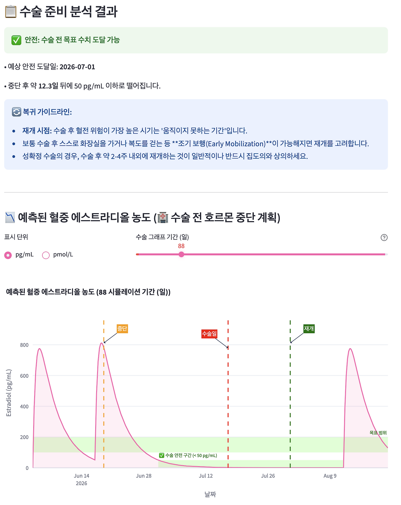
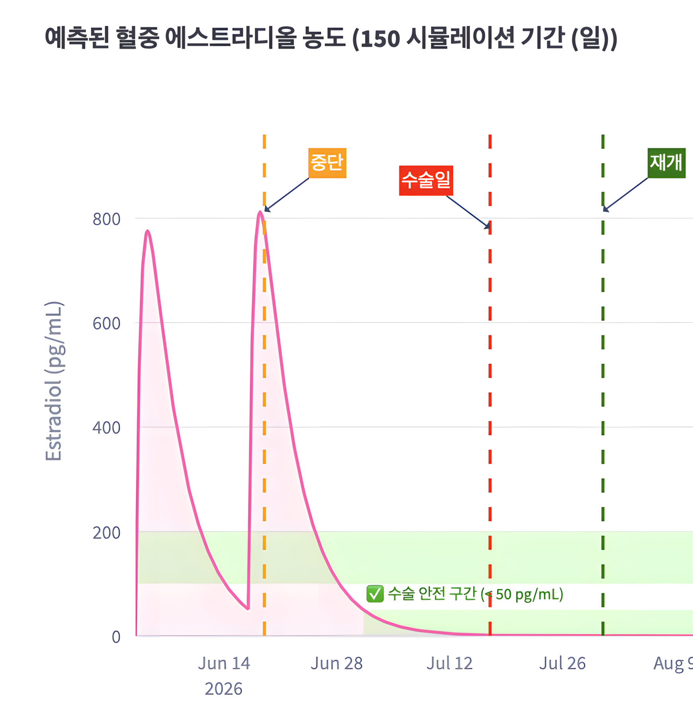

## 2. 수술 전 약을 끊는다는 것

> “수술 며칠 전부터 약을 끊으세요.”

이 문장은 매우 단순해 보입니다. 특정 날짜를 정해서 약 복용을 중단하고 수술이 끝난 뒤에 다시 시작하면 될 것처럼 들립니다. 하지만 몸 안에서 일어나는 일은 그렇게 칼로 무 자르듯 단순하지 않습니다.

약을 끊는다는 것은 조명 스위치를 끄듯 즉각적인 결과를 낳는 일이 아닙니다. 마지막 투여 이후에도 몸 안에는 약물이 남아 있으며, 농도는 바로 0이 되지 않습니다. 약물의 고유한 반감기, 환자의 청소율, 분포용적, 투여 경로, 그리고 오랜 기간 반복 투여로 쌓인 누적치에 따라 혈중 농도는 서서히, 각기 다른 속도로 내려갑니다.

결국 수술 전 약물 중단은 단순한 날짜 계산의 문제가 아닙니다. 시간에 따른 농도 곡선의 변화, 수술과 관련된 출혈이나 혈전의 위험도, 약을 끊는 동안 환자가 감당해야 하는 기저질환 악화의 부담, 그리고 언제 다시 안전하게 투약을 재개할 것인가를 조율하는 복합적인 결정입니다. 저는 이 질문을 시간축 위에 올려 시각화하고 싶었습니다. EstroFrame, AndroFrame, PharmaFrame은 각기 다른 목적에서 출발했지만, 이 지점에서는 모두 같은 맥락의 질문을 다루고 있습니다. 수술 전 약을 끊는다는 것은 곧 몸 안의 농도 곡선이 어떻게 내려가는지를 지켜보는 일입니다.

*수술 전후 약물 중단 시뮬레이션 화면*

**주소:** [estroframe.streamlit.app](http://estroframe.streamlit.app/)
**연결 프로젝트:** EstroFrame, AndroFrame, PharmaFrame
**형태:** HRT 및 일반 약물의 약동학 기반 수술 전후 중단/재개 시뮬레이션
**핵심 구조:** 투약 일정 → 수술 전 중단일 → 수술일 → 재개일 → 잔류 농도 곡선 → 위험도와 환자 부담 검토
**주의:** 실제 수술 전후 약물 조정이나 처방을 결정하는 도구가 아니라, 약동학적 사고 과정을 시각화하고 돕기 위한 연구용 프로토타입입니다.

### # 1) 중단은 스위치가 아니다

약을 끊었다고 해서 몸 안의 약물이 마법처럼 바로 사라지는 것은 아닙니다. 마지막 복용이나 주사는 EMR에 기록되는 단 하나의 사건에 불과합니다. 하지만 그 이후의 농도 변화는 약동학적 법칙을 따르며 시간의 흐름을 타고 이어집니다. 약물은 제형에 따라 계속 흡수되고, 전신으로 분포하며, 간과 신장을 거쳐 대사되고 배설됩니다.

경구약이라면 위장관의 흡수 속도와 생체이용률이 중요하게 작용하고, 주사제라면 제형 특성에 따른 저장소 효과(depot effect)가 긴 꼬리를 만들 수 있습니다. 신장으로 배설되는 약물이라면 환자의 eGFR 수치가 소실 속도를 결정하고, 간에서 대사되는 약물이라면 간기능 상태가 절대적인 영향을 미칩니다. 그래서 수술 전 약물 중단을 논할 때 던져야 할 질문은 단순히 "며칠 전부터 끊을 것인가"에 머물러서는 안 됩니다. 

그보다 더 정확하고 본질적인 질문은 "수술 당일, 환자의 몸 안에는 어느 정도의 약물이 잔류해 있을 것인가"에 가깝습니다. 중단이라는 행위 자체는 투약 사건을 멈추는 일에 불과하지만, 농도 곡선은 그 이후에도 멈추지 않고 계속해서 자신의 경로를 움직입니다.

### # 2) 마지막 투여일보다 잔류 농도가 중요하다

*마지막 투여 이후 서서히 감소하는 잔류 농도*

진료 현장에서 수술 전 약물 중단은 보통 날짜를 기준으로 안내됩니다. '수술 3일 전 중단', '1주 전 중단', '2주 전 중단'과 같은 방식은 환자에게 설명하기 명확하고, 병원의 일정을 관리하기 편하며, 의료진 간의 소통을 원활하게 만들어 줍니다. 

하지만 약동학적인 관점에서 들여다보면, 일괄적인 "3일 전 중단"이라는 지시가 모든 약과 모든 환자에게 같은 의미를 갖지는 않습니다. 반감기가 짧은 약은 하루 이틀 만에도 바닥에 닿을 만큼 빠르게 줄어들지만, 반감기가 길거나 체내 조직에 깊게 분포하는 약은 중단 후 며칠이 지나도 수술에 지장을 줄 만큼 의미 있는 농도가 남을 수 있습니다. 게다가 장기간 반복 투여로 인해 몸에 단단히 누적되어 있던 약물은 일회성 투여 때보다 훨씬 천천히 내려갑니다. 주사제나 서방형 제형처럼 흡수 자체가 서서히 이루어지는 경우에는 단순히 계산된 반감기만으로는 예측하기조차 어렵습니다.

따라서 수술 당일의 안전은 마지막 투여일 하나만으로 담보되지 않습니다. 수술 당일의 정확한 잔류 농도, 중단 기간 동안 몸이 겪는 농도의 하강 변화, 그리고 재개 후 다시 회복되는 속도까지 한꺼번에 고려해야 합니다. 결국 약을 끊는다는 것은 농도 곡선의 하강 구간 전체를 정밀하게 설계하는 과정입니다.

### # 3) EstroFrame과 AndroFrame: HRT 중단을 시간축 위에 올리다

호르몬 치료(HRT)에서는 이 문제가 한층 더 선명하게 드러납니다. 외래에서는 보통 단 한 번의 혈액 검사를 통해 호르몬 수치를 점검하지만, 몸이 겪는 실제 호르몬 농도는 투여 시점과 채혈 시점의 틈새에서 끊임없이 출렁입니다. 주사제의 경우 투여 직후의 수치와 주기 막바지의 수치는 완전히 다릅니다.

수술 전 호르몬을 며칠간 중단하라는 지시는 겉보기엔 단순한 안전 수칙처럼 보이지만, 그 기저에는 수많은 요소들의 팽팽한 줄다리기가 얽혀 있습니다. 수술과 연관된 치명적인 혈전 발생의 위험, 주사제와 경구약 등 제형별 반감기의 차이, 오랜 기간 투여로 쌓인 누적 농도, 약을 끊는 동안 환자가 고스란히 감당해야 하는 신체적·정서적 박탈감과 부담, 그리고 수술 후 재개 시점과 농도의 회복 속도까지.

EstroFrame과 AndroFrame은 이 복잡한 방정식들을 시간축 위로 올려 직관적으로 확인하려는 시도였습니다. 수술 전 중단일, 실제 수술일, 투약 재개일을 시뮬레이션 일정에 반영하고 그에 따른 잔류 농도 곡선을 그려냅니다. 핵심은 “며칠 전부터 끊는다”는 말뿐인 지시를, 눈에 보이는 농도 변화의 곡선으로 번역하는 일입니다. 이를 통해 위험을 줄이려는 방어적인 판단과, 환자의 고통을 덜어주려는 임상적 판단 사이에서 최적의 시간적 타협점을 찾습니다.

### # 4) PharmaFrame: 수술 전 약물 중단을 일반화하다

HRT 시뮬레이션에서 출발한 이 질문은 다른 모든 약물 영역으로도 고스란히 확장됩니다. 수술 전 약물 관리는 호르몬 치료에만 국한된 특수한 상황이 아닙니다.

갑상선 약물, 진통제 계열인 NSAIDs나 마약성 진통제(Opioids), 그리고 다양한 심혈관계 약물들은 저마다 수술 전후에 고려해야 할 치명적인 위험 요소를 안고 있습니다. 어떤 약은 수술 중 심각한 출혈을 유발할 수 있고, 어떤 약은 마취나 수술 스트레스와 겹쳐 심혈관 사고의 위험을 높입니다. 반대로 약을 너무 일찍, 너무 길게 중단하면 기존의 기저질환이 통제 불능 상태에 빠질 위험도 도사립니다.

PharmaFrame은 이 개별적인 딜레마들을 더 보편적이고 일반적인 약동학 프레임워크로 통합하려는 시도였습니다. 약물의 PK 데이터베이스를 구축하고 환자의 프로필을 입력한 뒤, 수술로 인한 강제 중단 기간을 일정에 반영합니다. 중단 기간 동안의 투여는 누락(missed) 처리되고, 우리는 수술 당일과 그 전후의 잔류 농도가 어떻게 추락하는지 그래프를 통해 목격하게 됩니다. 중요한 것은 수술 전 약물 관리를 단순한 "복용 여부(O/X)"의 문제에서 "시간-농도 곡선의 하강 추이"를 다루는 문제로 인식의 틀을 전환했다는 점입니다.

### # 5) 환자마다 같은 중단 기간이 같은 의미는 아니다

같은 약을 똑같이 7일 전에 중단하더라도 환자마다 몸이 그려내는 농도 곡선은 결코 같지 않습니다. 환자마다 체중이 다르고 체지방률에 따른 분포용적이 다르며, 무엇보다 약물을 걸러내는 신기능(eGFR)과 간기능이 제각각이기 때문입니다.

신장 배설 의존도가 높은 약물은 eGFR 수치에 따라 소실 속도가 현저히 느려질 수 있고, 지용성이 큰 약물은 넉넉한 체지방 조직에 깊숙이 축적되어 중단 후에도 몸 안에 끈질기게 머물 수 있습니다. 

따라서 수술 전 약물 중단 지침에 동일한 날짜를 적용한다고 해서, 모든 환자가 수술 당일 완벽하게 똑같은 생리적, 약동학적 안전 상태에 도달하는 것은 아닙니다. 개인화 약동학 모델의 진정한 가치는 완벽히 들어맞는 미래의 농도값을 맞히는 데 있는 것이 아닙니다. 획일화된 의학적 지시가 다양한 신체 조건의 환자들에게 적용될 때, 각기 얼마나 다른 곡선의 궤적을 그려낼 수 있는지 미리 상상하고 대비하기 위함입니다.

### # 6) 재개 시점도 판단이다

우리는 수술 전 약물 관리를 논할 때 흔히 '언제 끊을 것인가'에만 온통 신경을 곤두세웁니다. 하지만 언제, 어떻게 약을 다시 시작할 것인가 하는 '재개 시점' 역시 중단 시점 못지않게 고도의 임상적 판단을 요구합니다.

수술이 무사히 끝났다고 해서 중단했던 모든 약을 다음 날 아침부터 당장 한꺼번에 털어 넣을 수 있는 것은 아닙니다. 아직 아물지 않은 상처 부위의 출혈 위험이 남아 있을 수 있고, 마취와 수술 스트레스로 인해 위장관의 흡수 기능이 떨어져 있을 수도 있습니다. 반대로 기저질환의 통제를 위해 마냥 회복을 기다리며 투약을 미룰 수도 없는 노릇입니다.

결국 수술 전후의 약물 관리는 중단일, 수술일, 재개일이라는 세 개의 날짜가 톱니바퀴처럼 맞물려 돌아가는 과정입니다. 그리고 이 세 날짜 사이의 간격에서 농도 곡선은 쉴 새 없이 하강과 상승을 반복합니다. 재개 후에는 다시 약물이 몸에 쌓이는 상승 구간이 시작되며, 언제쯤 투약 전의 안정 상태로 회복될 것인지 예측하는 것 또한 임상 판단의 중요한 일부입니다. 약을 어떻게 안전하게 끊느냐 만큼이나, 어떻게 부드럽게 다시 시작하느냐가 환자의 최종적인 회복을 좌우합니다.

### # 7) 모델은 결정을 대신하지 않는다

수술 전 약물 중단이라는 복잡한 문제에는 모든 환자에게 완벽하게 들어맞는 단 하나의 정답이 존재할 수 없습니다. 

약물의 고유한 반감기와 농도 곡선의 형태, 수술의 종류에 따른 출혈 및 혈전 위험도, 투약 중단이 불러올 기저질환 악화 가능성, 약 없이 견뎌야 하는 환자의 신체적 불편감, 그리고 수술 후의 회복 양상과 모니터링 계획까지. 이 모든 변수들을 저울에 올려놓고 치열하게 균형을 잡아야 합니다.

제가 만든 그 어떤 시뮬레이션 모델도 이 지난하고 복잡한 임상적 판단을 대신해주지 않습니다. EstroFrame, AndroFrame, PharmaFrame은 의사의 처방을 결정해주거나 특정 중단 날짜를 정답인 양 점지해주는 인공지능이 아닙니다.

이 도구들의 유일한 목적은 우리가 던지는 질문을 눈에 보이게 만들어주는 데 있습니다. "약을 끊었을 때 몸 안의 농도 곡선은 어떤 각도로 떨어지는가", "수술 당일의 잔여 위험은 어느 정도인가", "위험을 회피하려다 환자에게 감당하기 힘든 부담을 지우고 있지는 않은가."

수술 전 약을 끊는다는 것은 단순히 달력의 숫자에 동그라미를 치는 일이 아닙니다. 시간이라는 도화지 위에서 약물의 농도와 수술의 위험도, 그리고 환자의 고통을 섬세하게 조율해 나가는 예술에 가깝습니다. 저는 그 치열한 조율의 과정을 조금 더 선명한 곡선의 형태로 눈앞에 꺼내놓고 싶었을 뿐입니다.