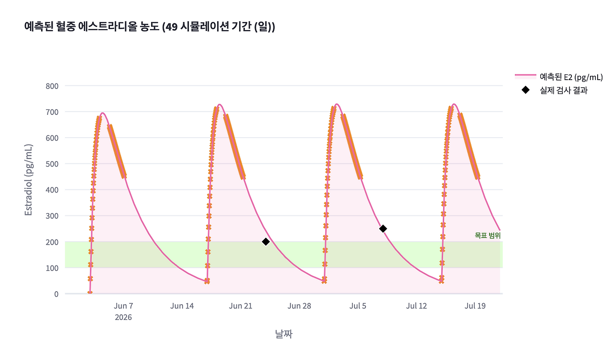
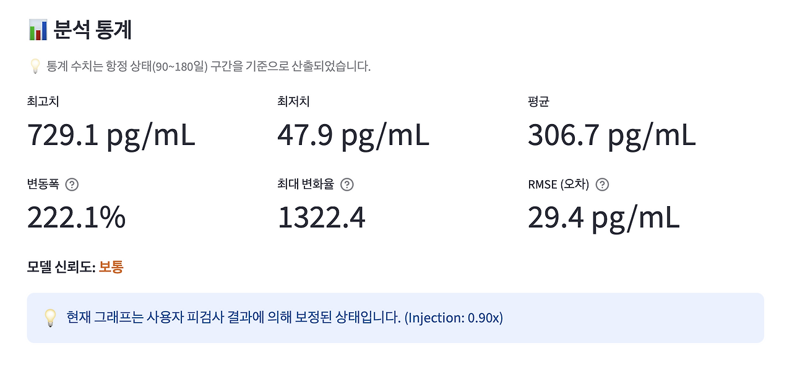
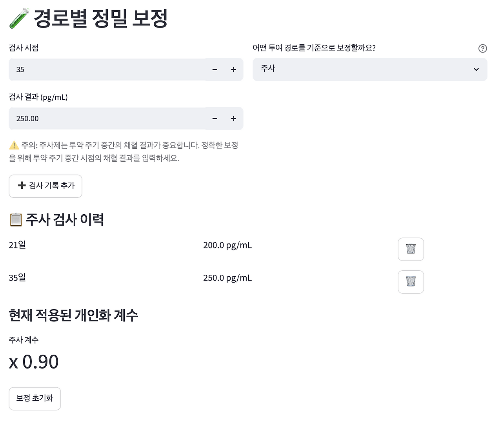

## 3. 모델은 처음부터 맞지 않는다

모델을 만들 때 가장 경계해야 할 착각이 하나 있습니다. 바로 처음부터 완벽하게 들어맞는 모델을 만들 수 있다는 착각입니다. 그럴듯한 수식을 세우고 문헌 값을 성실하게 입력한 뒤, 환자 정보를 바탕으로 매끄러운 그래프를 그려내면 마치 현실을 꽤 정확하게 묘사하고 있는 것처럼 보입니다.

하지만 실제로는 전혀 그렇지 않습니다. 모델은 결코 처음부터 맞지 않습니다.

대부분의 모델은 현실의 복잡성을 과감하게 쳐낸 단순한 가설에서 출발합니다. 그리고 그 가설은 실제 관찰값을 만나면서 깨지고, 부딪히고, 조금씩 수정되어 갑니다. 제가 EstroFrame, AndroFrame, NeuroFrame 등 여러 모델을 만들며 공통적으로, 그리고 가장 뼈저리게 느낀 것도 바로 이 지점이었습니다. 모델은 확고부동한 정답이 아니라, 끊임없이 조정되어야 하는 가설일 뿐입니다.

*예측값과 관찰값의 비교*

**주소:**
- [estroframe.streamlit.app](http://estroframe.streamlit.app/)
- [androframe.streamlit.app](http://androframe.streamlit.app/)
- [neuroframe.streamlit.app](http://neuroframe.streamlit.app/)

**연결 프로젝트:** EstroFrame, AndroFrame, NeuroFrame
**핵심 구조:** 초기 모델 → 예측값 생성 → 관찰값 입력 → 오차 확인 → 보정계수 또는 baseline 조정 → 다시 예측
**주의:** 모델은 실제 처방이나 치료, 생활 방식의 결정을 직접적으로 지시하는 도구가 아닙니다. 예측과 관찰의 차이를 정량적으로 확인하고 수정 과정을 밟기 위한 학습 및 연구용 구조입니다.

### # 1) 모델은 현실의 축소판이다

모델은 현실을 픽셀 단위로 복제하지 않습니다. 현실은 수학 공식 몇 줄로 담아내기엔 너무나 복잡하고 방대합니다. 사람마다 약물의 흡수율과 대사 속도가 다르고, 체중과 체지방률이 다르며, 매일매일의 생활 패턴마저 요동칩니다. 약을 제시간에 정확히 맞았는지, 채혈 시점이 식후였는지 공복이었는지도 결괏값을 크게 흔들어 놓습니다.

일상의 수면과 피로 역시 마찬가지입니다. 같은 시간에 자고 같은 시간에 일어나도 어떤 날은 머리가 맑고, 어떤 날은 물먹은 솜처럼 몸이 무겁습니다. 같은 양의 카페인을 마셔도 심장이 쿵쿵 뛸 만큼 효과가 강한 날이 있는가 하면, 아무리 마셔도 피로가 가시지 않는 날도 있습니다. 이처럼 끝없이 파생되는 수많은 변수를 처음부터 모델에 다 욱여넣을 수는 없습니다.

그래서 모델은 필연적으로 현실을 축소합니다. 가장 중요하다고 여겨지는 핵심 변수 몇 개만 추려내고 관계를 억지로 단순화하여, 일단 대략적인 뼈대부터 세웁니다. 이것은 모델의 한계나 실패가 아닙니다. 모든 모델은 원래 그렇게 불완전하게 태어납니다. 진짜 문제는, 모델을 만든 사람이나 쓰는 사람이 그 모델이 '단순화된 가설'에 불과하다는 사실을 잊어버리는 순간 시작됩니다. 모델은 현실 그 자체가 아니라, 현실을 더 잘 이해하기 위해 깎아 만든 축소판일 뿐입니다.

### # 2) 예측값은 관찰값을 만나야 한다

모델이 단순한 숫자 놀음을 넘어 현실적인 의미를 가지려면, 모델이 뱉어낸 '예측값'이 반드시 현실의 '관찰값'과 정면으로 마주해야 합니다. 약물 농도를 추정하는 모델이라면 예상 농도 곡선이 실제 채혈된 혈액검사 결과와 겹쳐져야 하고, 하루의 에너지 상태를 그리는 모델이라면 예상된 궤적이 실제 그날 느낀 주관적 명료도와 직접 비교되어야 합니다.

관찰값이 빠진 채 예측만 난무하는 모델은 현실과 단절된 자기만의 닫힌 세계에 머뭅니다. 혼자서 아무리 그럴듯하고 매끄러운 그래프를 그려내더라도, 그것이 현실과 얼마나 동떨어져 있는지는 알 길이 없습니다. 그래서 EstroFrame과 AndroFrame에서는 환자의 실측 검사값을 직접 입력하여 예측 곡선과 비교하는 구조를 필수적으로 넣었습니다. 투여 경로, 정확한 혈액검사 시점, 그리고 측정된 결괏값을 넣었을 때 비로소 모델의 예측과 실제 현실 사이의 노골적인 격차를 눈으로 확인할 수 있습니다.

NeuroFrame의 구조 역시 동일한 철학을 따릅니다. 수면 시간, 카페인 섭취량, 업무 부하를 재료 삼아 하루의 에너지 곡선을 야심 차게 예측하지만, 그 곡선이 진짜 내 하루의 체감과 맞아떨어지는지는 전적으로 다른 문제입니다. 그래서 하루의 끝에 수행하는 'end-of-day check-in'이 결정적으로 중요합니다. 오늘의 주관적 명료도, 실제 집중할 수 있었던 시간, 전반적인 에너지 만족도 같은 현실의 값들이 입력될 때, 모델은 비로소 환상에서 깨어나 현실과 부딪힙니다. 물론 관찰값은 모델의 불완전함을 들춰내어 개발자를 불편하게 만듭니다. 하지만 그 뼈아픈 불편함이 있어야만 모델은 진화할 수 있습니다.

### # 3) 오차는 실패가 아니라 정보다

*예측과 관찰의 차이*

예측이 틀렸다는 사실은 얼핏 모델의 참담한 실패처럼 보일 수 있습니다. 하지만 모델을 다루는 관점에서 오차는 실패가 아니라 가장 귀중한 '정보'입니다. 어느 방향으로 어긋났는지, 얼마나 크게 빗나갔는지, 특정한 조건에서만 반복적으로 틀리는지, 아니면 어떤 특정 변수가 개입될 때 오차가 폭발적으로 커지는지를 면밀히 들여다보아야 합니다. 

이 오차의 패턴을 읽어내면 모델이 현실의 어떤 조각을 놓치고 있는지 역으로 추적할 수 있습니다. 약물 농도의 예측값이 실제 검사값보다 유독 높게 나온다면, 환자의 실제 대사율이나 배설률이 교과서적인 문헌 값보다 훨씬 빠르다는 뜻일 수 있습니다. 반대로 예측값이 너무 낮다면 체내 분포용적이나 청소율에 대한 초기 가정을 근본적으로 다시 짚어봐야 합니다. 특정 경로(예: 경피 투여)에서만 오차가 크다면 그 경로의 흡수 메커니즘을 너무 나이브하게 설계했을 확률이 큽니다.

NeuroFrame에서도 마찬가지입니다. 모델은 오늘 오후를 최고의 생산성을 낼 수 있는 'Prime Zone'으로 호언장담했지만, 실제 체감 에너지는 바닥을 기었을 수 있습니다. 그렇다면 모델에 미처 반영하지 못한 전날의 감정적 스트레스, 보이지 않는 수면 부채, 혹은 급격한 기온 변화 같은 외부 변수를 새로 의심해 보아야 합니다. 오차는 부끄러운 결함이 아닙니다. 모델이 현실의 단단한 벽과 맞부딪히며 파생되는 불꽃입니다. 좋은 모델은 애초에 한 번도 틀리지 않는 완벽한 모델이 아닙니다. 자신이 얼마나 틀렸는지를 명확히 보여줄 수 있는 모델입니다.

### # 4) 보정은 모델을 현실 쪽으로 당기는 일이다

*보정 이력 화면*

관찰값을 통해 뼈아픈 오차를 확인했다면, 이제 남은 단계는 '보정(Calibration)'입니다. EstroFrame과 AndroFrame에서는 투여 경로별로 누적된 혈액검사 기록을 바탕으로 시스템에 보정계수를 먹일 수 있도록 설계했습니다. 같은 약물이라 하더라도 투여 경로에 따라 흡수 양상이 판이하고, 환자 개인의 유전적·생리적 특성에 따라 대사와 분포가 천차만별로 달라지기 때문입니다.

보정계수는 공중에 붕 떠 있는 추상적인 모델의 멱살을 잡아 현실 쪽으로 질질 끌어당기는 장치입니다. 최초의 모델이 텍스트북에 나오는 창백하고 일반적인 곡선이었다면, 숱한 오차와 보정을 거친 이후의 모델은 점점 그 환자 개인의 살갗에 밀착된 고유한 곡선으로 변모합니다.

NeuroFrame의 'baseline offset' 개념도 이와 정확히 같은 역할을 수행합니다. 수면과 카페인 공식으로 빚어낸 곡선이 실제 체감보다 시종일관 과대평가되거나 과소평가된다면, 매일의 자기평가 데이터를 근거로 그 곡선의 기준선 자체를 위아래로 끌어내리거나 올려야 합니다. 이것은 자신이 만든 모델의 실패를 자인하고 포기하는 일이 아닙니다. 오만했던 가설을 꺾고 모델을 현실의 굴곡에 맞게 구부러뜨리는 가장 과학적인 과정입니다. 모델이 틀렸음을 깨끗하게 인정하고, 그 틀림의 데이터를 다음 예측의 땔감으로 쓰는 일입니다.

### # 5) 보정할 수 없는 모델은 위험하다

모델이 처음부터 틀릴 수 있다는 것은 지극히 자연스러운 섭리입니다. 하지만 틀렸다는 사실이 명백하게 드러났음에도 불구하고 그것을 뜯어고칠 수 없다면, 그때부터 모델은 흉기가 됩니다. 특히 사람의 건강과 생명을 다루는 의료 영역에서는 더욱 치명적입니다.

현실의 값과 비교할 수도 없고, 오차가 얼마나 벌어졌는지 기록되지 않으며, 사후에 어떤 파라미터도 보정할 수 없는 '블랙박스' 모델이 있다고 가정해 봅시다. 이런 모델은 겉보기에 그럴듯하고 확신에 찬 결론을 내놓을수록 오히려 더 위험합니다. 

건강한 모델은 자신이 어떤 가녀린 가정들 위에 서 있는지 투명하게 고백해야 합니다. 어떤 입력값을 집어넣었는지, 내부적으로 어떤 파라미터를 곱했는지, 실제 관찰값과 비교했을 때 오차율은 몇 퍼센트였는지, 그리고 보정을 거치고 난 뒤 그래프가 얼마나 요동쳤는지 이 모든 과정이 백일하에 드러나야 합니다. 이 지저분한 수정의 족적이 낱낱이 보여야 비로소 의사나 환자는 이 모델을 어디까지 신뢰하고 어디서부터 의심해야 할지 결정할 수 있습니다. 

모델은 언제나 설명 가능해야 하고, 필연적으로 수정 가능해야 합니다. 처음부터 완벽하게 정답을 내놓는 오만한 모델보다, 틀렸을 때 군말 없이 고칠 수 있는 유연한 모델이 실제 임상 현장에서는 훨씬 더 강력하고 안전합니다.

### # 6) 개인화는 완성된 정밀함이 아니다

우리는 흔히 '개인화(Personalization)'라는 말에 과도한 환상을 품습니다. '개인화 모델'이라고 하면 마치 환자의 DNA부터 생활 습관까지 모조리 긁어모아 그 사람의 완벽한 디지털 클론을 창조해 내는 마법처럼 여겨집니다. 하지만 제가 모델링을 통해 체득한 개인화는 그렇게 거창하고 SF적인 개념이 아닙니다.

제가 생각하는 개인화는, 평범한 모델이 끈질기게 관찰값을 받아들이고 스스로를 깎아나가는 태도 그 자체입니다. 처음에는 누구나 일반적인 값으로 시작합니다. 문헌에 적힌 평균 반감기, 대다수에게 통용되는 흡수 시간, 평균 체중을 가정한 분포용적, 교과서적인 수면-에너지 공식을 차용합니다.

그다음 현실의 성적표를 받아 듭니다. 채혈된 혈액검사 수치, 정확한 채혈 시점, 그날 느낀 찌뿌둥함의 정도, 집중력을 유지했던 분(minute) 단위의 시간, 그리고 예측 곡선과의 오차 크기와 방향. 이 거친 데이터들을 주워 담아 모델의 기준선을 1밀리미터씩 위로, 혹은 아래로 옮깁니다. 

개인화는 단번에 도달하는 '완성된 정밀함'의 상태가 아닙니다. 끝없는 관찰과 오차 수정을 통해 영원히 점근선처럼 다가가는 지루한 과정입니다. 개인화는 상태가 아니라 동사입니다.

### # 7) 모델은 겸손해야 한다

모델은 언제나 현실보다 초라하고 작습니다. 화면에 그려진 매끄러운 곡선은 결코 환자의 몸속에서 벌어지는 복잡다단한 현실의 전부가 될 수 없습니다.

제가 진정으로 매료되는 모델은 한 번도 틀린 적 없는 완벽한 모델이 아닙니다. 자신이 틀린 정도를 솔직하게 보여주고, 그 오차의 폭을 부끄러움 없이 기록하며, 내일을 위해 기꺼이 자신의 수식을 뜯어고치는 유연한 모델입니다. 모델은 현실이라는 거대한 벽을 향해 끊임없이 몸을 던지며 스스로를 조정해 나가는 가설일 뿐입니다.

모델은 처음부터 절대로 맞지 않습니다. 하지만 관찰값을 두려워하지 않고 직면하며, 자신의 오차를 성실하게 기록하고, 다음번 예측에서 어김없이 스스로를 보정해 나간다면, 어제보다 오늘 조금 더 나아질 수는 있습니다.

제가 진정으로 매료되는 모델은 한 번도 틀린 적 없는 완벽한 모델이 아닙니다. 자신이 틀린 정도를 솔직하게 보여주고, 그 오차의 폭을 부끄러움 없이 기록하며, 내일을 위해 기꺼이 자신의 수식을 뜯어고치는 유연한 모델입니다. 모델은 하늘에서 뚝 떨어진 정답이 아닙니다. 현실이라는 거대한 벽을 향해 끊임없이 몸을 던지며 스스로를 조정해 나가는, 눈물겨운 가설일 뿐입니다.