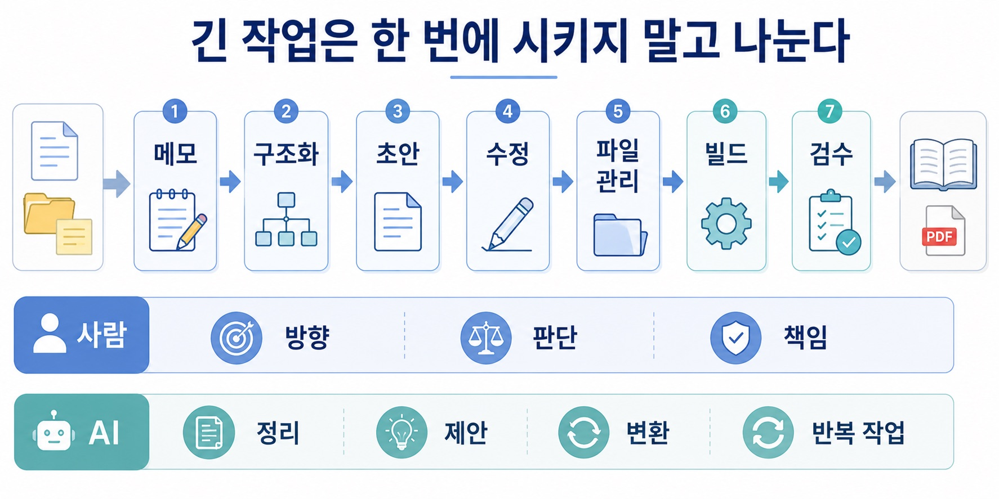
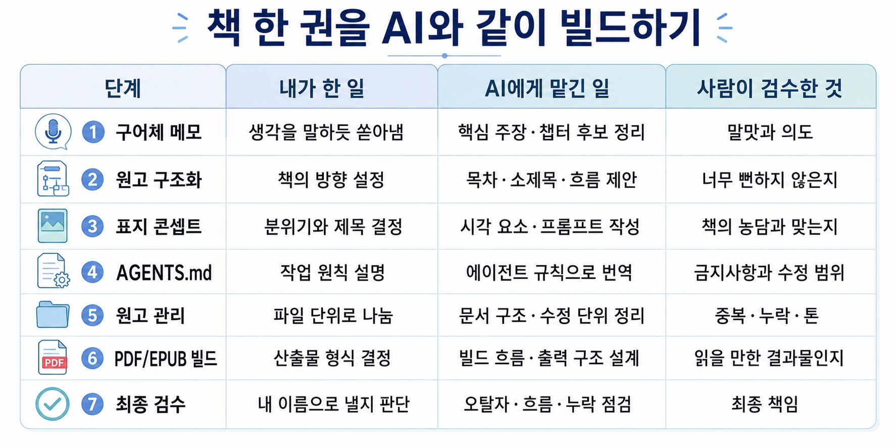
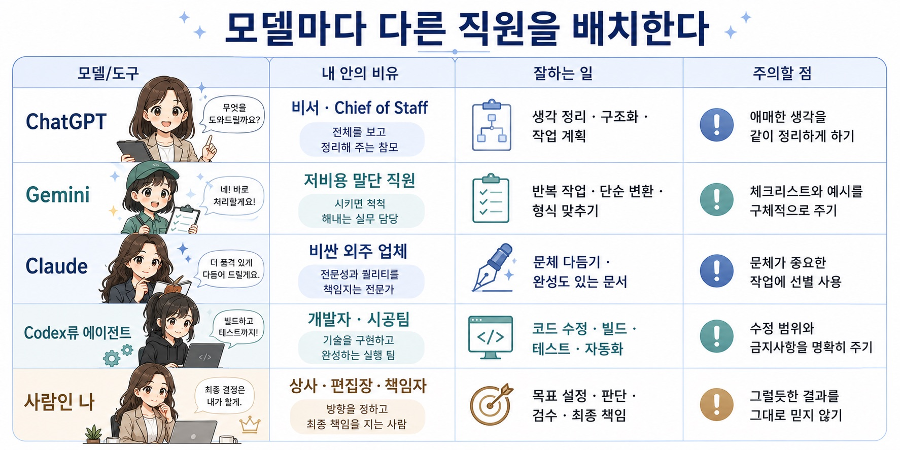
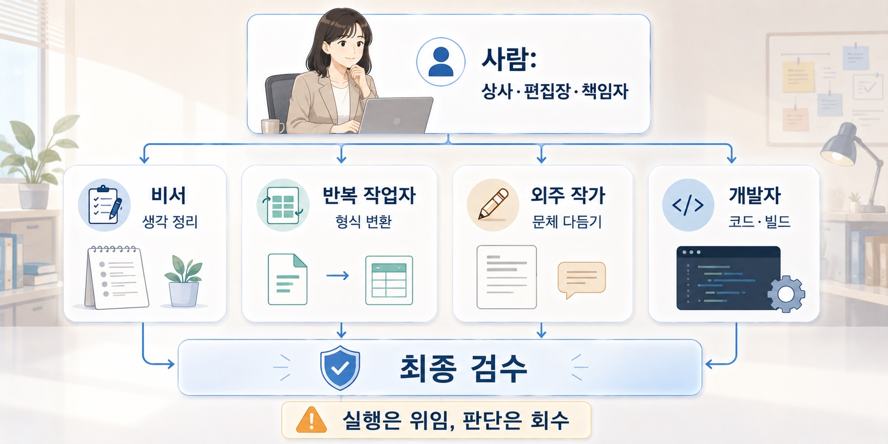

## 1. AI에게 일을 맡긴다는 건, 좋은 상사가 되는 일이다

ChatGPT Plus를 쓰다 보면 묘한 감각이 든다. 월 몇 만 원으로 꽤 똑똑한 직원을 한 명 고용한 것 같다. 심지어 Pro급으로 올라가도 월 수십만 원이다. 사람 인건비로 생각하면 말도 안 되게 싸다. 월 수십만 원에 글을 정리해주고, 코드를 짜주고, 자료를 요약해주고, 표지 콘셉트를 같이 고민해주고, 내가 대충 말한 생각을 구조화해주는 직원이 옆에 앉아 있는 셈이다.

물론 여기에는 중요한 조건이 있다. 아무리 직원이 똑똑해도 상사가 일을 설명하지 못하면 결과는 망한다. 부하직원이 아무리 똑똑해도 상사가 병신이면 조직은 산으로 간다. AI도 비슷하다. “알아서 잘해줘”라는 말은 사람에게도 위험한 지시이고, AI에게도 위험한 지시다. 무엇을 만들고 싶은지, 왜 필요한지, 어떤 기준을 만족해야 하는지, 어디까지 하면 되는지 알려주지 않으면 AI는 자기 나름대로 해석해서 움직인다. 그리고 그 해석은 종종 내가 원한 것과 다르다.

그래서 AI를 잘 쓰는 일은 천재 비서를 부리는 일이 아니다. 똑똑하지만 맥락을 모르는 보조직원을 매니징하는 일에 가깝다. 좋은 상사는 모든 일을 직접 하지 않는다. 목표를 정하고, 업무를 나누고, 기준을 세우고, 결과를 검수한다. 그리고 모르는 것이 있으면 직원에게도 묻는다.

“이 일을 잘 맡기려면 내가 너에게 어떤 정보를 더 줘야 하지?”

이 질문을 할 줄 아는 것이 중요하다. 상사가 항상 정답을 알고 있어야 하는 것은 아니다. 오히려 좋은 상사는 일을 맡기기 전에 필요한 정보를 확인한다. AI에게도 똑같이 물어볼 수 있다.

“내가 원하는 결과를 얻으려면 어떤 정보를 더 줘야 해?”

“이 작업을 어떤 단계로 나누면 좋을까?”

“내 지시에서 애매한 부분이 뭐야?”

“지금 정보만으로 가능한 일과, 추가 정보가 필요한 일을 나눠줘.”

이런 질문을 던지는 순간, AI는 단순한 답변 생성기가 아니라 함께 일을 정의하는 보조자가 된다.

### 1) 프롬프트는 주문이 아니라 업무 지시서다

AI 활용법을 이야기하면 흔히 “프롬프트를 잘 써야 한다”고 말한다. 맞는 말이지만, 그것만으로는 조금 부족하다. 프롬프트는 마법 주문이 아니다. 내가 원하는 결과를 기계가 처리할 수 있는 형태로 바꾸는 업무 지시서에 가깝다.

사람의 언어는 원래 두루뭉술하다.

“깔끔하게 정리해줘.”

“너무 딱딱하지 않게 써줘.”

“전문적으로 보이게 해줘.”

“내 의도는 살려줘.”

사람끼리는 이런 말도 어느 정도 통한다. 상대가 맥락을 읽고, 내 말투를 기억하고, 눈치껏 적당한 결과물을 만들어주기 때문이다. 하지만 AI에게는 이 표현들이 아직 덜 정의된 입력값이다. “깔끔하게”가 중복을 줄이라는 뜻인지, 문단을 짧게 나누라는 뜻인지, 표를 넣으라는 뜻인지, 말투를 담백하게 바꾸라는 뜻인지 알 수 없다.

그래서 AI에게 일을 맡길 때는 감각을 조금 더 작업 가능한 기준으로 바꿔야 한다.

“깔끔하게 정리해줘”보다는 “중복 문장을 줄이고, 문단당 핵심 메시지를 하나로 제한하고, 소제목을 추가해서 처음 읽는 사람이 3분 안에 구조를 파악할 수 있게 해줘”가 낫다.

“전문적으로 써줘”보다는 “용어는 정확하게 쓰되, 근거와 한계를 함께 표시하고, 과장된 표현은 피해서 작성해줘”가 낫다.

“보기 좋게 해줘”보다는 “모바일 화면에서도 읽기 쉽도록 짧은 문단, 소제목, bullet을 사용하되, 핵심 내용은 줄이지 말고 표현만 정리해줘”가 낫다.

AI에게 잘 말한다는 것은 내 감각을 버리는 일이 아니다. 내 감각을 AI가 다룰 수 있는 형태로 번역하는 일이다.

### 2) AI는 자연어와 기계의 작업 언어 사이에 있는 번역기다

AI가 잘하는 일 중 하나는 번역이다. 여기서 말하는 번역은 한국어를 영어로 바꾸는 종류의 번역만이 아니다. 사람이 대충 말한 자연어를, 다른 AI나 소프트웨어가 실행할 수 있는 지시문으로 바꾸는 것도 번역이다.

예를 들어 나는 “내 말투를 살려서 책을 만들고 싶다”고 말한다. 사람에게는 어느 정도 통하는 문장이다. 하지만 작업 시스템 입장에서는 아직 모호하다. 어떤 말투를 살릴 것인지, 어떤 형식으로 저장할 것인지, 장별 구조는 어떻게 나눌 것인지, 긴 출력은 어떻게 분할할 것인지가 정해져 있지 않다.

이때 ChatGPT는 내 말을 받아서 프로젝트 규칙, 프롬프트, AGENTS.md, 작업 계획, 파일 구조 같은 형태로 바꿔줄 수 있다. 사람의 “대충 이런 느낌”을 에이전트가 이해할 수 있는 “이 조건을 지켜서 이 순서로 작업하라”는 문장으로 바꿔주는 것이다.

앞으로 AI가 코딩을 더 많이 하고, 문서를 더 많이 만들고, 분석을 더 많이 대신하게 되더라도 이 능력은 사라지지 않는다. 오히려 더 중요해진다. 사람이 해야 할 일은 모든 코드를 직접 치는 것이 아니라, 무엇을 만들고 싶은지, 어떤 조건을 지켜야 하는지, 결과물이 어떤 기준을 만족해야 하는지를 분명하게 정의하는 일이 되기 때문이다.

결국 AI 시대의 핵심 능력은 프롬프트 몇 줄을 외우는 것이 아니다. 내 머릿속의 감각과 욕구를 기계가 실행 가능한 요구사항으로 바꾸는 능력이다.

### 3) 긴 작업은 한 번에 시키지 말고 파이프라인으로 나눈다

AI에게도 입력과 출력의 한계가 있다. 긴 글을 한 번에 붙여 넣고 “전부 정리해줘”라고 하거나, 책 한 장 분량의 글을 한 번에 완성해달라고 하면 결과가 흔들리기 쉽다. 앞부분의 조건을 뒤에서 잊어버리거나, 중간에 중요한 정보가 빠지거나, 출력이 길어지면서 구조가 무너질 수 있다.

그래서 긴 작업을 할 때는 프롬프트보다 먼저 작업 단위를 설계해야 한다. 입력할 자료가 너무 길다면 본문 전체를 채팅창에 붙여 넣기보다 별도 텍스트 파일이나 문서로 저장해두고, AI가 그 파일을 기준 자료로 참조하게 하는 편이 낫다. 그리고 바로 완성본을 요구하기보다 먼저 “이 자료를 어떤 순서로 처리하면 좋을지 계획을 세워줘”라고 요청한다.

출력도 마찬가지다. 한 번에 모든 내용을 뽑아내려고 하면 결과가 불안정해진다. 긴 문서라면 먼저 목차와 구조를 만들고, 각 절을 따로 작성한 뒤, 마지막에 전체 톤과 중복을 정리하는 식으로 나누는 편이 좋다.

AI는 무한한 종이가 아니다. 제한된 입력과 출력 안에서 작동하는 도구다. 그러므로 AI를 잘 쓴다는 것은 멋진 프롬프트 한 줄을 아는 것이 아니라, 자료를 어떤 단위로 넣고 결과를 어떤 단위로 받을지 설계하는 일에 가깝다.

### 4) 실제 작업 로그: 책 한 권을 AI와 같이 빌드하기

이 책도 그렇게 만들었다. 그냥 “책 한 권 만들어줘”라고 던진 것이 아니다. 구어체 메모, 장별 아이디어, 표지 콘셉트, 원고 구조, 빌드 파이프라인, 파일 관리 규칙을 전부 작은 작업으로 쪼갰다.

작업 흐름은 대략 이랬다.

그러니까 AI가 책을 대신 써준 것이 아니다. 책을 만드는 시스템을 AI와 같이 만든 것이다. 나는 생각을 말했고, AI는 그 생각을 구조화했다. 나는 방향을 정했고, AI는 작업 단위로 나눴다. 나는 결과를 보고 “이건 내 말이 맞다” 또는 “이건 내 의도와 다르다”고 판단했다.

이 과정에서 중요한 것은 AI에게 일을 던지는 것이 아니라, AI가 일할 수 있는 구조를 만드는 것이었다. 책 원고 정리, 표지 콘셉트 만들기, AGENTS.md 작성, PDF/EPUB 빌드까지 전부 AI와 같이 설계했지만, 최종적으로 그것을 이해하고 책임지는 사람은 나였다.

### 5) 모델마다 다른 직원을 배치한다

AI 모델을 하나의 만능 도구처럼 생각하면 오히려 쓰기 어렵다. 나는 차라리 여러 명의 직원이 있는 작은 사무실처럼 생각하는 편이 편했다.

ChatGPT는 내게 비서에 가깝다. 매일 옆에 두고 생각을 정리하고, 애매한 말을 구조화하고, 다른 AI에게 줄 프롬프트를 만들고, 긴 작업을 단계로 나누는 데 균형이 좋았다. 꼭 최종 작업자라기보다, 내가 여러 AI에게 일을 맡기기 전에 먼저 의도를 정리해주는 chief of staff 같은 역할이었다.

Gemini는 저비용 말단 직원처럼 느껴질 때가 있었다. 복잡한 맥락을 알아서 잘 파악하지는 못하지만, 해야 할 일을 아주 명확하게 써주면 그 일은 꽤 성실하게 한다. 이런 모델에게는 “알아서 잘해줘”라고 말하면 안 된다. 입력 형식, 출력 형식, 금지할 행동, 예시를 구체적으로 줘야 한다. 말귀를 잘 알아듣는 직원이라기보다는, 체크리스트를 주면 움직이는 직원에 가깝다.

Claude는 비싼 외주 업체처럼 느껴진다. 글을 다듬거나 일정한 톤의 문서를 만들거나, 완성도 있는 산출물을 뽑는 데 강하다. 다만 비용이 부담스럽다. 그래서 매일 아무 일에나 쓰기보다는, 정말 문체와 완성도가 중요한 작업에 가끔 맡기는 쪽이 낫다.

Codex 같은 코딩 에이전트는 개발자나 시공팀에 가깝다. 사람이 “이런 제품을 만들고 싶다”고 말하면, 실제 파일을 열고 코드를 고치고 빌드하고 테스트하는 일을 맡길 수 있다. 하지만 이쪽도 그냥 던지면 삽질한다. 프로젝트 구조, 금지할 행동, 테스트 방법, 출력 형식, 수정 범위를 알려줘야 한다. 그래서 AGENTS.md 같은 작업 규칙이 중요해진다.

이 관점에서 AI 활용은 “어떤 모델이 제일 똑똑한가”를 고르는 문제가 아니다. 어떤 일은 비서에게, 어떤 일은 말단 직원에게, 어떤 일은 외주 업체에게, 어떤 일은 개발자에게 맡기는 식으로 역할을 나누는 문제다. 중요한 것은 내가 원하는 결과를 이해하고, 작업을 나누고, 각 모델이 알아들을 수 있는 방식으로 지시하는 것이다.

물론 이 비교는 특정 시점의 사용 경험에 가깝다. 모델의 가격, 사용량 제한, 성능은 계속 바뀐다. 하지만 중요한 원칙은 남는다. AI 모델을 하나로 보지 말고, 역할이 다른 여러 직원처럼 배치하라는 것이다.

### 6) 책임은 결국 사람에게 있다

AI가 만든 결과물의 책임은 결국 나에게 있다. 이건 꽤 중요하다. AI를 써서 책을 만들든, 코드를 만들든, 발표자료를 만들든, 최종적으로 그 결과물을 내 이름으로 내보내는 순간 책임은 나에게 온다.

그래서 내가 모르는 것을 AI가 그럴듯하게 만들어내면 위험하다. 내가 이해하지 못하는 코드, 내가 판단할 수 없는 의학 정보, 내가 검수하지 못하는 분석 결과를 그대로 가져다 쓰면 안 된다. 그건 AI 활용이 아니라 책임 회피에 가깝다.

특히 의학에서는 더 그렇다. AI가 만든 의학 정보를 내가 이해하고 검수할 수 없으면, 그걸 활용하는 건 진짜 미친 짓이다. 의학 정보는 틀렸을 때 그냥 문장이 어색한 정도로 끝나지 않는다. 누군가의 판단, 치료, 검사, 불안, 비용, 안전에 영향을 줄 수 있다. AI가 그럴듯한 말투로 틀린 정보를 만들어내면 오히려 더 위험하다. 틀린 말인데 너무 말이 되게 들리기 때문이다.

의대생이나 의료인이 AI를 쓴다면 적어도 결과물이 말이 되는지 볼 수 있어야 한다. 용어가 맞는지, 병태생리가 말이 되는지, guideline이나 근거와 충돌하지 않는지, 환자에게 적용할 때 위험한 비약은 없는지 확인해야 한다. 내가 모르는 영역이라면 AI의 답을 그대로 쓰는 것이 아니라, 그 답을 검토하기 위한 출발점으로만 써야 한다.

AI를 쓴다는 것은 내가 몰라도 되는 영역을 무한히 늘리는 일이 아니다. 오히려 최소한 결과물을 이해하고, 분석하고, 판단하고, 검수할 수 있어야 한다. 내가 직접 모든 코드를 외워서 칠 필요는 없지만, 코드가 대략 무엇을 하는지, 어디가 위험한지, 결과가 말이 되는지는 봐야 한다. 내가 모든 문장을 처음부터 쓰지 않아도 되지만, 글이 내 생각을 왜곡하지 않았는지, 근거 없는 말을 추가하지 않았는지, 독자에게 오해를 주지 않는지는 확인해야 한다.

AI가 강력해질수록 사람의 역할은 줄어드는 것처럼 보인다. 하지만 실제로는 조금 다르다. 사람이 직접 모든 문장을 쓰고, 모든 코드를 치고, 모든 표를 정리하는 비중은 줄어들 수 있다. 대신 목표를 정의하고, 작업을 분해하고, 기준을 세우고, 결과를 검수하는 일이 더 중요해진다.

AI에게 일을 맡긴다는 것은 일을 하지 않는다는 뜻이 아니다. 일을 시킬 수 있는 형태로 바꾸고, 나온 결과를 책임질 수 있는 수준으로 이해하는 일이다.

AI를 잘 쓰는 사람은 명령을 많이 내리는 사람이 아니다. 일을 이해 가능한 단위로 나누고, 좋은 기준을 주고, 결과를 책임지고 검수하는 사람이다. 똑똑한 직원을 고용했다고 해서 상사의 역할이 사라지는 것은 아니다. 오히려 상사가 해야 할 일이 더 분명해진다.

AI와의 소통 능력은 결국 업무 지시 능력이다. 원하는 것을 설명하고, 애매한 부분을 줄이고, 작업 가능한 단위로 나누고, 결과를 다시 판단하는 능력. 앞으로 더 많은 일이 AI에 의해 실행될수록, 사람에게 더 중요해지는 것은 바로 이 능력일지도 모른다.

AI를 쓴다는 것은 책임을 외주화하는 게 아니다. 실행은 위임하되, 판단은 다시 회수하는 일이다.
