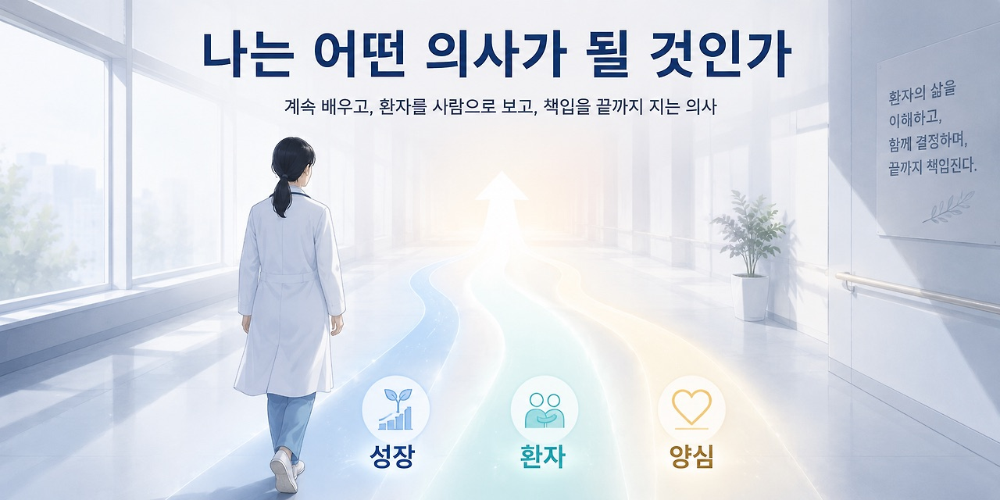
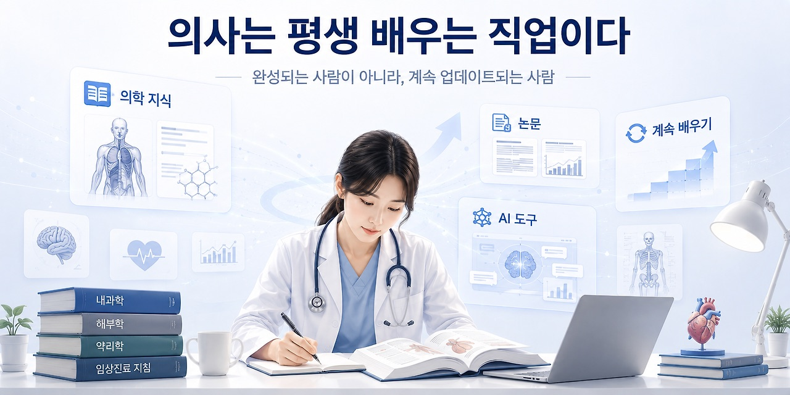
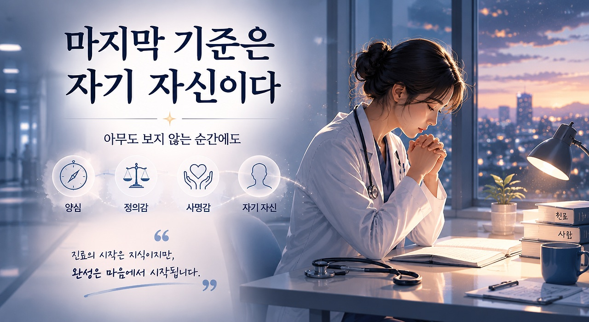
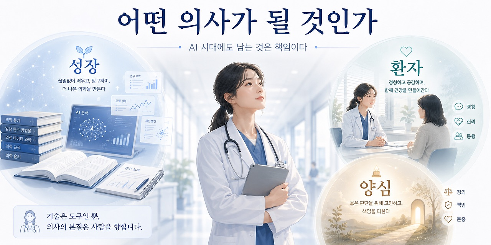

## 3. 어떤 의사가 될 것인가

오늘 한 교수님이 우리에게 물었다.

> “자네들은 어떤 의사가 될 것인가.”

의대에 들어온 뒤 이 질문을 여러 번 들었다. 좋은 의사가 되어야 한다는 말도 많이 들었다. 환자를 위하는 의사가 되어야 한다는 말도, 평생 공부해야 한다는 말도, 책임감 있는 의사가 되어야 한다는 말도 들었다. 그런데 이상하게도 이 질문은 들을 때마다 조금씩 다르게 다가온다.

처음에는 막연한 다짐처럼 들렸다. 조금 더 시간이 지나자 직업윤리처럼 들렸다. 그리고 이제는, 앞으로 내가 어떤 방식으로 살아남을 것인가에 대한 질문처럼 들린다. 의사는 한 번 완성되는 직업이 아니다. 면허를 받는다고 끝나는 것도 아니고, 전문의가 된다고 끝나는 것도 아니다. 오히려 그때부터 더 긴 시간이 시작된다.

나는 오늘 그 질문을 세 가지 축으로 다시 정리해 보았다.

성장.

환자.

그리고 자기 자신(自信).

### # 1. 의사는 평생 배우는 직업이다

해리슨 교과서의 첫 페이지에는 이런 문장이 나온다.

> “Medicine is an ever-changing science.”

의학은 계속 변한다.

질병의 이름이 바뀌고, 진단 기준이 바뀌고, 치료 원칙이 바뀐다. 예전에는 당연하다고 여겼던 치료가 더 이상 권고되지 않기도 하고, 과거에는 불가능하다고 생각했던 치료가 표준이 되기도 한다. 그래서 의사가 된다는 것은 한 번 배운 지식으로 평생 버티겠다는 뜻이 아니다. 계속 바뀌는 지식 앞에서 계속 배우겠다는 뜻에 가깝다.

출발점은 저마다 다를 수 있다.

어떤 병원에서 시작했는지, 어떤 전공을 선택했는지, 처음부터 얼마나 잘했는지는 물론 중요하다.

하지만 그것이 전부는 아니다.

긴 시간으로 보면 시작은 하나의 지점일 뿐이다. 더 중요한 것은 그 이후에도 계속 배우고, 수정하고, 성장할 수 있는가이다. 최근 의료 환경은 AI의 등장으로 빠르게 바뀌고 있다. 정보를 찾는 방식도, 논문을 읽는 방식도, 진료 기록을 다루는 방식도 달라지고 있다.

AI는 이미 의학 공부와 임상 판단의 주변부에 들어와 있고, 앞으로는 더 깊숙이 들어올 것이다. 그렇다고 해서 의사의 역할이 사라진다고 생각하지는 않는다. 오히려 AI 시대가 될수록 의사의 역할은 더 분명해진다.

환자의 이야기를 직접 듣는 일, 환자의 표정과 말투, 망설임과 불안을 읽는 일, 신체진찰을 통해 화면 밖의 정보를 얻는 일, AI가 제안한 답을 그대로 받아들이지 않고 이 환자에게 정말 적용 가능한지 판단하는 일, 그리고 그 판단에 대해 최종 책임을 지는 일. 이것은 여전히 의사의 몫이다.

AI는 강력한 도구다. 하지만 도구는 방향을 스스로 정하지 않는다. 도구를 어떻게 쓸지, 어디까지 믿을지, 어떤 상황에서 멈출지를 결정하는 사람은 결국 의사다. 그래서 나는 AI 시대의 의사가 더 많이 배워야 한다고 생각한다. 의학도 배워야 하고, 기술도 이해해야 하며, 그 기술이 만들어내는 오류와 한계도 알아야 한다.

의사는 완성된 사람이 아니라, 계속 업데이트되는 사람이어야 한다.

### # 2. 환자를 가족처럼 생각한다는 것

의사라면 누구나 마음 한쪽에 두려움이 있다.

의료 분쟁.

소송.

예상하지 못한 악화.

내가 놓친 것은 없었는지에 대한 불안. 이 위험을 완전히 없앨 수는 없다. 의료는 언제나 불확실성을 포함하고 있고, 의사도 결국 사람이다.

항상 완벽할 수는 없다.

하지만 위험을 줄이는 태도는 있다. 교수님은 환자를 가족처럼 생각하라고 하셨다. 이 말은 너무 익숙해서 오히려 쉽게 지나치기 쉽다. 하지만 실제 상황에 놓고 생각하면 꽤 강한 기준이다.

응급 호출이 왔을 때, 피곤해서 몸이 무겁고 이미 해야 할 일이 쌓여 있을 때, 환자가 같은 질문을 반복하고 보호자가 예민하게 반응할 때, 내가 설명할 여유가 별로 없다고 느낄 때. 그 순간 스스로에게 묻는 것이다. “이 사람이 내 가족이라면 나는 어떻게 했을까?” 물론 모든 환자를 실제 가족처럼 느낄 수는 없다. 그것은 인간적으로 불가능하다. 하지만 적어도 의사결정의 기준을 세울 때, 이 질문은 방향을 잡아준다.

조금 더 확인했을 것이다. 조금 더 설명했을 것이다. 조금 더 빨리 보러 갔을 것이다. 조금 더 조심스럽게 말했을 것이다.

그 차이가 의료의 질을 만든다.

좋은 의사-환자 관계는 단순한 친절에서 나오지 않는다. 환자에게 무조건 맞춰주는 것도 아니다. 오히려 정확한 설명, 일관된 태도, 예측 가능한 대응, 그리고 환자가 자신이 방치되지 않았다고 느끼게 하는 신뢰에서 나온다. 의료는 기술만으로 이루어지지 않는다.

검사 수치와 영상, 약물과 수술만으로 완성되지 않는다. 의료는 결국 사람과 사람 사이에서 일어난다. AI가 진단을 보조하고, 알고리즘이 위험도를 계산하고, 모델이 예후를 예측하는 시대가 와도 환자를 직접 마주하는 사람은 여전히 의사다. 환자는 단지 질병을 가진 데이터 포인트가 아니다.

불안하고, 기대하고, 때로는 화가 나고, 때로는 아무 말도 하지 못하는 사람이다. 좋은 의사는 치료를 잘하는 사람이어야 한다. 하지만 그것만으로 충분하지 않다. 좋은 의사는 환자가 자신을 맡길 수 있다고 느끼게 하는 사람이어야 한다.

### # 3. 마지막 기준은 자기 자신(自信)이다

예전과 달리, 이제 의사라는 이유만으로 존경받는 시대는 아니다. 어쩌면 그것이 더 자연스러운 일일지도 모른다. 어떤 직업도 이름만으로 존중받을 수는 없다. 존중은 결국 그 사람이 어떻게 행동하는지에서 만들어진다.

그럼에도 의사에게 필요한 소양은 여전히 있다. 나는 그것을 정의감과 사명감이라고 생각한다. 다만 이런 말은 조금 낡게 들릴 수 있다. 요즘 시대에 정의감, 사명감이라는 말을 하면 너무 거창하거나 비현실적으로 들리기도 한다. 하지만 막상 의료 현장에 가까이 갈수록, 이런 단어가 완전히 사라질 수 없다는 생각이 든다.

아무도 보지 않는 순간이 있다. 기록에는 남지 않는 판단이 있다. 조금 더 볼 수도 있었고, 그냥 넘어갈 수도 있었던 장면이 있다. 누군가는 몰랐을 수도 있고, 환자도 끝내 알지 못했을 수도 있는 선택이 있다. 그때 남는 것은 외부의 평가가 아니다. 자기 자신이다.

나는 내가 무엇을 했는지 안다. 무엇을 하지 않았는지도 안다.

조금 더 할 수 있었는데 하지 않았던 순간도, 최선을 다했지만 어쩔 수 없었던 순간도 결국 자기 자신은 알고 있다. 사람은 자기 양심에 떳떳할 때 비로소 자기 자신을 믿을 수 있다. 그리고 그 자기 신뢰는 험난한 시간을 버티게 하는 중요한 힘이 된다. 레지던트가 되면 환자가 갑자기 악화되는 순간을 맞이하게 될 것이다.

최선을 다했는데도 결과가 좋지 않은 날도 있을 것이다. 의사이기 전에 인간이기 때문에, 내가 할 수 있는 일에는 한계가 있다. 그 한계를 인정하는 것은 무책임과 다르다. 오히려 한계를 알기 때문에, 내가 할 수 있는 몫에 더 충실해야 한다. 그래서 나는 마음속에 하나의 기도를 적어 둔다.

“주님, 제가 할 수 있는 최선을 다하겠습니다. 그리고 나머지는 주님께 맡기겠습니다.” 이 기도는 책임을 내려놓겠다는 말이 아니다. 오히려 내가 책임질 수 있는 부분을 끝까지 책임지겠다는 말에 가깝다.

내가 배워야 할 것을 배우고, 봐야 할 것을 보고, 설명해야 할 것을 설명하고, 확인해야 할 것을 확인하는 것. 그 이후에도 인간이 통제할 수 없는 영역이 남는다면, 그것은 겸허하게 받아들이는 것. 그것이 내가 지금 이해하는 의사의 태도다.

### # 나는 어떤 의사가 될 것인가

나는 대단한 의사가 되겠다고 쉽게 말하고 싶지는 않다. 그 말은 너무 크고, 아직은 잘 모르겠다.

다만 방향은 조금 알 것 같다.

계속 배우는 의사.

환자를 데이터가 아니라 사람으로 보는 의사. AI와 기술을 활용하되, 그 책임을 회피하지 않는 의사. 그리고 아무도 보지 않는 순간에도 자기 자신에게 부끄럽지 않은 의사.

어떤 의사가 될 것인가.

아직 완성된 답은 없다. 아마 평생 답을 고쳐가며 살게 될 것이다. 하지만 적어도 지금의 나는 이렇게 말할 수 있다. 의사는 한 번 완성되는 직업이 아니라, 평생 자기 자신을 업데이트하는 직업이다. 그리고 그 업데이트의 기준은 결국 환자와 자기 자신 앞에서 떳떳한가에 있다.
