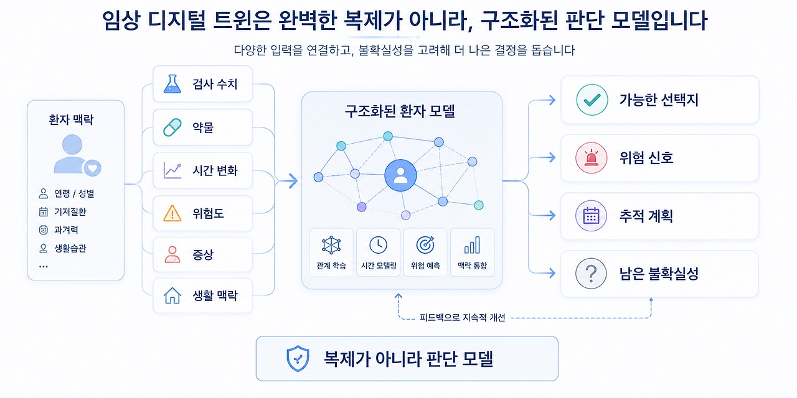
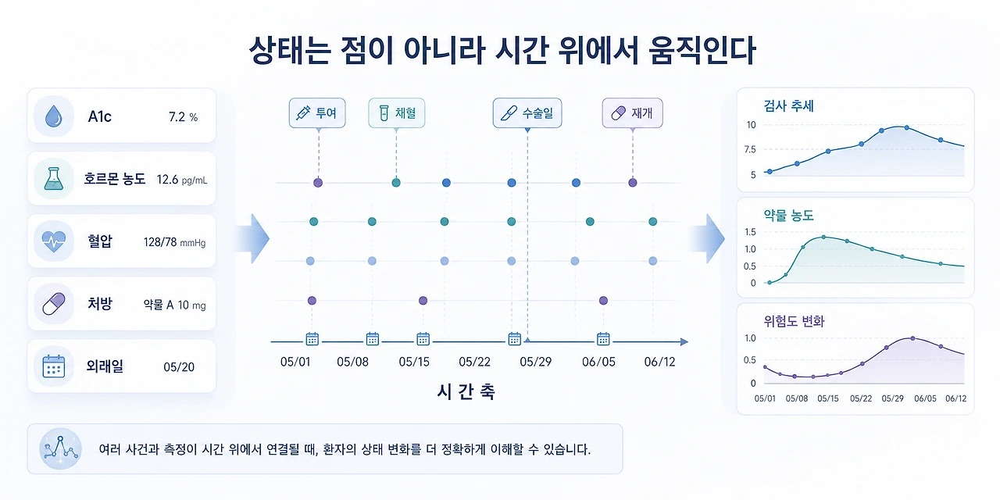
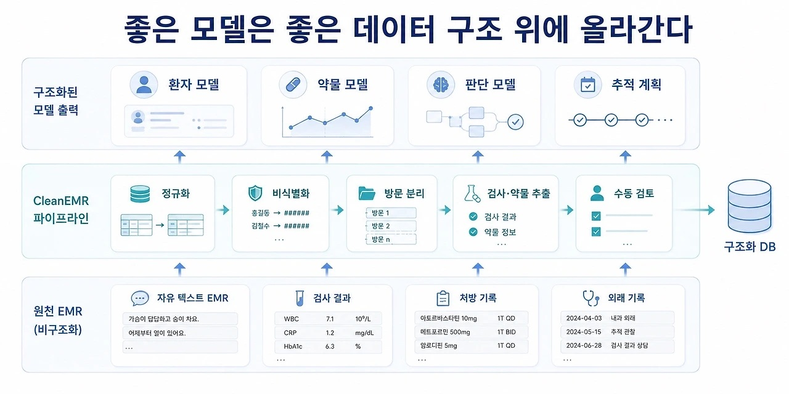

## 4. 임상 디지털 트윈 설계자

디지털 트윈이라는 말은 거창하게 들립니다.

현실의 무언가를 가상 공간에 그대로 복제하는 것처럼 느껴집니다. 공장, 도시, 항공기, 기계 장비처럼 구조가 비교적 명확한 대상을 떠올리기 쉽습니다. 하지만 임상에서 환자의 디지털 트윈을 만든다는 말은 훨씬 조심스럽게 다뤄야 합니다.

환자는 기계가 아닙니다.

몸은 복잡하고, 생활은 변하고, 감정과 선호는 숫자만으로 환원되지 않습니다. 검사 수치가 같아도 환자가 처한 맥락은 다를 수 있습니다. 그래서 제가 생각하는 임상 디지털 트윈은 환자를 완벽하게 복제하는 시스템이 아닙니다.

그보다 현실적인 의미에서는 의사결정에 필요한 변수와 변화를 추적하는 구조화된 환자 모델에 가깝습니다.

환자의 현재 상태, 시간에 따른 검사 수치 변화, 복용 중인 약물, 위험도, 치료 반응, 예상되는 다음 상태, 그리고 아직 불확실한 부분. 이런 요소들을 하나의 구조 안에 놓고 더 설명 가능한 판단을 준비하는 것.

제가 만들고 싶은 것은 환자를 대체하는 AI가 아니라, 판단을 돕는 환자 모델입니다.

임상 디지털 트윈 개념도

연결 프로젝트: EstroFrame, AndroFrame, DiaFrame, NeuroFrame, CleanEMR

형태: 임상 상태, 약물, 판단, 데이터 구조화를 연결하는 장기 비전

핵심 구조: EMR 데이터 구조화 → 상태 변수 추출 → 시간 변화 추적 → 모델 생성 → 관찰값 보정 → 의사결정 보조

주의: 환자를 대체하거나 자동으로 진료하는 AI가 아니라, 임상 판단을 더 설명 가능하게 만들기 위한 구조화된 모델 개념

### # 1) 환자를 복제하는 것이 아니다

임상 디지털 트윈을 이야기할 때 가장 먼저 경계해야 할 것은 복제라는 환상입니다. 환자의 몸을 완벽하게 재현하고, 미래를 정확히 예측하고, 의사의 판단 없이도 최적의 결정을 내리는 시스템. 그런 상상은 매력적이지만 현실의 임상과는 거리가 있습니다.

의료 데이터는 불완전합니다. 검사 간격은 일정하지 않고, 복약 순응도는 흔들리고, 생활 습관은 계속 바뀝니다. 기록되지 않은 정보도 많습니다. 환자가 어떤 음식을 먹었는지, 실제로 약을 어떻게 먹었는지, 그날의 스트레스가 어땠는지, 증상을 얼마나 참고 있었는지는 항상 데이터로 남지 않습니다.

그래서 임상 디지털 트윈은 현실의 완전한 복제본이 될 수 없습니다. 오히려 중요한 것은 복제가 아니라 근사입니다.

의사결정에 필요한 변수들을 고르고, 그 변수들이 시간에 따라 어떻게 변하는지 추적하고, 어떤 가정 아래에서 다음 상태를 예측하는지 표시하는 것.

이 정도의 겸손한 모델이 임상에서는 더 현실적입니다. 디지털 트윈은 정답을 만드는 장치가 아니라 판단의 구조를 보여주는 장치여야 합니다.

### # 2) 상태를 시간 위에 올리다

검사 수치와 약물 농도의 시간축 관계

의학은 많은 순간을 점으로 기록합니다. 혈액검사 결과, 혈압, 체중, A1c, 호르몬 농도, 약물 처방, 외래 방문일. 각각은 하나의 시점에 찍힌 값입니다.

하지만 환자의 상태는 점으로 존재하지 않습니다. 시간에 따라 움직입니다. 검사 수치는 오르고 내리고, 약물 농도는 흡수와 대사를 거치며 변하고, 증상은 좋아졌다 나빠지며, 위험도도 치료와 생활 변화에 따라 달라집니다. 그래서 임상 디지털 트윈의 기본 단위는 정적인 값이 아니라 시간에 따른 상태 변화입니다.

EstroFrame에서 보려 했던 것도 이것이었습니다. 호르몬 농도를 단일 검사값으로만 보지 않고, 투여 시점과 채혈 시점 사이에서 움직이는 시간-농도 곡선으로 보고 싶었습니다.

같은 estradiol 수치라도 주사 직후인지, 주기 중간인지, 주기 말인지에 따라 의미가 달라질 수 있습니다. 그 순간 호르몬은 숫자 하나가 아니라 시간 위에서 움직이는 상태가 됩니다. AndroFrame도 같은 문제의식에서 출발했습니다.

호르몬 치료는 처방전 위에서는 용량과 간격으로 기록되지만, 몸 안에서는 peak와 trough, 평균 농도와 변동폭으로 경험됩니다. 디지털 트윈은 이런 시간축을 필요로 합니다. 환자의 현재 값뿐 아니라 그 값이 어디에서 왔고 어디로 움직일 가능성이 있는지를 함께 봐야 하기 때문입니다.

### # 3) 약물은 환자 안에서 다시 계산된다

약물은 약 자체의 특성만으로 움직이지 않습니다. 같은 약이라도 환자에 따라 다르게 경험됩니다. 체중, 체지방률, 신기능, 간기능, 투여 경로, 복약 순응도는 모두 약물 농도 곡선의 모양을 바꿀 수 있습니다. 약물은 환자 안으로 들어간 뒤 환자의 조건과 만나 다시 계산됩니다.

신기능이 떨어진 환자에서

신장 배설 비율이 높은 약물은 다르게 움직일 수 있습니다.

간기능이 좋지 않은 환자에서

간 대사 의존도가 높은 약물은 더 조심해서 봐야 합니다.

복약을 한 번 놓치거나, 수술 전 일정 기간 중단하거나, 다시 시작하는 시점이 달라지면 곡선은 다시 바뀝니다.

임상 디지털 트윈은 약물을 단순히 “복용 중” 또는 “중단”으로만 보지 않습니다. 언제, 얼마만큼, 어떤 경로로 들어왔고, 환자 안에서 어느 정도 남아 있으며, 다음 시점에 어떻게 변할지를 묻습니다. 약물은 처방의 항목이 아니라 환자 상태를 바꾸는 동적 변수입니다.

### # 4) 판단도 모델이 될 수 있다

디지털 트윈은 생리적 상태만 다루지 않습니다. 임상 판단의 구조도 모델이 될 수 있습니다. DiaFrame은 이 지점에서 출발했습니다.

당뇨병 약제 선택은 단순히 A1c 하나만 보고 결정되지 않습니다. A1c, 공복혈당, eGFR, BMI, 현재 사용 중인 약제, 저혈당 위험, 심혈관 위험, 신장 기능, 환자의 나이와 순응도 같은 조건들이 함께 들어옵니다.

의사는 이 정보들을 바탕으로 치료를 유지할지, 강화할지, 완화할지, 다른 약제로 변경할지 판단합니다.

DiaFrame은 이 판단을

AI가 대신하게 하려는 도구가 아니었습니다.

오히려 AI 추천을

검증 가능한 구조로 제한하고 싶었습니다.

AI가 어떤 방향을 제안했는지,

어떤 약제 계열을 추천했는지,

실제 처방과 어디가 일치하고

어디가 다른지 비교하는 구조.

즉 DiaFrame은 처방 판단의 디지털 트윈에 가깝습니다.

환자의 상태와 실제 처방 방향을

하나의 검증 가능한 데이터 구조 안에 놓고, AI의 추천을 그 구조 안에서 평가하는 것입니다.

여기서 중요한 것은 AI가 답을 내는 일이 아닙니다. 그 답을 비교하고, 오류를 찾고, 불일치 사례를 리뷰할 수 있는 구조입니다.

임상 디지털 트윈은 생리적 모델뿐 아니라

판단의 모델도 포함할 수 있습니다.

### # 5) 상태도 모델이 될 수 있다

NeuroFrame은 조금 다른 방향의 시도였습니다. 이 프로젝트는 환자를 모델링하려는 도구는 아니었습니다. 하루의 상태를 모델링하려는 시도에 가까웠습니다.

수면 시간, 카페인 섭취, 업무량, 교대 근무, 주관적 명료도, 하루가 끝난 뒤의 피드백. 이런 값들을 바탕으로 하루의 에너지 곡선을 예측하고, Prime Zone과 Crash Zone, Sleep Gate를 나누어보려 했습니다.

이것 역시 넓은 의미에서는 상태의 디지털 트윈입니다. 완벽한 생리학 모델은 아닙니다. 하지만 하루를 무작정 버티는 것이 아니라 어떤 시간대에 집중력이 높을지, 언제 무너질 가능성이 큰지, 어떤 일정을 어느 구간에 배치할지 예상해보는 구조입니다.

그리고 중요한 것은 피드백입니다. 예측한 에너지 곡선이 실제 체감과 맞았는지, 주관적 명료도는 어땠는지, 집중은 성공했는지, 실제 집중 시간은 얼마나 되었는지를 다시 입력합니다.

모델은 처음부터 맞지 않습니다. 관찰값을 만나고, 오차를 보고, 조금씩 보정됩니다. 임상 디지털 트윈도 마찬가지입니다. 처음부터 완성된 복제본이 아니라 반복되는 관찰과 보정을 통해 조금씩 현실에 가까워지는 모델입니다.

### # 6) CleanEMR은 디지털 트윈의 바닥이다

CleanEMR → 구조화 데이터 → 모델 계층 구조도

모델을 만들기 전에 데이터가 필요합니다. 그리고 의료에서 데이터는 처음부터 깔끔한 형태로 존재하지 않습니다. EMR에는 많은 정보가 있지만, 그 정보는 자유 텍스트와 검사 결과, 처방 기록과 외래 기록 속에 흩어져 있습니다. CleanEMR은 이 흩어진 기록을 연구 가능한 형태로 바꾸기 위한 전처리 파이프라인이었습니다.

환자, 방문, 검사, 활력징후, 약물, 실제 처방 방향, 수동 검토가 필요한 문장. 이런 것들이 구조화되어야 그다음 모델이 의미를 가집니다.

디지털 트윈은 화려한 AI 모델에서 시작하지 않습니다. 먼저 환자의 상태를 담을 데이터 구조가 필요합니다.

어떤 값이 어느 환자에게 속하는지,

어느 방문의 값인지,

어떤 원문을 근거로 추출되었는지,

어떤 부분은 아직 불확실한지 알아야 합니다. CleanEMR은 디지털 트윈의 바닥에 있는 작업입니다.

눈에 잘 띄지는 않지만, 없으면 위에 어떤 모델도 안정적으로 올라가기 어렵습니다. 좋은 환자 모델은 좋은 데이터 구조 위에서만 만들어질 수 있습니다.

### # 7) 임상 디지털 트윈 설계자

제가 만들고 싶은 것은 환자를 대신하는 AI가 아닙니다. 환자를 하나의 데이터 포인트로 줄이는 시스템도 아닙니다. 오히려 반대에 가깝습니다. 환자의 상태가 얼마나 복잡한지 알기 때문에 그 복잡함을 조금 더 조심스럽게 다루는 구조가 필요하다고 생각합니다.

디지털 트윈은 환자를 완벽하게 복제하는 일이 아닙니다. 의사결정에 필요한 변수들을 고르고, 그 변수들의 시간적 변화를 추적하고, 관찰값을 통해 보정하고, 불확실한 부분을 표시하고, 의사와 환자가 설명 가능한 판단을 하도록 돕는 모델을 만드는 일입니다.

EstroFrame은 호르몬 농도의 시간축을 보려는 시도였습니다. AndroFrame은 호르몬 치료의 다른 축을 같은 방식으로 다루려는 시도였습니다. PharmaFrame은 약물과 환자 조건을 연결한 일반 약동학 모델로 확장하려는 시도였습니다. DiaFrame은 당뇨병 약제 판단을 검증 가능한 구조로 만들려는 시도였습니다. NeuroFrame은 하루의 상태와 에너지 변화를 모델로 보려는 시도였습니다. CleanEMR은 그 모든 모델이 올라갈 수 있는 의료 데이터의 바닥을 만드는 시도였습니다.

각각은 서로 다른 프로젝트처럼 보입니다. 하지만 제게는 같은 방향을 향하고 있었습니다.

감각을 수치로 바꾸고, 수치를 구조로 묶고, 구조를 모델로 만들고, 모델을 관찰값으로 보정하고, 그 결과를 설명 가능한 판단으로 가져가는 일. 이것이 제가 생각하는 임상 디지털 트윈입니다.

저는 의사가 되고 싶습니다. 동시에 이런 모델을 설계하는 사람이 되고 싶습니다.

환자를 더 정확하게 이해하기 위한 구조, 판단을 더 명확하게 만드는 모델. 제가 만들고 싶은 것은 그 사이에 있습니다.

의학과 공학 사이. 데이터와 환자 사이. 예측과 책임 사이. 저는 그 구조를 설계하고 싶습니다.
