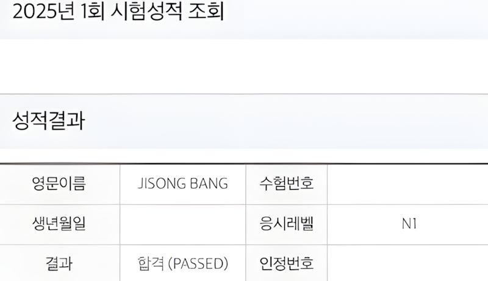

## 하루 30분, 1년 반. JLPT N1까지

일본어는 큰 계획 없이 시작했습니다. 다만 한 가지는 지켰습니다. 매일 30분. 길게 하지 않았고, 대신 끊지 않았습니다. 그렇게 1년 반 동안 N3, N2, N1을 순서대로 준비했고, 결국 N1에 합격했습니다.

특별한 재능이 있었다기보다는, 구조를 만들고 반복했을 뿐입니다.

JLPT N1 시험 결과

### # **1) 하루 30분을 유지한 방법**

처음부터 N1을 목표로 하지 않았습니다. N3부터 차례대로 밟았습니다. 단계별로 넘어가되, 한 번에 많은 시간을 쓰지 않았습니다. 특히 지하철을 타야 하거나, 여유시간이 생긴다면 그날의 Anki를 먼저 돌리고 휴대폰으로 교재도 읽었습니다.

하루 30분은 부담이 없고, 다음 날 다시 앉을 수 있습니다. 교재는 해커스 JLPT 책 세 권을 사용했습니다. N3, N2, N1 각각 한 권씩 끝까지 풀었습니다. 문제를 많이 풀기보다는, 틀린 문제를 구조화하는 데 시간을 썼습니다.

왜 이 문법이 여기 들어가는지, 왜 이 표현이 자연스러운지 이해하려고 했습니다. 짧은 시간이라도 매일 반복하니, 감각이 끊기지 않았습니다. 언어는 결국 누적이라는 걸 체감했습니다.

### # **2) 한자와 단어는 구조로 외우기**

한자는 따로 정리하지 않으면 끝이 없습니다. 그래서 무작정 외우는 대신 구조로 접근했습니다.

[https://nihongokanji.com](https://nihongokanji.com/%20%EC%82%AC%EC%9D%B4%ED%8A%B8%EB%A5%BC%20%ED%99%9C%EC%9A%A9%ED%96%88%EC%8A%B5%EB%8B%88%EB%8B%A4.%20%ED%95%9C%EC%9E%90%EB%A5%BC%20%EB%B6%80%EC%88%98%20%EB%8B%A8%EC%9C%84%EB%A1%9C%20%EB%82%98%EB%88%A0%20%EB%B3%B4%EC%97%AC%EC%A3%BC%EA%B3%A0,%20%EA%B5%AC%EC%A1%B0%EB%A5%BC%20%EC%84%A4%EB%AA%85%ED%95%B4%EC%A4%98%EC%84%9C%20%EC%A2%8B%EC%95%98%EC%8A%B5%EB%8B%88%EB%8B%A4.%20%EB%B9%84%EC%8A%B7%ED%95%9C%20%ED%98%95%ED%83%9C%EB%81%BC%EB%A6%AC%20%EB%AC%B6%EC%96%B4%EB%B3%B4%EB%8B%88%20%EC%95%94%EA%B8%B0%EA%B0%80%20%ED%9B%A8%EC%94%AC%20%EC%88%98%EC%9B%94%ED%95%B4%EC%A1%8C%EC%8A%B5%EB%8B%88%EB%8B%A4.%20%EA%B0%9C%EB%B3%84%20%EA%B8%80%EC%9E%90%EB%A5%BC%20%EC%99%B8%EC%9A%B0%EB%8A%94%20%EA%B2%8C%20%EC%95%84%EB%8B%88%EB%9D%BC,%20%EC%A1%B0%ED%95%A9%EC%9D%84%20%EC%9D%B4%ED%95%B4%ED%95%98%EB%8A%94%20%EB%8A%90%EB%82%8C%EC%9D%B4%EC%97%88%EC%8A%B5%EB%8B%88%EB%8B%A4.)

[**일본어 한자 공부방**

일본어 상용한자의 모든 것을 무료로 자유롭게 공부하실 수 있는 사이트입니다. https://nihongokanji.com](https://nihongokanji.com/)

위의 사이트를 활용했습니다. 한자를 부수 단위로 나눠 보여주고, 구조를 설명해줘서 좋았습니다. 비슷한 형태끼리 묶어보니 암기가 훨씬 수월해졌습니다. 개별 글자를 외우는 게 아니라, 조합을 이해하는 느낌이었습니다.

단어와 한자는 Anki로 관리했습니다. 덱은 직접 만들지 않고 인터넷에서 공유된 덱을 받아 사용했습니다. 대신 무작정 돌리지 않고, 헷갈리는 단어는 따로 태그를 달아 반복했습니다. 이미 알고 있는 단어를 반복하는 데 시간을 쓰지 않으려고 했습니다.

- 한자는 부수 구조로 이해하고

- 단어는 반복으로 고정하고

- 문장은 문제 풀이로 감각을 유지했습니다.

이 세 가지를 분리해서 관리했습니다.

### # **3) N1 합격 이후에 느낀 점**

N1을 준비할 때는 양이 많아서 부담이 컸습니다. 하지만 이미 N3, N2를 거치며 쌓인 구조가 있었습니다. 완전히 새로운 공부가 아니라, 확장에 가까웠습니다.

시험장에서 모르는 단어가 나와도, 한자 구조를 보면 대략적인 의미를 추측할 수 있었습니다. 문법도 처음 보는 표현이라기보다, 익숙한 패턴의 변형처럼 느껴졌습니다. 결국 N1 합격은 단기간 집중의 결과라기보다, 하루 30분씩 쌓인 반복의 결과였습니다.

언어 공부도 결국 구조와 반복의 문제라는 걸 배웠습니다. 한자를 부수로 나누고, 단어를 덱으로 관리하고, 문장을 문제 속에서 확인하는 방식. 이 방식이 저에게는 가장 안정적이었습니다. 앞으로 새로운 언어를 배운다고 해도, 같은 방식으로 접근할 것 같습니다.
